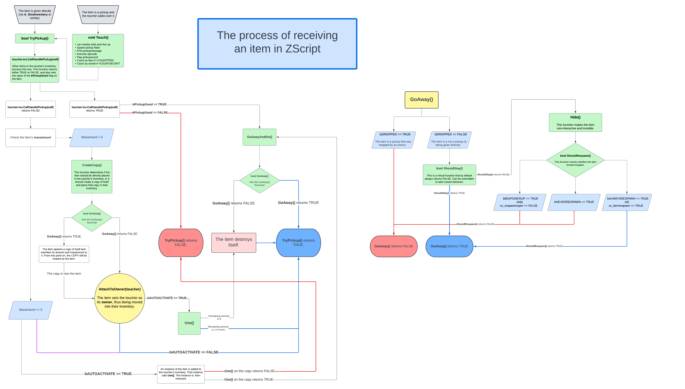

🟢 [<<< BACK TO START](README.md)

🔵 [<< Previous: Player, PlayerInfo and PlayerPawn](12.0_Player.md)🔵 [>> Next: Weapons, PSprite and overlays](12_Weapons_Overlays_PSprite.md)

---

# Inventory

## Table of Content

* [Overview](#overview)
- [The process of picking up an item](#the-process-of-picking-up-an-item)
  * [Conditions](#conditions)
  * [The process](#the-process)
- [Properties and flags](#properties-and-flags)
- [Virtual functions](#virtual-functions)
  * [DoEffect](#doeffect)
  * [AttachToOwner](#attachtoowner)
  * [DetachFromOwner](#detachfromowner)
  * [TryPickup](#trypickup)
    + [Calling TryPickup to force-pick up items](#calling-trypickup-to-force-pick-up-items)
  * [Touch](#touch)
  * [Use](#use)
  * [ModifyDamage](#modifydamage)
  * [AbsorbDamage](#absorbdamage)
  * [DepleteOrDestroy](#depleteordestroy)
  * [HandlePickup](#handlepickup)
  * [PickupMessage](#pickupmessage)
  * [PlayPickupsound](#playpickupsound)
- [Variations of Inventory](#variations-of-inventory)
  * [Health pickups](#health-pickups)
  * [Armor](#armor)
    + [BasicArmor](#basicarmor)
    + [HexenArmor](#hexenarmor)
    + [BasicArmorPickup](#basicarmorpickup)
    + [BasicArmorBonus](#basicarmorbonus)
  * [Weapon](#weapon)
  * [Ammo](#ammo)
  * [PowerupGiver and Powerup](#powerupgiver-and-powerup)

## Overview

The word "Inventory" within GZDoom can refer to two different concepts:

* A list of items held by an actor. Any actor can contain items, this isn't limited just to players . Monsters and even items themselves can hold other items inside them. The inventory is a special data type—a linked list. You can learn more about them in [this section of the **Arrays and linked lists** chapter](13_Arrays.html#linked-lists).

* `Inventory`, which is a base GZDoom class that all items are based on. Items are actors that can be picked up and are normally placed in the toucher's inventory.

This naming convention is, obviously, confusing, so in this chapter and the rest of the guide I'll use the terminology as follows:

* **inventory** will refer to inventory as a list of items held by an actor;

* **`Inventory`** will refer to the base `Inventory` class;

* **item** will refer to a specific item based on the `Inventory` class (or one of `Inventory`'s subclasses);

* **pickup** will refer to an item that specifically exists in the world and can be picked up by walking over it (not all items are like that).

Also, I'm going to use the term **toucher** to refer to the actor (usually a player pawn) that is receiving an item, because this is the name used in some of `Inventory` functions (such as the `Touch()` virtual function used by items to handle the process of picking up). If the actor already has the item in question, they're referred to as **"owner"**, since the item will track them via their `owner` field.

## The process of picking up an item

### Conditions

PIckups can be spawned in the map (provided they have a `Spawn` sequence) and picked up by actors that have a `PICKUP` flag set on them (which by default only includes actors based on `PlayerPawn`). When that happens, in most cases the player pawn will get that item into their inventory. For this to happen the item must have a `SPECIAL` flag set on it (which is set by default), and the item shouldn't have any flags that completely disable collision, such as `NOCLIP` or `NOINTERACTION`. 

Note that items are interactive but they're not solid, so they're not supposed to have the `SOLID` flag—if they did, the player wouldn't be able to intersect the item's hitbox and pick it up. It's also not a good idea to try and add collision to items, such as adding `SHOOTABLE` or `VULNERABLE` to them.

Items can also be given to actors directly by calling `GiveInventory()` or `A_GiveInventory` on them and specifying the item's class name and amount to give. Any actor can receive item this way, they don't need the `PICKUP` flag.

### The process

This process of obtaining an item involves a whole lot of steps that are handled within the item's `TryPickup()` function (covered further in the chapter), which calls multiple other functions to determine the conditions. *Very roughly* the process looks as follows:

1. First, the item will let *other* items already present in the toucher's inventory process itself with their `HandlePickup()` calls (more on that later). `HandlePickup()` allows other items in the toucher's inventory intercept new pickups before they're picked up. As a result of that processing, the item may either be be allowed to move on to the next step, or gets destroyed, or it may be set up to be respawned later (for example, if it has the `bALWAYSRESPAWN` flag, or the `sv_itemrespawn` console command is enabled).

2. Then the item will check if the toucher already has a maximum amount of items of this class in their inventory. If they do, nothing happens. If the item was a world pickup, it stays in the world. If it was given to the actor directly (e.g. via `A_GiveInventory`), it's not given and is simply destroyed.

3. If the toucher has *never* received this item before in the current play session:
   
   The pickup gains the `bNOSECTOR` flag, so that it's no longer rendered or attached to any sectors. It still exists but is functionally detached from the world. After that one of the two things happens:
   
   **In singleplayer**: the item sets the toucher as its `owner`, becoming a part of its inventory list. 
   
   **In multiplayer**: if the item was picked up from the world, it'll create *a copy of itself*, and that copy will set the toucher as `owner`, becoming a part of its inventory. After that the original pickup sets itself up to be respawned (upong respawning the `bNOSECTOR` flag will be removed from it.)

4. If the toucher *has* received this item before, the item doesn't place itself into their inventory; instead, it gets a pointer to an instance of itself that is already present in the toucher's inventory and increases its `amount`. After that, the origial item is either destroyed, or set (if it was a pickup and the gamemode/flags allow it), set up for respawn.

The last step is especially important: when you already have an instance of an item in your inventory, picking up a new item simply increases the `amount`; this is why when receiving multiple items of the same type, you don't get multiple item instances in your inventory; instead you get one instance of that item with a specific `amount` value.

The complete process that takes place when an item is received can be represented with the following flowchart:



## Properties and flags

`Inventory` defines a bunch of item-specific properties and flags that have to be prefixed with `Inventory.` in order to use them in the `Default` block. 

Here are the main `Inventory` properties:

- `Inventory.amount` — the value by which the amount if the item is increased when you pick it up (1 by default).

- `Inventory.maxamount` — the maximum amount; if `amount` of an item instance reaches this, you won't be able to pick up more.

- `Inventory.pickupmessage` — a string printed on the screen when you pick up the item. It's not printed if the item is given directly.

- `Inventory.pickupsound` — the sound played when the item is picked up. As with all sounds, this takes an [SNDINFO](https://zdoom.org/wiki/SNDINFO) definition, not a file name. It's not played if the item is given directly.

- `Inventory.icon` — the graphic displayed in the HUD, provided the item also has the `INVENTORY.INVBAR` flag set. This can either be a sprite or a graphic.

The other properties can be found on [ZDoom wiki](https://zdoom.org/wiki/Actor_properties#Inventory).

Here are the main `Inventory` flags:

* `INVENTORY.INVBAR` — the item is displayed in the HUD while it's in inventory.

* `INVENTORY.UNDROPPABLE` — the item can't be removed from actor's inventory. Implies `UNCLEARABLE`.

* `INVENTORY.UNCLEARABLE` — the item can't be cleared from the inventory by ACS scripts but can be dropped (for example, by using the `drop` console command).

* `INVENRORY.UNTOSSABLE` — the item *can* be removed from the inventory with function calls but can't be dropped by using the `drop` console command.

* `INVENTORY.IGNORESKILL` — used specifically by `Ammo` (which is a subclass of `Inventory`): the amount of ammo will not be doubled regardless of skill (by default the lowest and highest difficulty levels in Doom will double the amount of ammo received from pickups).

* `INVENTORY.PERSISTENTPOWER` — the item is kept when travelling between levels (normally items are stripped, unless the levels belong to the same [hub](https://zdoom.org/wiki/Hub).

* `INVENTORY.AUTOACTIVATE` — the item will call its `Use()` function when picked up. This is mostly used by `PowerupGiver`.

The other flags can be found on [ZDoom wiki](https://zdoom.org/wiki/Actor_flags#Inventory).

## Virtual functions

`Inventory` has a very large number of virtual functions. I'll cover the most important ones.

### DoEffect

```csharp
virtual void DoEffect()
```

This function is called every tic while the item has a valid `owner`. It's similar to `Tick()`, except `Tick()` is run all the time, whether the item has an `owner` or not. This function can be used to add behavior to the owner without having to replace their actor class.

`Inventory`'s own `DoEffect()` is empty, but it's recommended to call `super.DoEffect()` when overriding it, for consistency.

Normally, `DoEffect()` won't run if the `owner` is null, but under very special circumstances it can happen, so, when overriding, it's important to still null-check the `owner` pointer. One notable example is when the owner has a `Death` state sequence with a total duration of 0: if that happens, when the owner gets killed, the item's `DoEffect()` will still run during that game's tic before the item is destroyed. 

> *Note:* 0-tic `Death` sequences are a bad practice and shouldn't be used; at least one empty state (such as `TNT1 A 1`) should always be present. Still, since edge cases like this are possible, it's important to null-check the `owner`.

### AttachToOwner

```csharp
virtual void AttachToOwner(Actor other)
```

This function is run when the item has been received for the first time (the toucher's inventory doesn't have instances of the item in it), so it has to be placed in the actor's inventory. Within this function, `other` is a pointer to the actor who is receiving this item.

Overriding it is useful if you want to affect the toucher once, when the item is picked up. Note, the `super.` call should always be present, otherwise the item won't be attached properly:

```csharp
override void AttachToOwner(Actor other)
{
    super.AttachToOwner(other);
    // This block is only run if the item got
    // successfully placed in the other's
    // inventory:
    if (owner)
    {
        owner.speed *= 0.5;
    }
}
```

This code will reduce the owner's `speed` by 50% when the item is picked up. Note, you will need to have means to restore their speed later—for example, with `DetachFromOwner()`.

> *Note*, this function isn't run for items that don't actually get placed in the inventory — notable examples are health and armor pickups (more on that later).

Note, however, that this virtual is only run when this item is received for the *first* time. If the toucher already has an item of this type in ther inventory, this virtual will not be called. If you want to apply some kind of an effect whenever an item is received, even if you receive more of the same item, give the item `+INVENTORY.AUTOACTIVATE` and utilize its `Use()` virtual instead.

### DetachFromOwner

```csharp
virtual void DetachFromOwner()
```

This function is called when the item is destroyed and should be removed from the owner's inventory. In contrast to `AttachFromOwner()`, this function doesn't have arguments because it always interacts with `owner`.

Note, this function is triggered specifically when the item is removed from the inventory completely and causing it to be destroyed. Just using up all instances of the item, i.e. reducing its amount to 0, does *not* destroy the item: the owner still keeps an instance of the item in their inventory, but that instance's `amount` is set to 0, making it unusable.

This function can be useful when you need to revert special behavior. Note, you have to call `super.` in order for the actual removal to happen.

Example:

```csharp
class SlowDown : Inventory
{
    double prevSpeed; //this will store orginal owner's speed
    int timer;

    override void AttachToOwner(Actor other)
    {
        super.AttachToOwner(other);
        // Check if the owner was established properly:
        if (owner)
        {
            // Save owner's current speed, then reduce
            // their speed by 50%:
            prevSpeed = owner.speed;
            owner.speed *= 0.5;
            // Set up a timer:
            timer = 175;
        }
    }

    override void DoEffect()
    {
        super.DoEffect();

        // Do nothing if the owner is frozen
        // (by a 'freeze' cheat or a freeze powerup):
        if (owner.isFrozen())
        {
            return;
        }

        // Increment the timer:
        timer--;
        // If the owner is null for some reason, or the
        // timer has run out, destroy the item:
        if (!owner || timer <= 0)
        {
            Destroy();
        }
    }

    override void DetachFromOwner()
    {
        // If the owner still exists at this point,
        // restore their speed:
        if (owner)
        {
            owner.speed = prevSpeed;
        }
        // Proceed with item removal:
        super.DetachFromOwner();
    }
}   
```

> *Note:* This specific example is not really recommended for use, because for a timed effect like this it would make more sense to use a `Power`-based item and override its `InitEffect()` and `EndEffect()` functions instead (more on those later).

### TryPickup

```csharp
virtual protected bool TryPickup (in out Actor toucher)
```

`TryPickup()` is called by the item whenever an actor is trying to obtain that item, either by walking over it or by being given it directly (via scripts or cheats). `Toucher` is a pointer to the actor receiving the item. Note, this function is *not* equivalent to `AttachToOwner()`: `AttachToOwner()` is called when the item has already been received and needs to be attached to the owner, whereas `TryPickup()` is called *before* that, and it actually determines whether the item will be received or not. Also, as noted, `AttachToOwner()` isn't run for items that don't actually get placed into inventory (such as health pickups that simply modify player's health value instead, then disappear), whereas `TryPickup()` is always run, since it's *the* function that handles what happens when an item is received.

`TryPickup()` normally returns `true` when an item has been successfully picked up. For a simple example of how its return value works, let's say we're talking about a regular item that has `amount` and `maxamount`:

- When you touch the item (or the item is given to you via other means), `TryPickup()` will check the `amount` if this item type you already have in your inventory.

- If you haven't picked this item up before, the item will be moved into your inventory, its `amount` will be set to the same value as the `Inventory.amount` property on this item class (1 by default), and `TryPickup()` will return true.

- If you have this item, but the amount you have is lower than `Inventory.maxamount` of the item, `TryPickup()` will get a pointer to this item in your inventory, increase its `amount`, then destroy the pickup and return `true`.

- If you already have the maximum possible amout, `TryPickup()` will return `false` and nothing will happen. 

Normally, if you want something to happen as soon as the item is picked up, you'd only do it if `TryPickup()` returns true, which would look as follows:

```csharp
override bool TryPickup(in out Actor toucher)
{
    // first call super. and save the result:
    bool ret = super.TryPickup(toucher);
    // If the result is true (the item was picked
    // up successfuly), do your special behavior:
    if (ret)
    {
        // special behavior
    }
    // Return the result, whatever it was:
    return ret;
}
```

There are special cases, however. For example, if the item in question has `INVENTORY.ALWAYSPICKUP` flag set, the item will be "picked up" (in the sense that it'll disappear from the world), but `TryPickup()` will still return `false` because you didn't actually pick it up, it simply got hidden/removed. In an edge case like this you could simply add your behavior into `TryPickup()` and then return the super call unconditionally:

```csharp
override bool TryPickup(in out Actor toucher)
{
    // Your special behavior goes here

    // Proceed to normal handling:
    return super.TryPickup(toucher);
}
```

The `TryPickup()` function is somewhat long (see [on GZDoom Github](https://github.com/ZDoom/gzdoom/blob/453688ccc6d09edb6e36460425e48abbc0653c39/wadsrc/static/zscript/actors/inventory/inventory.zs#L448)), and each sublcass of `Inventory` (such as `Ammo`, `Health`, etc.) adds their own behavior.

#### Calling TryPickup to force-pick up items

Note that if you want to spawn an item first (for example, to modify its properties somehow), and *then* give it to the player, you should *not* attempt to call `TryPickup()` directly. Instead there's a separate function intended to do exactly that: [`CallTryPickup()`](https://github.com/ZDoom/gzdoom/blob/453688ccc6d09edb6e36460425e48abbc0653c39/wadsrc/static/zscript/actors/inventory/inventory.zs#L592) (which is not virtual and isn't intended to be modified). This would look like this:

```csharp
let ms = Inventory(Spawn("Soulsphere"));
if (ms)
{
    ms.amount = 150;
    // This assumes that the calling actor's 'target'
    // pointer is not null and is probably a player:
    ms.CallTryPickup(target);
}
```

This piece of code would spawn a Soulsphere, modify its `amount` to be 150 instead of 100, and then give it to `target` (which is assumed to be a player pawn). Note, this specific example wouldn't be useful in practice, it's just here to illustrate the concept.

For a more practical example, here's a special item that, by using a [BlockThingsIterator](https://zdoom.org/wiki/BlockThingsIterator) would make the `owner` (presumably, a player pawn) collect all health items within a 256x256 area around them:

```csharp
class HealthCollector : Inventory
{
    Default
    {
        +INVENTORY.UNDROPPABLE
        +INVENTORY.UNTOSSABLE
    }

    override void DoEffect()
    {
        super.DoEffect();

        // first, null-check that owner exists and is a player:
        if (!owner || !owner.player)
        {
            // If not, destroy this item and do nothing else:
            Destroy();
            return;
        }

        // Establish a distance first:
        double dist = 256;
        // Create a BlockThingsIterator around the owner
        // with the specified distance:
        BlockThingsIterator itr = BlockThingsIterator.Create(owner, dist);
        // Iterate through things found by the iterator:
        while (itr.Next())
        {
            // Try casting the found object as Health:
            let hp = Health(itr.thing);
            // Check the cast was successful (otherwise
            // this object isn't Health) and doube-check
            // the distance from owner to it:
            if (hp && owner.Distance3D(hp) <= dist)
            {
                // If the check was successful, attempt
                // to have the item be consumed by the
                // owner:
                hp.CallTryPickup(owner);
            }
        }
    }
}
```

This control item (which you will have to remember to give to the player, e.g. using an [event handler](11_Event_Handlers.md)) will force the owner (the player pawn) to automatically pick up all items that inherit from `Health` (the base class for all health pickups, also a subclass of `Inventory`) by calling `CallTryPickup()` on them. Note, as a result of this, these items will call their own `TryPickup()` functions and do what they need to do, such as checking amount/maxamount, etc.

**Important note:** `CallTryPickup()`/`TryPickup()` do not play the item's pickupsound or print its pickupmessage. Those are handled by separate virtual functions: `PlayPickupSound()` and `PrintPickupMessage()` respectively. By default, they're only called from the `Touch()` virtual. If you want to simulate the item being received fully, i.e. with a sound and a message, just call `Touch()` instead.

### Touch

```csharp
virtual void Touch (Actor toucher)
```

`Touch()` is not an `Inventory`-specific function, it's defined in `Actor`, but `Inventory` [overrides it](https://github.com/ZDoom/gzdoom/blob/master/wadsrc/static/zscript/actors/inventory/inventory.zs#L759) to handle the process of picking up an item pickup. `Touch()` prints the item's pickupmessage (via `PrintPickupMessage()`), plays its pickupsound (via `PlayPickupSound()`), and also initiates `TryPickup()` (via `CallTryPickup()`).

`Touch()` is essentially a "collision" function for items (and it's called after `CanCollideWith()`, the main Actor collision function). It's only called for actors that have a +SPECIAL flag (which all items have by default), and interacts with actors that have a +PICKUP flag (which player pawns have by default, which lets them pick up items). `Touch()` also calls `PrintPickupMessage()` and `PlayPickupSound()` to print the pickupmessage and play the pickupsound for the item.

`Touch()` is only called for picking up items in the world, not for receiving items directly via `A_GiveInventory`, `GiveInventory`, console `give` commands, ACS functions, etc. For this reason, if an item is given directly, it only calls `CallTryPickup()`, and you don't hear a sound, get a flash or see a pickupmessage, since all of those are handled by `Touch()`.

`Touch()` *can* be called on items directly in order to give them to another actor, even if they're not colliding. Here's a variation of the example I used earlier with `CallTryPickup()`, except using `Touch()`:

```cs
class HealthCollector : Inventory
{
    Default
    {
        +INVENTORY.UNDROPPABLE
        +INVENTORY.UNTOSSABLE
    }

    override void DoEffect()
    {
        super.DoEffect();

        if (!owner || !owner.player)
        {
            Destroy();
            return;
        }

        double dist = 256;
        BlockThingsIterator itr = BlockThingsIterator.Create(owner, dist);
        while (itr.Next())
        {
            let hp = Health(itr.thing);
            if (hp && owner.Distance3D(hp) <= dist)
            {
                hp.Touch(owner); //here's where we're using Touch()
            }
        }
    }
}
```

### Use

```cs
virtual bool Use (bool pickup)
```

`Use()` is called when an item is used.  When it returns `true`, the item is consumed.

"Using an item" means any of the following:

- Selecting the item in the inventory bar and pressing the "use item" keybind (the item will need `+INVENTORY.INVBAR` set in order to show up in the HUD at all)

- Using the `use <itemname>` command either from a console or via a dedicated keybind

- If the item has `+INVENTORY.AUTOACTIVATE` set, it gets used automatically when received

Note that for the item to be usable, its `Use()` function has to do something and then return `true`. The base `Inventory` class has an empty `Use()` call that simply returns `false`, so by default items are not usable.

There are also some subclasses of `Inventory` that are defined to be useable: for example, `HealthPickup` (a base for useable healing items, such as Hexen's Quartz Flask) or `PowerupGiver` (a pickup for powerups that gives a related `PowerUp` item upon use). Note that all Doom's PowerupGivers have the `AUTOACTIVATE` flag set, so they're used automatically on pickup, but for example in Hexen and Heretic PowerupGivers are usually useable manually.

In DECORATE the only way to make a custom useable item was to inherit from `CustomInventory` or classes such as `HealthPickup`, `PowerupGiver`, etc., since DECORATE doesn't have access to virtual functions. In ZScript, however, you simply need to inherit from `Inventory` and then override `Use()`.

### ModifyDamage

```csharp
virtual void ModifyDamage(int damage, Name damageType, out int newdamage, bool passive, Actor inflictor = null, Actor source = null, int flags = 0)
```

This function is primarily used by powerups such as [PowerProtection](https://zdoom.org/wiki/Classes:PowerProtection) and [PowerDamage](https://zdoom.org/wiki/Classes:PowerProtection) to modify the damage that the owner deals *or* receives. However, it's defined in the base `Inventory` class, so you can set up *any* item in your inventory (a weapon, for example) to modify the incoming/outgoing damage.

`Source` is the actor responsible for the damage—such as a player or a monster that used the attack. `Inflictor` is a projectile or a puff used by said attack (and in many cases it can be null, e.g. in case of melee or hitscan attacks wh

While it has no return value, `newdamage` is the outgoing value that will determine the final damage amount.

By checking for `passive` you determine whether you want to modify outgoing damage (`passive` is false) or incoming damage (`passive` is true).

This function is documented and has examples [on ZDoom Wiki](https://zdoom.org/wiki/ModifyDamage).

This function's passive part is not called if the damage inflictor is set up to ignore protection, such as using a [`DamageMobj()`](https://zdoom.org/wiki/DamageMobj) call with `DMG_NO_PROTECT` flag. Its active part is, similarly, not called if the damage inflictor used by the player utilizes that flag.

### AbsorbDamage

```csharp
virtual void AbsorbDamage (int damage, Name damageType, out int newdamage, Actor inflictor = null, Actor source = null, int flags = 0))
```

`AbsorbDamage()` is a function very similar to `ModifyDamage()`, except it's run after it, and is normally used for armor rather than PowerProtection/PowerDamage. In contrast to `ModifyDamage()`, `AbsorbDamage()` only works in passive mode.

Overriding this function can be used similarly to `ModifyDamage()` to alter how much damage the owner receives. Note that it can also be bypassed, but the conditions are different from those of bypassing `ModifyDamage()`: `AbsorbDamage()` isn't called if the inflictor is set to bypass armor specfiically, e.g. if it's a projectile with `+PIERCEARMOR` flag, or a [`DamageMobh()`](https://zdoom.org/wiki/DamageMobj) call with the `DMG_NO_ARMOR` flag.

### DepleteOrDestroy

```csharp
void DepleteOrDestroy()
```

This is a non-virtual function that by default is called when an item's amount in your inventory reaches 0. It determines whether the item should remain in your inventory (with its amount set to 0, so it's still unusable) or be removed completely.

If you want to make sure a specific item (like a control item that exists only to add some special effects/behaviors to the owner) is removed when a certain condition is met, use `Destroy()` instead.

If the item is destroyed, it calls `DetachFromOwner()` first, so you can still override that to add some "when this item is removed" behaviors.

### HandlePickup

```csharp
virtual bool HandlePickup (Inventory item)
```

[`HandlePickup()`](https://zdoom.org/wiki/HandlePickup) is an interesting virtual function: it's called on *all* items in your inventory when you receive any new item. With this, items in your inventory can process *other* items you're receiving and do something with that data. This can even be used to override what items you can or cannot receive. The structure of this function, with examples, is documented [on ZDoom Wiki](https://zdoom.org/wiki/HandlePickup), so I won't go into details here.

This function is actually very useful in gameplay mods where you replace the original Doom items with your modded versions. Usually, mods have this problem where the player can receive both the vanilla items and the modded items. This can happen if the player uses a `give all` cheat, or they play through a map that has ACS scripts that, for example, remove all your weapons and then give you back a standard Fist or Pistol. This is inconvenient, because those vanilla weapons, despite not being bound to slots, may show up in your HUD (depending on how it's set up), and the player may even be occasionally auto-switched to those weapons when they run out of ammo for a mod's weapon.

You can circumvent this by having one special control item in the player's inventory, and using that control item's `HandlePickup()` override to intercept the *other* items the player attempts to receive (by any means) and, for example, give other items instead.

Note, this function isn't run for items whose `TryPickup()` returns `false`, so if the item isn't meant to be attached to the player, `HandlePickup()` won't see it.

### PickupMessage

```csharp
virtual string PickupMessage()
```

This function returns the string that functions as the item's `pickupmessage` (gets printed on the screen when the item is picked up). Note, when you set the value of `Inventory.pickupmessage` in the item's Default block, this value isn't printed directly; instead it's saved in an `Inventory`-specific variable `pickupMsg`, which is then processed by the `PickupMessage()` function. By default it does this:

```csharp
    virtual String PickupMessage ()
    {
        return PickupMsg;
    }
```

(See [GZDoom Github](https://github.com/ZDoom/gzdoom/blob/671b8696bbf2388ff73c219188512e868124272a/wadsrc/static/zscript/actors/inventory/inventory.zs#L745))

You can override this function to add more complex pickup messages. For example, let's say you want your ammo pickups to print the amount you receive when picking up, not just a standard line like "Picked up a clip". This can be done:

```csharp
class Clip_Test : Clip
{
    override string PickupMessage()
    {
        // First retrieve and localize the default
        // pickupmessage for this item:
        string pkm = StringTable.Localize(pickupMsg);
        // Now use String.Format() to combine the
        // default message with a number and pass
        // the item's amount to this number:
        return String.Format("%s (+%d)", pkm, amount);
    }
}
```

When this Clip is picked up, you'll see "Picked up a Clip (+10)" as the pickupmessage.

Note that all vanilla items use [LANGUAGE](https://zdoom.org/wiki/LANGUAGE) lump references, rather than literal strings in their code (e.g. for Clip it's `"$GOTCLIP"`), and it's always a good idea to keep your text strings in that lump rather than write them out literally in ZScript. 

LANGUAGE strings need to be localized with the `StringTable.Localize()` function to be printed, otherwise the identifier will be printed literally, such as "$GOTCLIP". By default `PickupMessage()` doesn't do it, because when it simply returns `pickupMsg`, the engine will localize that string automatically. However, when you're returning a more complex value—such as our formatted string there—and only a part of it needs localization, you have to do it manually in ZScript, hence the `StringTable.Localize()` call.

### PlayPickupsound

```csharp
virtual void PlayPickupSound (Actor toucher)
```

[`PlayPickupSound()`](https://github.com/ZDoom/gzdoom/blob/master/wadsrc/static/zscript/actors/inventory/inventory.zs#L1060) is the function that plays the item's `pickupsound` as defined in its properties. It handles various flags and attenutation for the sound.

One potentially useful feature that may require overriding is function is if you want pickupsounds from different pickups to not cut each other off (which they will do by default). Unfortunately, you'll have to copy-paste the whole contents of the original override to inject your own behavior, since it has no return value and doesn't have a flags argument. To do this you will have to copy the entire function, but replace the last line as follows:

```csharp
flags |= CHANF_OVERLAP;
toucher.A_StartSound(PickupSound, chan, flags, 1, atten);
```

Addign `CHANF_OVERLAP` to the `flags` value (which is defined at the start of the override) will let the various pickupsounds play over each other on the same channel.

The full example of how to do this is provided [on ZDoom Wiki](https://zdoom.org/wiki/PlayPickupSound#Examples).

## Variations of Inventory

There are multiple special subclasses of inventory that define their own special behavior. All of these subclasses support `Inventory`'s virtual functions, properties and flags, being its descendants, but their behavior can be rather different from standard items. Here I'll provide a brief overview of how some of the most common variations are different.

### Health pickups

There is a number of different healing items used in various games supported by GZDoom. Their code can be found [on GZDoom Github](https://github.com/ZDoom/gzdoom/blob/master/wadsrc/static/zscript/actors/inventory/health.zs).

[`Health`](https://github.com/ZDoom/gzdoom/blob/671b8696bbf2388ff73c219188512e868124272a/wadsrc/static/zscript/actors/inventory/health.zs#L36) is the base class used by simple "pick up to heal" items, such as Doom's Stimpack, Medikit or Soulsphere. These items are never placed in the toucher's inventory. When picked up, they check the toucher's `health` value against their own `maxamount` value, and if the former is smaller than the latter, the item will add its `amount` to the toucher's `health` and destroy itself. Otherwise the pickup will do nothing and stay in the world (unless it has the `INVENTORY.ALWAYSPICKUP` flag enabled, in which case the pickup will simply be destroyed).

[`HealthPickup`](https://github.com/ZDoom/gzdoom/blob/671b8696bbf2388ff73c219188512e868124272a/wadsrc/static/zscript/actors/inventory/health.zs#L117) is a different healing item class, unrelated to `Health`. It gets put in the player's inventory like a traditional item. In contrast to `Inventory`, however, its `Use()` function isn't empty: instead, when an item of this type is used, it'll attemp to heal the owner and, if successful, `Use()` will return `true`, reducing the `amount` of this item in your inventory. Hexen's Quartz Flask (internally [`ArtiHealth`](https://github.com/ZDoom/gzdoom/blob/671b8696bbf2388ff73c219188512e868124272a/wadsrc/static/zscript/actors/raven/ravenartifacts.zs#L4)) is an example of this.

`HealthPickup` has another nifty property: `HealthPickup.Autouse`. When the owner's health reaches the value specified in this property, this item will be used automatically, if present. (In case of the aforementioned Quartz Flask, the value is 1.)

Note, not all health pickups are based on these two. For example, Doom's Megasphere, which givs both armor and health, is actually a `CustomInventory` that gives two separate items based on `Health` and `Armor` (as seen [here](https://github.com/ZDoom/gzdoom/blob/671b8696bbf2388ff73c219188512e868124272a/wadsrc/static/zscript/actors/doom/doomartifacts.zs#L47)).

### Armor

[`Armor`](https://github.com/ZDoom/gzdoom/blob/671b8696bbf2388ff73c219188512e868124272a/wadsrc/static/zscript/actors/doom/doomartifacts.zs#L47) is a variation of `Inventory` that defines virtually no special behavior and serves as a base for other armor classes. 

#### BasicArmor

The main armor class is [`BasicArmor`](https://github.com/ZDoom/gzdoom/blob/671b8696bbf2388ff73c219188512e868124272a/wadsrc/static/zscript/actors/inventory/armor.zs#L57): the player always has an instance of `BasicArmor` in their inventory, this is the class that actually handles damage reduction (via an `AbsorbDamage()` override). `BasicArmor` defines a number of custom properties, such as `savepercent` (by how much the damage is reduced) and `actualSaveAmount` (the amount of armor, calculated from `saveAmount` of armor pickups).

Armor pickups are never placed in your inventory; instead they get access to `BasicArmor` in the toucher's inventory and modify its properties, then get removed (or set up for respawning). This follows the same logic as health pickups that modify the toucher's health and are then removed. 

`BasicArmor` never functions as a pickup and is already present in the player's inventory on map start. Whenever you need to get information about the player's current armor, such as its amount, damage reduction or even icon, you need to do it by getting a pointer to `BasicArmor` in their inventory and reading information off it, such as `let arm = BasicArmor(ppawn.FindInventory("BasicArmor"));` (where `ppawn` is a pointer to the PlayerPawn you need).

#### HexenArmor

Another variation of basic armor exists known as [`HexenArmor`](https://github.com/ZDoom/gzdoom/blob/master/wadsrc/static/zscript/actors/inventory/armor.zs#L440). It's an analog of `BasicArmor` made specifically for Hexen, which consits of 4 separate armor pieces held in an array, with a special formula for armor reduction based on which pieces you have. In principle it functions the same way as `BasicArmor`, and, just like `BasicArmor`, it's always present in the player's inventory, even if you're not playing Hexen. It's fairly rarely used in custom projects due to added complexity.

#### BasicArmorPickup

[`BasicArmorPickup`](https://github.com/ZDoom/gzdoom/blob/master/wadsrc/static/zscript/actors/inventory/armor.zs#L343) is, as its name implies, the base class for all armor pickups—the armor items that you can actually spawn in the world and pick up. As mentioned above, the armor pickups are never placed in your inventory, instead they get a pointer to `BasicArmor` in your inventory and modify its values. This is the class that the various in-game armors are based on.

`BasicArmorPickup` overrides the `Use()` function to set the player's armor values; as such, it has `+INVENTORY.AUTOACTIVATE` set by default so that the `Use()` function is actually called.

Note that armor amount can be modified based on the game's difficulty level, if a custom difficulty level is set up to include that modifier. Armor pickups check `G_SkillPropertyFloat(SKILLP_ArmorFactor))` in order to get that modifier.

#### BasicArmorBonus

[`BasicArmorBonus`](https://github.com/ZDoom/gzdoom/blob/master/wadsrc/static/zscript/actors/inventory/armor.zs#L217) is somewhat similar to `BasicArmorPickup` with 2 main differences:

- It's set up to be always picked up by default (due to `+INVENTORY.ALWAYSPICKUP`)

- If you already have armor, it never modifies its `savepercent`, only its amount.

This means that armor bonuses are set up to add to your current armor; they only give you armor if you had no armor before.

This is how Dooms' `ArmorBonus` functions: it will always add to your armor, so if you had Blue Armor before (50% damage reduction), it won't be reverted to another armor type, and so on.

### Weapon

[`Weapon`](https://github.com/ZDoom/gzdoom/blob/master/wadsrc/static/zscript/actors/inventory/weapons.zs) is a subclass of `StateProvider`, which is a subclass of `Inventory`. Weapons are also items, but they define a whole lot of custom behavior, such as:

* The ability to draw sprite animations on the screen, which is defined in `StateProvider` and inherited by `Weapon`. Note that the sprite animation itself is handled by another class, `PSprite`. (This is covered in detail in the [Weapons, Overlays and PSprite chapter](12_Weapons_Overlays_PSprite.md).

* Weapons consume `Ammo` when fired. They also give `Ammo`, if you're picking a weapon that you already have.

* Weapons also define a slew of custom functions for attacking, PSprite manipulation and other things.

Aside from that, weapons also function as items: they have access to all `Inventory` functions and they even utilize their `amount`, so it's possible, for example, to check the amount of your current weapon and display different animations (such as displaying a dual-wield animation when the amount is more than 1).

### Ammo

[`Ammo`](https://github.com/ZDoom/gzdoom/blob/master/wadsrc/static/zscript/actors/inventory/ammo.zs#L36) is a base class for ammo items, which are normally required to use weapons. Like most items, ammo items get placed into the toucher's inventory when they're picked up for the first time, and after that the instance of that ammo is never removed, even if its amount reaches 0. Picking up new ammo pickups of the same time increases the amount of the ammo item in your inventory.

Ammo utilizes `HandlePickup()` overrides to handle the process of picking up ammo. It also checks if the current difficulty level has a factor affecting how much ammo you're supposed to get (in Doom you get double ammo on "I'm Too Young To Die" and "Nightmare!", for example).

What's also special about `Ammo` is that it's designed in a way that only inheriting from `Ammo` directly creates a new ammo type, whereas inheriting again from a custom ammo type simply creates a new pickup of the *same* type.

This behavior can be changed (for example, if you want to create a custom version of the *base* `Ammo` class) by overriding `Ammo`'s [`GetParentAmmo`](https://github.com/ZDoom/gzdoom/blob/master/wadsrc/static/zscript/actors/inventory/ammo.zs#L69) function. For example:

```csharp
class MyBaseAmmo : Ammo
{
    override Class<Ammo> GetParentAmmo ()
    {
        class<Object> type = GetClass();

        // This part adds MyBaseAmmo class to exceptions,
        // so that it's not considered a new ammo type:
        while (type.GetParentClass() != "Ammo" && type.GetParentClass() != "MyBaseAmmo" && type.GetParentClass() != NULL)
        {
            type = type.GetParentClass();
        }
        return (class<Ammo>)(type);
    }
```

### PowerupGiver and Powerup

[`PowerupGiver`](https://github.com/ZDoom/gzdoom/blob/master/wadsrc/static/zscript/actors/inventory/powerups.zs) is a class for items that give the owner a related `Powerup` when used. PowerupGivers themselves don't have any effects, they're just items, but they're the ones that function as pickups. The actual powerup effect, however, is always defined in a `Powerup`-based class, which is attached to its respective PowerupGiver via its `Powerup.Type` property.

PowerupGivers are also placed into player's inventory by default, and they give the `owner` their related powerup in their `Use()` function. Most powerup givers in Hexen or Heretic, for example, are meant to be used from the inventory bar, whereas in Doom all powerup givers have `+INVENTORY.AUTOEFFECT` set, which makes them activate immediately upon pickup.

If a powerup is never meant to be spawned in a map and function as a pickup, it doesn't need a PowerupGiver at all.

[`Powerup`](https://github.com/ZDoom/gzdoom/blob/master/wadsrc/static/zscript/actors/inventory/powerups.zs#L65) is a class based on `Inventory` that is designed to provide some special effects for its `owner` while it's in their inventory. Powerups utilize various functions to handle those effects (such as using `ModifyDamage()` to modify the incoming/outgoing damage, for example). The key features of `Powerup` compared to `Inventory` are:

* Effect duration tracked via an integer variable `effectTics`. This value is reduced in the powerup's `DoEffect()` override, and once it reaches 0, the powerup destroys itself.

* [`InitEffect()`](https://github.com/ZDoom/gzdoom/blob/master/wadsrc/static/zscript/actors/inventory/powerups.zs#L195) and [`EndEffect()`](https://github.com/ZDoom/gzdoom/blob/master/wadsrc/static/zscript/actors/inventory/powerups.zs#L237) virtual functions that determine what happens when the powerup activates and deactivates (including when its duration runs out).

`Powerup` doesn't define any special behavior by itself. The actual powerups are classes such as `PowerDamage`, `PowerProtection`, `PowerHighJump`, `PowerInvulnerability` and others. You can also easily create your own powerups by inheriting from `Powerup` and overriding its `InitEffect()`, `EndEffect()` and, if necessary, `DoEffect()`, to determine its effects. For example:

```csharp
class InvulnerabilityAndReflect : Powerup
{
    uint prevRenderstyle;

    Default
    {
        // Negative duration sets the duration
        // in seconds rather than tics:
        Powerup.Duration -30;
    }

    override void InitEffect()
    {
        super.InitEffect();
        if (owner)
        {
            owner.bINVULNERABLE = true;
            owner.bREFLECTIVE = true;
            // Save the owner's current renderstyle:
            prevRenderstyle = owner.GetRenderstyle();
            owner.A_SetRenderstyle(owner.alpha, STYLE_Stencil);
            owner.SetShade("FF0000");
        }
    }

    override void EndEffect()
    {
        super.EndEffect();
        if (owner)
        {
            owner.bINVULNERABLE = false;
            owner.bREFLECTIVE = false;
            // Restore owner's renderstyle to what it was:
            owner.A_SetRenderstyle(owner.alpha, prevRenderstyle);
        }
    }
}
```

This custom powerup makes the onwer invulnerable, reflects projectiles that hit them, and also changes their renderstyle so that they appear in a flat red color. It'll work both on monsters and players (note, for players it'll also color their weapon sprite).

`Powerup` and `PowerupGiver` also has one more interesting interaction: there's a number of properties that can be defined *either* in PowerupGiver *or* Powerup, and they will have the same effect. For example, `Powerup.Color`, `Powerup.Duration`, as well as certain powerup-specific properties such as `Powerup.Strength`, can be defined in either class. If they're defined in the PowerupGiver, the respective Powerup will automatically gain those features as soon as the powerup giver gives the powerup to the player.

Note that if you want to create a powerup that is never meant to be spawned in the map or picked up, and instead should only be given directly, creating a PowerupGiver for it is *not* necessary. You can simply define a Powerup and its properties as you wish and give it to the player directly. 

`Powerup` is also a good base not only for powerups, but for any sort of timed effect in general, as long as that effect is meant to be attached to an actor. For example, if you want to attach a damage-over-time effect to a monster when they're hit with your fire projectile, and also spawn some fire/smoke particles around them, you can do this by creating a custom powerup with a specific duration and spawns those effects in `DoEffect()` on its `owner`.

### CustomInventory

[`CustomInventory`](https://github.com/ZDoom/gzdoom/blob/master/wadsrc/static/zscript/actors/inventory/stateprovider.zs#L453) is a class that used to be very heavily utilized in DECORATE because it allows for some basic scripting. In ZScript its use is much more limited but not non-existent.

`CustomInventory` is designed to support special state sequences: it enters its `Pickup` sequence when it's picked up, and its `Use` sequence when it's used (which is either when the player selects it and uses it, or automatically if it has `+INVENTORY.AUTOACTIVATE` set. Using those state sequences, you can add special behavior to it by directly putting it into those states. Note that these states don't support duration or animation, they can only execute functions. An example of `CustomInventory` used in the original code is Doom's Megasphere, which looks as follows:

```csharp
class Megasphere : CustomInventory
{
    Default
    {
        +COUNTITEM
        +INVENTORY.ALWAYSPICKUP
        +INVENTORY.ISHEALTH
        +INVENTORY.ISARMOR
        Inventory.PickupMessage "$GOTMSPHERE";
        Inventory.PickupSound "misc/p_pkup";
    }
    States
    {
    Spawn:
        MEGA ABCD 6 BRIGHT;
        Loop;
    Pickup:
        TNT1 A 0 A_GiveInventory("BlueArmorForMegasphere", 1);
        TNT1 A 0 A_GiveInventory("MegasphereHealth", 1);
        Stop;
    }
}
```

> *Note:* `BlueArmorForMegasphere` is essentially a clone of BlueArmor, and `MegasphereHealth` is a simple item that provides 200 health up to the maximum of 200. They're defined right next to the Megasphere in the code, as seen [here](https://github.com/ZDoom/gzdoom/blob/671b8696bbf2388ff73c219188512e868124272a/wadsrc/static/zscript/actors/doom/doomartifacts.zs#L49).

In ZScript this specific feature isn't really necessary, since you can use virtual overrides (`Use()`, `AttachToOwner()`, `TryPickup()`) to achieve the same results.

*However*, `CustomInventory` has one more feature that still makes it relevant: it's not based directly on `Inventory`, but rather on `StateProvider`. This means that it's the only class aside from `Weapon` that is allowed to utilize `PSprite` and draw sprite animations on the screen. This can be useful in specific instances, for example if you want to create a quick secondary weapon (such as Duke3D-styles quick kick) that can be activated at a button press and is completely independent from the actual weapon you currently have selected. Doing this, however, requires several specific steps, which will be described in [Weapons, Overlays and PSprite](12_Weapons_Overlays_PSprite.md).

### Others

Other notable subclasses of Inventory are described on ZDoom Wiki:

* [Key](https://zdoom.org/wiki/Classes:Key)

* [MapRevealer](https://zdoom.org/wiki/Classes:MapRevealer)

* [PuzzleItem](https://zdoom.org/wiki/Classes:PuzzleItem)

* [FakeInventory](https://zdoom.org/wiki/Classes:FakeInventory)

---

🟢 [<<< BACK TO START](README.md)

🔵 [<< Previous: Player, PlayerInfo and PlayerPawn](12.0_Player.md)🔵 [>> Next: Weapons, overlays and PSprite](12_Weapons_Overlays_PSprite.md)
