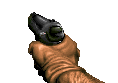
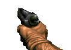
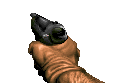
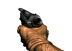
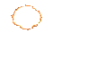

🟢 [<<< BACK TO START](README.md)

🔵 [<< Previous: Inventory](12.1_Inventory.md) 🔵 [>> Next: Arrays and linked lists](13_Arrays.md)

------

# Weapons, overlays and PSprite

## Table of Contents

* [Overview](#overview)
* [Basic weapon states and flow](#basic-weapon-states-and-flow)
* [Basic weapon functions](#basic-weapon-functions)
  + [A_WeaponReady](#a-weaponready)
  + [Weapon attack functions](#weapon-attack-functions)
    - [A_FireBullets](#--a-firebullets--)
    - [A_FireProjectile](#a-fireprojectile)
    - [A_CustomPunch](#a-custompunch)
    - [A_RailAttack](#a-railattack)
  + [A_ReFire](#a-refire)
  + [Hitscan puffs](#hitscan-puffs)
  + [Other useful functions](#other-useful-functions)
* [Handling data from weapons](#handling-data-from-weapons)
  + [Accessing data from weapon states](#accessing-data-from-weapon-states)
  + [Accessing data from the weapon's virtual functions](#accessing-data-from-the-weapon-s-virtual-functions)
  + [Checking current weapon](#checking-current-weapon)
  + [When to use Tick()](#when-to-use-tick--)
* [Action functions](#action-functions)
* [PSprite and overlays](#psprite-and-overlays)
  + [Differences between PSprites and actor sprites](#differences-between-psprites-and-actor-sprites)
  + [Difference between PSprites and state sequences](#difference-between-psprites-and-state-sequences)
* [PSprite manipulation](#psprite-manipulation)
  + [Creating PSprites](#creating-psprites)
    * [Native function](#native-function)
    * [ZScript function](#zscript-function)
    * [Layer numbers](#layer-numbers)
    * [PSprite pointers](#psprite-pointers)
    * [Independent overlay animation](#independent-overlay-animation)
  + [Removing PSprites](#removing-psprites)
    * [Native function](#native-function-1)
    * [ZScript method](#zscript-method)
  + [PSprite flags](#psprite-flags)
  + [PSprite properties](#psprite-properties)
    * [Native property-altering functions](#native-property-altering-functions)
    * [Internal properties](#internal-properties)
  + [Checking PSprite state](#checking-psprite-state)
  + [PSprite offsets](#psprite-offsets)
    * [Native offset functions](#native-offset-functions)
    * [Internal offset values](#internal-offset-values)
  + [Overlay scale, rotation and pivot](#overlay-scale--rotation-and-pivot)
  + [Overlay translation](#overlay-translation)
* [Akimbo weapons](#akimbo-weapons)
  + [Classic dual weapon](#classic-dual-weapon)
  + [Independent dual weapons activated with Fire/Alt Fire keys](#independent-dual-weapons-activated-with-fire-alt-fire-keys)
* [Creating PSprite animations with CustomInventory](#creating-psprite-animations-with-custominventory)

## Overview

Weapons (i.e. classes that inherit from the base `Weapon` class) feature a number of special behaviors that aren't found in other classes, and you need to be aware of those behaviors to use them effectively.

Here's a brief overview of their features:

* `Weapon` is a subclass of [`Inventory`](12.1_Inventory.md) (the full inheritance chain is `Actor`>`Inventory`>`StateProvider`>`Weapon`), and thus they have access to all Inventory functions and virtual functions.
* `Weapon` and `CustomInventory` are the only two classes that inherit from an internal `StateProvider` class, which allows them to draw sprite animations on the screen. The sprites drawn on the screen are handled by a separate special class called `PSprite` (short for "player sprite").
* PSprite is a special internal class whose main purpose is to handle on-screen sprite drawing. PSprites hold various properties of those sprite layers, such as duration in tics, position on the screen, and so on.
* On-screen sprites can be drawn in multiple layers. The main layer is layer 1, also defined as `PSP_Weapon` (PSP_Weapon is just an alias of number 1). New layers can be drawn above and below it. A separate PSprite class instance is be created to handle each layer.
* Most weapon functions, such as `A_FireBullets`, `A_WeaponReady` and other functions that are called from the States block, despite being defined in the weapon, are actually called and executed by the [player pawn](https://zdoom.org/wiki/Classes:PlayerPawn) carrying that weapon, rather than the weapon itself. For example, when you call `A_FireProjectile` from the weapon, it's the player pawn that spawns the projectile in the world.
  * For this reason monster attack functions, such as `A_SpawnProjectile`, can't be used in weapons, and vice versa.
* Functions that can be called from weapon states are always [action functions](09_Custom_functions.md#action-functions). Custom functions also have to be defined as action functions.

## Basic weapon states and flow

Weapons are actors, so they utilize the `Default` block and the `States` block in a similar manner to actors. However, only the `Spawn` state sequence defines how the weapon looks in the world, as a pickup. The other state sequences define the on-screen animation of the weapon, and they're handled by a separate class, `PSprite` (which will be covered in more detail later in the chapter).

Weapons are also items (they're based on the `Inventory` class), which means they can be placed in the world, dropped by enemies, and picked up by the player to be added to their inventory. Starting weapons (given to the player at the start of the game) are defined in the `PlayerPawn`, through their [`Player.StartItem` property](https://zdoom.org/wiki/Classes:PlayerPawn#Player.StartItem).

Weapons come with a number of [unique properties](https://zdoom.org/wiki/Actor_properties#Weapon) and [unique flags](https://zdoom.org/wiki/Actor_flags#Weapons), and they also utilize unique basic state sequences:

* `Select`: Used when the weapon is selected and starts moving from the bottom of the screen. Normally, [`A_Raise`](https://zdoom.org/wiki/A_Raise) is called to raise the weapon over several tics, but it's not compulsory. It's possible to jump straight to `Ready` from this state. Otherwise, `A_Raise` will automatically jump to `Ready` as soon as the vertical position of the weapon's sprite reaches the value contained in the `WEAPONTOP` global constant (which is equal to 32).

* `Deselect`: Used when another weapon is about to be selected, and the current weapon has to be moved away from the screen before that happens. The deselection animation is played with the function [`A_Lower`](https://zdoom.org/wiki/A_Lower). The weapon can only be deselected if it was ready for deselection, which requires calling `A_WeaponReady`.

* `Ready`: Entered after the weapon has been selected and raised. To make the weapon actually ready to be fired or deselected, the [`A_WeaponReady`](https://zdoom.org/wiki/A_WeaponReady) function has to be called.

* `Fire`: Entered when the player presses the primary attack button while the weapon was ready to fire (which requires calling `A_WeaponReady`).

* `AltFire`: Entered when the player presses the alternative attack button while the weapon was ready to fire (which requires calling `A_WeaponReady`).

* `Hold`: If anywhere in the `Fire` sequence the [`A_ReFire`](https://zdoom.org/wiki/A_ReFire) function is called and the player is holding the attack button, the animation will move to the `Hold` sequence and will continue animating in that sequence. It can be used in order to create a weapon that has a different animation for the first shot and for all the subsequent shots, as long as the player is holding the attack button.
  
  * If this state sequence is not provided, calling `A_ReFire` will simply make the animation jump back to the beginning of `Fire` if the player is holding the attack button.

* `AltHold`: Functions the same way as `Hold`, but is used when calling `A_ReFire` from the `AltFire` sequence.
  
  * If this state sequence is not provided, calling `A_ReFire` inside `AltFire` will simply make the animation jump back to the beginning of `AltFire` if the player is holding the attack button. Alternative attack will never use the regular `Hold` sequence.

* `Reload`: Entered when the player presses Reload while the weapon was ready to reload, which requires calling `A_WeaponReady(WRF_ALLOWRELOAD)`. The actual reload logic has to be fully coded by the author, there's no built-in system for reloading.

* `Zoom`: Entered when the player presses Zoom while the weapon was ready to zoom, which requires calling `A_WeaponReady(WRF_ALLOWZOOM)`.

* `User1`, `User2`, `User3` and `User4`: These are empty state sequences that can be utilized by the authors to define any kind of extra state sequences that can be called as long as `A_WeaponReady(WRF_ALLOWUSER#)` is called, where `#` is a number between 1 and 4. Effectively, they allow creating extra attacks for the weapon. These state sequences are attached to empty "user" inputs (the corresponding console commands are, respectively, `+user1`, `+user2`, `+user3` and `+user4`). These inputs are not used for anything in GZDoom by default, so you can attach custom actions to them and give them names by [creating a keysection in the KEYCONF lump](https://zdoom.org/wiki/Adding_keysections), and then calling `A_WeaponReady` with the necessary flag. So, for example, if you call `A_WeaponReady(WRF_ALLOWUSER1)`, and the player presses the button bound to `+user1`, the weapon will enter its `User1` state sequence.

* `Flash`: This state sequence is entered on a separae sprite layer whenever `A_GunFlash` function is called in Fire/Hold. If this happens, the sprites in the `Flash` state sequences will be drawn and animated above the weapon, on the layer 1000. This is what vanilla Doom weapons use to draw muzzle flashes, so that the muzzle flash can be drawn fullbright while the rest of the weapon isn't. Vanilla Doom weapons also use `A_Light2` and `A_Light1` functions that illuminate *the whole level* to create the impression of the weapon illuminating your surroundings. Note, `A_Light0` has to be called after either of those to reset the effect, otherwise the light level of the whole map will remain permanently raised.
  
  * It's not a requirement to use this method to create muzzle flashes in your weapons. Nowadays, with a higher flexibility in the number of layers you can create, and with the access to dynamic light, using `A_GunFlash` or `A_Light#` functions doesn't yield the best visual results.

* `AltFlash`: Functions the same way as `Flash` but is used when `A_GunFlash` is called from AltFire/AltHold.

* `Lightdone`: This state sequence is defined in the base `Weapon` class and doesn't need to be overridden in your weapons. All it does is call `A_Light0` and then destroy the current layer (it's meant to only be used by the gun flash layer, not the main weapon layer). Normally, weapons that utilize the `Flash`/`AltFlash` sequences and call `A_Light2` or `A_Light1`, end with `goto Lightdone` in order to reset the illumination effect. However, it's not a requirement; you can also simply call `A_Light0` manually and then `stop`.

As an example of a simple weapon, let's take a look at the Doom Pistol:

```csharp
// The base class for all Doom weapons is DoomWeapon.
// DoomWeapon is directly based on Weapon; the only thing
// it defines is Weapon.Kickback of 100. You don't have
// to base your custom weapons on it.
class Pistol : DoomWeapon
{
     Default
    {
        // Determines the order of this weapon when
        // the player runs out of ammo and a new weapon
        // has to be selected. The higher this number,
        // the lower will be its priority during automatic
        // selection:
        Weapon.SelectionOrder 1900
        // Determines how much ammo the weapon consumes
        // during primary attack:
        Weapon.AmmoUse 1
        // Determines how much ammo the weapon gives to
        // the player when they pick it up. If the weapon
        // is dropped by an enemy, this amount will be
        // halved. Pistol doesn't appear as a pickup in
        // vanilla Doom maps but can be placed in custom
        // maps:
        Weapon.AmmoGive 20
        // Contains the name of the ammo class utilized
        // for the primary attack of this weapon:
        Weapon.AmmoType "Clip"
        // Contains a string printed when the player
        // kills another player with this weapon in deathmatch:
        Obituary "$OB_MPPISTOL"
        // This flag marks this weapon as weak. This means,
        // as soon as the player picks up another weapon
        // without this flag, it'll be selected instead
        // of this one:
        +WEAPON.WIMPY_WEAPON
        // The pickup message is printed when the item
        // is picked up:
        Inventory.Pickupmessage "$PICKUP_PISTOL_DROPPED"
        // Internal name of this object. Can be different
        // from class name, and can be localized with
        // the LANGUAGE lump:
        Tag "$TAG_PISTOL"
    }
    States
    {
    Ready:
        PISG A 1 A_WeaponReady; // makes the weapon ready to fire and deselect
        Loop;
    Deselect:
        PISG A 1 A_Lower; // lowers the weapon on the screen
        Loop;
    Select:
        PISG A 1 A_Raise; // raises the weapon on the screen
        Loop;
    Fire:
        PISG A 4;
        // Most vanilla weapons utilize custom attack functions
        // similar to vanilla Doom. For example, A_FirePistol
        // combines A_FireBullets, A_GunFlash and A_StartSound:
        PISG B 6 A_FirePistol;
        PISG C 4;
        // If the player is still holding the attack button,
        // PISGB won't be shown, and instead the animation
        // will jump back to the start of Fire. Thus, tapping
        // attack button will produce longer fire animations
        // than holding it:
        PISG B 5 A_ReFire;
        Goto Ready;
    Flash:
        // This illuminates the whole level slightly:
        PISF A 7 Bright A_Light1;
        // As mentioned above, the LightDone sequence calls 
        // A_Light0 to reset illumination and destroy this layer:
        Goto LightDone;
    // While in vanilla Doom the Pistol doesn't exist as a pickup,
    // it does in GZDoom. GZDoom also comes with a pickup sprite
    // for it, which didn't exist in the original Doom. This
    // allows authors to place pistol pickups in their maps, have
    // custom enemies drop the Pistol, or summon it via the console:
     Spawn:
        PIST A -1;
        Stop;
    }
}
```

It's worth noting at this point that the weapons from vanilla games (Doom, Heretic, Hexen, etc.) are largely not very good examples of how to make your own weapons. While they provide the basics, such as the use of states, their behavior is usually rather simplistic and limited to highly specific functions that don't offer any flexibility. For example, when you decide to make your own pistol for your project, it's unlikely you'll be using `A_FirePistol`, because you'll want your own firing sound, your own damage/spread values, and so on. At the same time, you'll likely be using many other functions to make your weapons look and feel better. As such, it's important to familiarize yourself with various weapon functions rather than rely on the code provided by the vanilla weapons.

## Basic weapon functions

All weapon functions are [documented on ZDoom Wiki](https://zdoom.org/wiki/Category:Decorate_Weapon_functions), so I'm not going to provide detailed descriptions of each and every one. Instead, I'll point out the ones you'll need to pay most attention to and will utilize most often.

### A_WeaponReady

```csharp
A_WeaponReady(int flags)
```

[`A_WeaponReady`](https://zdoom.org/wiki/A_WeaponReady) is normally called in the `Ready` state sequence, and it's what allows the weapon to perform its various functions. What behavior it enables is determined by the value of the `flags` argument, which may contain various flags; several flags can be combined with the `|` character. By default calling this function allows the player to use fire, altfire and to switch to another weapon. In addition to that, as soon as this function is called, the weapon sprite will bob (if the player is moving), unless the `WRF_NOBOB` flag is used. 

Calling this function will also immediately reset the calling layer's offset to their default values, which is `0` for X and `WEAPONTOP` (aka `32`) for Y. As such, if the weapon's sprite was moved prior to that with `A_WeaponOffset` or `A_OverlayOffset`, calling `A_WeaponReady` will reset those offsets.

Various behaviors can be selectively enabled or disabled with the help of flags. For example, if you're going to create a reloading system for your weapon, you will need to call `A_WeaponReady(WRF_ALLOWRELOAD)` in order for the weapon to recognize when the Reload key is pressed and move to the `Reload` state sequence. Same goes for Zoom and User1–4 keys.

Internally, `A_WeaponReady` modifies the value of the `weaponstate` field on the `PlayerInfo` struct of its user player by calling various functions on the relevant `PlayerPawn` actor. For example, the `WF_WEAPONBOBBING` internal flag is added to the field whenever the weapon is allowed to bob (which normally happens when `A_WeaponReady` is called; by default weapons don't bob while firing). The full list of these internal weapon state flags is defined in GZDoom, in the `constant.zs` file (see [here](https://github.com/ZDoom/gzdoom/blob/62f37079a7834b813f251818d1db6c80e644d209/wadsrc/static/zscript/constants.zs#L1167-L1181)).

### Weapon attack functions

[Weapon attack functions](https://zdoom.org/wiki/Category:Decorate_Weapon_attack_functions) are the various customizable attack functions which you'll be mostly using in your custom weapons. All of these functions are defined in the `StateProvider` class (see [on GitHub](https://github.com/ZDoom/gzdoom/blob/master/wadsrc/static/zscript/actors/inventory/stateprovider.zs)).

#### A_FireBullets

```csharp
A_FireBullets (double spread_xy, double spread_z, int numbullets, int damageperbullet , class<Actor> pufftype = "BulletPuff" , int flags = FBF_USEAMMO , double range = 0 , class<Actor> missile = null , double spawnheight = 32 , double spawnofs_xy = 0)
```

[`A_FireBullets`](https://zdoom.org/wiki/A_FireBullets) is used to perform **hitscan attacks**—i.e., attacks that instantly deal damage at the specified point. This is how bullet attacks were created in the original games and a lot of modern games still use this method. The attack supports custom spread values, a custom damage value, an ability to spawn a puff (which by default is spawned when the attack hits level geometry rather than another actor) and a few other features.

Using the `missile` argument of this function you can also spawn a projectile that will fly towards the point the hitscan hit. This can be utilized, for example, to create bullet tracers, by sending some kind of a glowing, purely visual (non-damaging) projectile towards the impact point of the bullet.

Note that by default the first bullet fired by the weapon will ignore its spread arguments and will instead be fired with perfect accuracy. To be more precise, this isn't really about the "first bullet," but rather this will be true until the weapon calls `A_ReFire` for the first time. That's why tap-firing the Pistol and the Chaingun in Doom produces perfectly accurate shots. This perfect accuracy is disabled if there are several bullets fired (`numbullets` is above 1), like with the Shotgun, or if the value of `numbullets` is negative (so, for example, using `-1` instead of `1` will still cause the function to fire a single hitscan, but it will never be perfectly accurate).

#### A_FireProjectile

```csharp
action Actor, Actor A_FireProjectile(class<Actor> missiletype, double angle = 0, bool useammo = true, double spawnofs_xy = 0, double spawnheight = 0, int flags = 0, double pitch = 0)
```

[`A_FireProjectile`](https://zdoom.org/wiki/A_FireProjectile) is the basic function used to fire projectiles. Projectiles are separate actors that use the `speed` property to determine their movement speed, and `damage` to determine how much damage they will deal to the actor they hit. 

Note that `A_FireProjectile` returns two actor pointers. They both point to the projectile, but the difference is that the first pointer will only be created for projectiles that actually managed to enter their Spawn state sequence before they hit something. This doesn't always happen: if a projectile is fired into an enemy or level geometry at a point-blank range, it'll immediately enter its Death state sequence (and deal damage); in this case the first pointer will be null. The second pointer, however, will always be returned. As such, if you want to fire a projectile and then do something with it, you will need to utilize ZScript syntas for functions with multiple returns:

```csharp
Actor p1, p2; //creates two Actor variables named p1 and p2
[p1, p2] = A_FireProjectile(...); //... implies that you will provide your own arguments

// you can now use the p2 pointer to the projectile, which is guaranteed to exist
```

#### A_CustomPunch

```csharp
action void A_CustomPunch(int damage, bool norandom = false, int flags = CPF_USEAMMO, class<Actor> pufftype = "BulletPuff", double range = 0, double lifesteal = 0, int lifestealmax = 0, class<BasicArmorBonus> armorbonustype = "ArmorBonus", sound MeleeSound = 0, sound MissSound = "")
```

[`A_CustomPunch`](https://zdoom.org/wiki/A_CustomPunch) is the base function for all sorts of melee attacks. In essense, it's a hitscan attack with a limited range (customizable with the `range` argument). It features some optional additional mechanics, like health stealing, armor stealing, as well as `meleesound` and `misssound` arguments to play sounds when the attack hits something or misses.

#### A_RailAttack

```csharp
action void A_RailAttack(int damage, int spawnofs_xy = 0, bool useammo = true, color color1 = 0, color color2 = 0, int flags = 0, double maxdiff = 0, class<Actor> pufftype = "BulletPuff", double spread_xy = 0, double spread_z = 0, double range = 0, int duration = 0, double sparsity = 1.0, double driftspeed = 1.0, class<Actor> spawnclass = "none", double spawnofs_z = 0, int spiraloffset = 270, int limit = 0)
```

[`A_RailAttack`](https://zdoom.org/wiki/A_RailAttack) is, essentially, another hitscan attack, much like `A_FireBullets`, but it also comes with built-in behavior that creates a trail of particles (which are very cheap, non-actor effects in GZDoom) from the shooter towards the point where the rail ends. Instead of particles, custom visual actors can be used by passing the necessary class name to the `spawnclass` argument (be careful with this feature, however, since it instantly creates a large number of actors which can easily result in a FPS drop, *especially* if multiple rails are fired in quick succession and the actors in question take a while to disappear).

This attack also pierces enemies by default (this behavior can be disabled with the `RGF_NOPIERCING` flag), which can't be achieved with `A_FireBullets`.

### A_ReFire

[`A_ReFire`](https://zdoom.org/wiki/A_ReFire) is commonly used in Fire or AltFire sequences and does two things:

1. It'll perform a state jump if the player is holding the attack button with the following rules:
   
   - If called in Fire, will jump to the Hold state sequence, if present, otherwise will jump back to the beginning of Fire.
   - If called in AltFire, will jump to the AltHold state sequence, if present, otherwise will jump back to the beginning of AltFire.
   - The function checks for the primary attack button when called in Fire/Hold, and for the alternative attack button when called in AltFire/AltHold; thus it cannot "link" the attacks and won't let you refire from primary into alternative and vice versa.

2. Every time it's called, it'll increment the `refire` field on the `PlayerInfo` struct of the firing player.

While functioning similarly to a state jump with extra steps, the last part is especially important: as noted earlier in the [`A_FireBullets`](#A_FireBullets) section, by default `A_FireBullets`, when firing only one bullet, will fire it with perfectly accuracy while the value of `player.refire` is 0, and only once it's incremented through the `A_ReFire` call the spread will be utilized. 

The value of `player.refire` is reset to 0 only when `A_WeaponReady` is called.

However, `A_ReFire` can backfire (pun intended) if the weapon for some reason gets deselected after refiring (for example, if [`A_CheckReload`](https://zdoom.org/wiki/A_CheckReload) is called in the Hold sequence and the weapon deselects because it's out of ammo). Since `A_WeaponReady` doesn't get called in this case, the deselected weapon will be stuck as "ready to refire," and the next time it's selected and the player presses the attack button, it'll immediately jump to Hold instead of Fire (also, the "perfect accuracy on first shot" rule of `A_FireBullets` won't be applied either, since `player.refire` won't be 0).

### Hitscan puffs

[Puffs](https://zdoom.org/wiki/Puff) are actors spawned by hitscan attacks (such as `A_FireBullets` , `A_RailAttack` and `A_CustomPunch`) at the point of impact, such as a puff of smoke spawned by bullet weapons in Doom when hitting a wall. Normally puffs only spawn on surfaces and non-bleeding actors (actors with the `NOBLOOD` flag), but they can be made to spawn on actors as well.

The default puff actor used in Doom is [`BulletPuff`](https://zdoom.org/wiki/Classes:BulletPuff), and this is what most hitscan functions will use by default. However, making new puffs doesn't require inheriting from `BulletPuff`; puffs are just actors and can be based on the `Actor` class directly.

The use of puffs is [fully documented on ZDoom Wiki](https://zdoom.org/wiki/Puff), so I'll only note the main functions puffs perform:

1. Puffs can enter [different state sequences](https://zdoom.org/wiki/Puff#Puff_usage_and_behavior) when they hit something (a bleeding actor, a non-bleeding actor, level geometry). This can be used to make the puff play different animations or even spawn some extra actors (such as sparks, debris, etc.) in different situations. Note, if you want special behavior when the attack hits a bleeding actor, the puff will need the [`PUFFONACTORS`](https://zdoom.org/wiki/Actor_flags#PUFFONACTORS) flag, otherwise it won't spawn on an actor.

2. If you want to give your hitscan attack a custom [damagetype](https://zdoom.org/wiki/Damage_types), you can do that by defining this propery on the attack's puff.

3. If your puff uses the [`PUFFGETSOWNER`](https://zdoom.org/wiki/Actor_flags#PUFFGETSOWNER) flag, its `target` pointer will point to the attacking player. This can be used to perform something on the player when the puff spawns. For example, this puff will give the player ammo for their current weapon whenever it hits a monster:
   
   ```csharp
   class AmmoRewardPuff : Bulletpuff
   {
       Default
       {
           +PUFFONACTORS
           +PUFFGETSOWNER
       }
   
       States
       {
       Spawn:
           TNT1 A 1 NoDelay
           {
               if (target && target.player)
               {
                   let weap = target.player.readyweapon;
                   if (weap)
                   {
                       if (weap.ammotype1)
                       {
                           target.GiveInventory(weap.ammotype1, weap.ammogive1);
                       }
                       if (weap.ammotype2)
                       {
                           target.GiveInventory(weap.ammotype1, weap.ammogive2);
                       }
                   }
               }
           }
           stop;
       Crash:
           goto super::Spawn;
       }
   }
   ```

### Other useful functions

You can freely call most of Actor functions from weapon states, and there are plenty of those you'll be using quite often:

* [`A_StartSound`](https://zdoom.org/wiki/A_StartSound) is used to play sounds, which you'll, obviously, be doing often in your weapons. The sounds will be emitted from your PlayerPawn. Note, by default this function uses the CHAN_BODY channel to play sound, which is the same channel used for other actor sound (for example, the PlayerPawn pain and death sounds). If you don't want them to interfere, use either CHAN_WEAPON, or any free channel (the number of channels isn't limited).
  
  * [`A_StopSound`](https://zdoom.org/wiki/A_StopSound) can be used to interrupt a sound playing on a channel.

* [`A_Quake`](https://zdoom.org/wiki/A_Quake) or [`A_QuakeEx`](https://zdoom.org/wiki/A_QuakeEx) will create a quake around the PlayerPawn and may be useful to create slight shaking of the screen, although the same effect may be achieved by other means.

* [`A_SetAngle`](https://zdoom.org/wiki/A_SetAngle) and [`A_SetPitch`](https://zdoom.org/wiki/A_SetPitch) can be called to modify the PlayerPawn angle and pitch, for example to create a recoil effect (the `angle` and `pitch` fields can also be modified directly, but these functions can do that with sub-tic interpolation for a slightly smoother experience). Be careful, however, because most values that aren't very small can be very disorienting. 
  
  * Regarding `A_SetPitch`: remember that **some players don't use free mouselook** and rely on vertical autoaiming, so changing their pitch will forever raise their camera. Best practice here is to check `if (Level.IsFreelookAllowed() && CVar.GetCVar('freelook', player)` — this check will only return true if the MAPINFO for the current map allows freelook *and* the player using the gun has freelook enabled.

* [`A_SetBlend`](https://zdoom.org/wiki/A_SetBlend) can be used to temporarily tint the player's screen to a specific color, which can be useful for various visual effects.

* [`A_AttachLight`](https://zdoom.org/wiki/A_AttachLight) and [`A_AttachLightDef`](https://zdoom.org/wiki/A_AttachLightDef) can be used to attach a dynamic light to the PlayerPawn. These functions can illuminate the surroundings in an arguably more realistic manner than `A_Light1` and the related functions.
  
  * If you want the light to appear at the same height as your weapon rather than your feet, for the `ofs` argument use `(0, 0, player.viewHeight)` to place it at the view height of the player, or `(0, 0, height * 0.5)` to simply place it in the middle of the PlayerPawn.
  
  * [`A_RemoveLight`](https://zdoom.org/wiki/A_RemoveLight) will be necessary to remove the light afterwards, otherwise it'll still around.

* [`LineTrace`](https://zdoom.org/wiki/LineTrace) is a generally very useful utility function, and it can be useful for weapons as well: for example, you can use it to detect if a player is aiming at something specific.
  
  * If you want to fire a `LineTrace` using *precisely* the attack height of the player (which isn't the same as their viewheight, or center of the screen, or the center of the player pawn), use the following as the `offsetz` argument: `height * 0.5 - floorclip + player.mo.AttackZOffset*player.crouchFactor`.

## Handling data from weapons

Weapons are a subclass of [Inventory](https://zdoom.org/wiki/Classes:Inventory) (the inheritance chain is Inventory > StateProvider > Weapon), so they have access to Inventory's [virtual functions](10_Virtual_functions.md), such as `DoEffect()` (called every tic while the weapon is in somebody's inventory).

However, weapons also have states, which, as described earlier, exist in a unique context, where sprites are drawn by PSprite and functions are executed by the player. Accessing data in those states has its peculiarities.

> *Note*: At this point you may want to refresh your memory about [state flow control](A1_Flow_Control.md#state-control), especially if you're not clear on what "state", "state sequence" and "state label" mean.

### Accessing data from weapon states

Excluding the Spawn sequence states (which are just regular actor states, just like the Spawn states of monsters, decorations, etc.), weapon states (e.g. those in the Ready, Fire, Select sequences, etc.) are not really actor states. They're drawn by a special PSprite class (more on that later), and the functions in those states are executed by the player pawn holding the weapon. This last part means that weapon functions need to interact both with the weapon and with the player: for example, `A_FireProjectile` needs to check various data on the weapon (such as what type of ammo to consume when firing), and then some data on the player pawn (such as its angle and pitch, to determine the direction in which to fire the projectile).

This is true not only for the weapon functions, however, but also for all weapon states. All weapon states exist in a special context, where they interact both with the weapon itself, and with the player pawn that holds that weapon. As a result, there are some rules regarding accessing data from weapon states:

* In the context of a weapon state, `self` is *not* the weapon iself but rather the *player pawn* that holds that weapon.
* The weapon itself is accessible via the `invoker` pointer.
* If you have a variable `varname` defined in your weapon, to access it from a state you need to use `invoker.varname`.
* If you want to access a variable on the player pawn, you can just use its name directly. For example, `speed` returns the value of the `speed` property of the player pawn. You can also use `self` pointer (as in, `self.speed`) but, as everywhere else in ZScript, this prefix is optional.
* Skipping `invoker` in a weapon state context is not optional: GZDoom will abort with a "Self pointer used in ambiguous context" error.

As an example, let's look at this version of the Plasma Rifle with an overheat/cooldown mechanic. Instead of showing a "cooldown" PLSGB0 sprite unconditionally, like the vanilla Plasma Rifle does, it shows it only if the `heatCounter` value reaches 40:

```csharp
class OverheatingPlasmaRifle : PlasmaRifle
{
    int heatCounter; //this holds how much heat is accumulated

    States
    {
    Ready:
        PLSG A 10
        {
            A_WeaponReady();
            // While we're not firing, the heat will decay at the rate
            // of 1 per 10 tics (since the frame duration is 10 tics):
            if (invoker.heatCounter > 0)
            {
                invoker.heatCounter--;
            }
        }
        loop;
    Fire:
        PLSG A 3 
        {
            // If we've gained too much heat, jump to Cooldown:
            if (invoker.heatCounter >= 40)
            {
                return ResolveState("Cooldown");
            }
            // Otherwise accumulate heat and fire:
            invoker.heatCounter++;
            A_FirePlasma();
            return ResolveState(null);
        }
        TNT1 A 0 A_ReFire();
        // note we're not using any cooldown animation here
        goto Ready;
    Cooldown:
        // Display a cooldown frame for 50 tics:
        PLSG B 50 
        {
            // This is meant to be a custom sound:
            A_StartSound("weapons/plasma/cool");
            // Reset the heat counter:
            invoker.heatCounter = 0;
        }
        goto Ready;
    }
}
```

Note that whenever `heatCounter` is referenced in a weapon state, it has to be prefixed with `invoker.` to tell the game it's a variable on the weapon. This happens because, as stated earlier, weapon states interact both with the weapon and with the player carrying it, and as a result the context has to be specified explicitly.

### Accessing data from the weapon's virtual functions

If you want to access data on the weapon or on the player pawn *outside* of a state—i.e. from a virtual function override—the rules are the same as with regular Inventory items:

* For the weapon's variables, use their names directly.

* For the player pawn's variables you will need to use the `owner` prefix.

If you take the Plasma Rifle described above and decide to let the gained heat stacks decay at *all* times instead of just the Ready state sequence, you can do it in `DoEffect()`, where you will not need `invoker` to check the variable:

```csharp
class OverheatingPlasmaRifle2 : PlasmaRifle
{
    int heatCounter;

    override void DoEffect()
    {
        super.DoEffect();
        // Using the modulo operator we can call this block
        // every 10 tics:
        if (level.time % 10 == 0)
        {
            // No 'invoker' required here:
            if (heatCounter > 0)
            {
                heatCounter--;
            }
        }
    }

    // 'invoker' is still required in the states:
    States
    {
    Fire:
        PLSG A 3 
        {
            if (invoker.heatCounter >= 40)
            {
                return ResolveState("Cooldown");
            }
            invoker.heatCounter++;
            A_FirePlasma();
            return ResolveState(null);
        }
        TNT1 A 0 A_ReFire;
        goto Ready;
    Cooldown:
        PLSG B 50 
        {
            A_StartSound("weapons/plasma/cool");
            invoker.heatCounter = 0;
        }
        goto Ready;
    }
}
```

> *Note:* `%` is a modulo operator, you can read about it in the [Arithmetic operators section of the Flow Control chapter](A1_Flow_Control.md#arithmetic-operators).

And, as mentioned, if you want to do something to the player pawn from `DoEffect()`, just use the `owner` pointer like you would in a regular item:

```csharp
// This pistol will give 1 HP to its owner every second:
class HealingPistol : Pistol
{
    override void DoEffect()
    {
        super.DoEffect();
        // Null-check the owner pointer and call the code every 35 tics:
        if (owner && level.time % 35 == 0)
        {
            owner.GiveBody(1); //heal 1 HP
        }
    }
}
```

> *Note*: `Health` property should not be modified directly on players. [`GiveBody()`](https://zdoom.org/wiki/GiveBody) is the only function that should be used for healing player pawns.

### Checking current weapon

It's important to remember that `DoEffect()` is called every tic when an item is in an actor's inventory. This means that if you add something to a weapon's `DoEffect()` override, that stuff will be called even when that weapon isn't selected.

The currently selected weapon can be accessed via the `player.ReadyWeapon`  pointer (in a virtual function it'll also require the `owner` prefix).

Here's a slight modification of the healing pistol mentioned earlier:

```csharp
// This pistol will give 1 HP to its owner every second
// but only while it's equipped:
class HealingPistol : Pistol
{
    override void DoEffect()
    {
        super.DoEffect();
        // Null-check the owner and make sure it's a player:
        if (!owner || !owner.player)
        {
            return;
        }
        // Do nothing if the player has no weapon selected (e.g. is dead)
        // or the selected weapon is different from this one:
        if (!owner.player.ReadyWeapon || owner.player.ReadyWeapon != self)
        {
            return;
        }
        // Heal the owner once a second:
        if (level.time % 35 == 0)
        {
            owner.GiveBody(1);
        }
    }
}
```

### When to use Tick()

You may wonder at this point why I haven't mentioned the `Tick()` function. Do weapons have it?

Yes, all actors have it, and weapons are not an exception. However, you probably won't use it very often, since most of the stuff the weapons need to do they do while in the player's inventory—and for that you'd be better off using `DoEffect()`.

But it's imaginable you may want to add some visual effects or something to the weapon while it's lying on the floor. Just remember one thing: `Tick()` is called *every tic*, it doesn't stop being called when the weapon is picked up. So, for effects that should be applied to weapons that haven't been picked up yet, you should only apply the effects when the weapon doesn't have an owner.

With that out of the way, let's make a simple example. This BFG will emit swirling green particles in a flame-like manner until it's picked up:

```csharp
class BurningBFG : BFG9000
{
    override void Tick()
    {
        super.Tick();
        // If it has an owner, return and do nothing:
        if (owner)
            return;
        A_SpawnParticle
        (
            "00FF00",
            SPF_FULLBRIGHT|SPF_RELVEL|SPF_RELACCEL,
            lifetime:random(50,90), 
            size:frandom(2,5),
            angle:frandom(0,359),
            xoff:frandom(-radius,radius), yoff:frandom(-radius,radius), zoff:frandom(height,height+9),
            velx:frandom(0.5,1.5), velz:frandom(1,2),
            accelx:frandom(-0.05,-0.2), accelz:-0.1,
            startalphaf:0.9,
            sizestep:-0.2
        );
    }
}
```

> *Note:* The way the function above is formatted may seem unusual, but since [`A_SpawnParticle`](https://zdoom.org/wiki/A_SpawnParticle) is a very long function, I'm splitting it into multiple lines and utilizing [named arguments](https://zdoom.org/wiki/ZScript_named_arguments) to be able to clearly see (and show) which arguments I'm defining where.

And this shotgun will try to run (or rather slide) away from you:

```csharp
class RunawayShotgun : Shotgun
{
    Default
    {
        +FRIGHTENED // Runs away from you, not towards you
        speed 5; // Can't move without speed
    }
    override void Tick()
    {
        super.Tick();
        if (owner)
        {
            return;
        }
        // A_Chase required a valid target,
        // so find it first, if there isn't one:
        if (!target)
        {
            LookForPlayers(true);
        }
        A_Chase();
    }
}
```

> *Note:* `LookForPlayers` is one of the many "look" functions available to actors in ZScript. If the first argument is true, like here, it'll look all around the actor (similarly to calling `A_Look` with `LOOKALLAROUND` flag on the actor). In contrast to A_Look* it doesn't imply any state jumps.

## Action functions

As mentioned in the [Custom Functions and Function Types](09_Custom_functions.md#action-functions) chapter, action functions are functions that can be called from a PSprite and differentiate between `invoker` and `self`. With what you've learned in this subsection about handling data from weapons, action functions should hopefully make more sense to you know. 

To reiterate: if a function is defined as an **action** one, it means it interprets the `invoker` and `self` pointers exactly in the same way, as they're interpreted in weapon states: i.e. `invoker` is the weapon, and `self` is the weapon's owner. As such, all functions that are meant to be called from weapon states normally should be defined as action to be able to interact with weapon and player pawn data correctly.

However, exceptions are possible. If a function is defined in the weapon but isn't an action function, it can still be called in a weapon state, but in that case, like all weapon-scope data, it'll require an `invoker.` pointer. One example of a native Weapon function that isn't define as an action one is `DepleteAmmo()`, which is a function that—you guessed it—depletes the weapon's ammo. (You can find it [on GZDoom Github repository](https://github.com/coelckers/gzdoom/blob/d348bad8234dffa9c8739c0a8233de166f2c9aea/wadsrc/static/zscript/actors/inventory/weapons.zs#L994).)

As an example, let's say you want your weapon to fire multiple projectiles but only consume 1 ammo. You could, of course, call `A_FireProjectile` with the `useammo` argument set to true once, and then call it several times more with that argument set to false, but it's not particularly pretty. Instead, you could do this:

```csharp
class PlasmaShotgun : Shotgun
{
    States
    {
    Fire:
        SHTG A 3;
        SHTG A 7 
        {
            // Consume 1 shell:
            invoker.DepleteAmmo(invoker.bAltFire, true);
            // Execute A_FireProjectile 8 times
            for (int i = 8; i > 0; i--)
            {
                A_FireProjectile("Plasmaball", angle: frandom(-5.6, 5.6), useammo: false);
            }
            A_GunFlash();
        }
        SHTG BC 5;
        SHTG D 4;
        SHTG CB 5;
        SHTG A 3;
        SHTG A 7 A_ReFire;
        Goto Ready;
    }
}
```

Using a [for loop](A1_Flow_Control.md#loop-control) we execute A_FireProjectile 8 times, making sure it doesn't consume any ammo. Note that `DepleteAmmo()` has to be called as `invoker.DepleteAmmo()` since it's being called on the weapon. It also requires passing `invoker.bAltFire` (an internal flag that determines whether the weapon is currently using primary or secondary fire).

As mentioned, the difference between action and non-action functions is how they interact with the pointers:

**Action function:**

* `self` — the owner, cast as Actor

* `invoker` — the caller of the function (for weapons it's the weapon itself). Note, `invoker.owner` will be the same thing as `self`.

* `player` (or `self.player`) — the [PlayerInfo struct](12.0_Player.md) attached to the owner (as long as the owner is a player)

* `player.mo` (or `self.player.mo`) — the owner, cast as PlayerPawn

**Regular function:**

* `self` — the caller of the function (i.e. the weapon)

* `owner` — the owner, cast as Actor

* `owner.player` (or `self.owner.player`) — the [PlayerInfo struct](12.0_Player.md) attached to the owner (as long as the owner is a player)

* `owner.player.mo` (or `self.owner.player.mo`) — the owner, cast as PlayerPawn

* `invoker` — same as `self`

## PSprite and overlays

PSprite (short for "player sprite") is a special class that handles drawing sprites on the player's screen (but below the HUD/UI). The sprites themselves are defined within Weapon/CustomInventory but drawn on the screen with the help of PSprite. If multiple sprite layers are used, a separate PSprite instance is created for every layer.

> *Note:* The terms "PSprite" and "overlay" are somewhat interchangeable. "PSprite" refers to either the PSprite class itself, or a specific PSprite instance (i.e. a sprite layer that is currently being handled by PSprite). The latter can also be called an "overlay", in reference to the A_Overlay* functions.

Like regular sprites, PSprites have duration in tics, offsets (those define their position on the screen), and as of GZDoom 4.5.0 they can also be rotated and scaled. You can even use the same images as PSprite and as an actor sprite, although normally this won't work well because different offsets are used, but in principle its doable.

### Differences between PSprites and actor sprites

The main differences between PSprites and regular actor sprites are:

* PSprites are drawn on the screen, just below the HUD.
* PSprites can be drawn in multiple layers, over and under each other, while still being part of the same weapon or CustomInventory. In contrast, actor sprites can't have layers.
* PSprites contain a lot of data that can be read and modified: duration, offsets, scale, rotation angle, the index of the layer the sprite is being drawn on.
* While you can access an actor's current sprite via its `sprite` field, accessing the weapon's PSprite requires `FindPSprite()` or `GetPSprite()` functions that return a pointer to the PSprite of a specific layer (more on that below).

### Difference between PSprites and state sequences

It's important to understand that PSprites and state sequences are two entirely different concepts. A state sequence defines a sequence of sprite frames and function calls. The *same* state sequence can be drawn multiple times, on multiple layers, even at the same time.

Any state sequence defined in a Weapon (aside from Spawn) can be drawn as PSprite. While `PSP_Weapon` (aka layer 1) is used by default and has to exist for the weapon to function, any other sequence can be drawn on any other layer. 

## PSprite manipulation

PSprites can be drawn in multiple layers. By default weapon sprites are drawn on layer 1, which also has an alias of `PSP_Weapon` (i.e. writing `PSP_Weapon` is the same as writing `1`). This layer has to exist for the weapon to function, and it can only be null under specific circumstances, e.g. when the player is dead (their weapon becomes deselected but no other weapon is selected), they have no weapons (e.g. they have been taken away by a script), or `stop` has been called in a weapon's state sequence used by layer 1 (which is almost always a mistake and shouldn't be done).

Vanilla Doom used layers in a very limited manner: most of the weapon sprites were drawn on the same layer (PSP_Weapon), and only muzzle flashes were placed on a separate layer, so that they could be made fullbright without making the whole weapon fullbright. This was achieved via `A_GunFlash`, which is a simple function that draws a predefined state sequence (either `Flash` or `AltFlash`, depending the function was called in `Fire` or `AltFire`) on the `PSP_Flash` layer (which is layer 1000). `A_GunFlash` doesn't allow choosing the layer; layers created by it are always drawn on layer index 1000, which also uses an alias `PSP_Flash`.

GZDoom, however, offers functions that allow drawing any state sequence on any layer, allowing mod authors to create weapons with however many layers they want, and control those layers in various ways:

* There's a number of `A_Overlay*` functions that can be found among the [list of weapon functions on the ZDoom wiki](https://zdoom.org/wiki/Category:Decorate_Weapon_functions). Most of them are available both in ZScript and DECORATE.

* There are also ZScript-only PSprite methods: a selection of player functions that can manipulate PSprites. For example, it's possible to get a pointer to a specific PSprite via `player.FindPSprite` or `player.GetPSprite` and manipulate its state and properties directly. 

In this subsection we'll be taking a look at both approaches in parallel.

In order to explain in detail all PSprite interactions and manipulations, among other things I'll also be using a new weapon class as an example. In contrast to most other examples in this guide, this one will use an original set of sprites, not found in Doom. Here they are:

PGUNA0


PGUNB0


PGUNC0


PGUND0


PGUFA0


PGUFZ0


The sprites can be found in the `pistolAngled` folder accompanying this guide. As you can see, there are 4 sprites here showing the movement of the slide (PGUNA–PGUND), one sprite with muzzle highlights (PGUFA) designed to be overlayed on top of PGUNA, and one sprite with the muzzle flash (PGUFZ). I will be referring to these sprites specifically in the example code for `PistolAngled` and `PistolAngledDual` below.

### Creating PSprites

##### Native function

The main overlay function is `A_Overlay(<layer>, <state label>, <override>)`. Historically an expanded version of `A_GunFlash`, this is the function that creates overlays: more specifically, it creates a new PSPrite on a specified layer, and draws the specific state sequence on that layer, independently from PSP_Weapon.

It's important to note that muzzle flashes in vanilla Doom could only be drawn above the weapon layer (since `A_GunFlash` draws on layer 1000). This approach requires cutting out the shape of a barrel from the muzzle flash sprite, which can be annoying. Also, vanilla Doom sprites highlight a specific, roughly cut-out section of the gun's barrel, rather than using realistic muzzle highlights, which is pretty noticeable in the dark environment.

Using the custom sprites provided above, we'll define a more complex muzzle flash: it'll consist if a flash sprite drawn *below* the gun (using negative layer numbers), and a muzzle highlights layer drawn *above* the gun:

```csharp
class PistolAngled : Pistol
{
    States
    {
    Ready:
        PGUN A 1 A_WeaponReady;
        loop;
    Fire:
        PGUN A 2
        {
            A_FireBullets(5.6, 0, 1, 5);
            A_StartSound("weapons/pistol", CHAN_WEAPON);
            A_Overlay(-2, "Flash");
            A_Overlay(2, "Highlights");
        }
        PGUN BD 1;
        PGUN CBA 2;
        PGUN A 5 A_ReFire;
        goto Ready;
    Flash:
        PGUF Z 2 bright A_Light1;
        TNT1 A 0 A_Light0;
        stop;
    Highlights:
        PGUF A 2 bright;
        stop;
    Select:
        PGUN A 1 A_Raise;
        loop;
    Deselect:
        PGUN A 1 A_Lower;
        loop;
    }
}
```

> *Note:* It's important to remember that the [vanilla weapon illumination functions](https://zdoom.org/wiki/A_Light0), such as as `A_Light1` and `A_Light2`, actually illuminate *the whole level*, and if you don't call `A_Light0` after them, the map's light level will remain permanently raised. While using them is typical in vanilla weapons, it's not a requirement; you may opt for something GZDoom-specific, like a dynamic light.
> 
> Instead of calling `A_Light0` you can also call `goto LightDone`: LightDone is a state sequence defined in the base `Weapon` class that simply calls `A_Light0` and `stop` to destroy the layer.

The third argument of `A_Overlay` is a boolean value by default set to `false`. If it's set to `true`, the overlay will not be created if that layer is already occupied by a PSprite. If `false`, the overlay will be created unconditionally, and if any animation was already active on that layer, it'll be destroyed first. 

You can use that argument if you want to avoid recreating the layer when not necessary; more examples of that will be provided below.

##### ZScript function

A ZScript-only player function that behaves similarly to `A_Overlay` is `SetPSprite`. The syntax is:

```csharp
player.SetPSprite(<layer number>, <state pointer>);
// 'Layer' is an integer number defining the
// number of the sprite layer to be created.
// 'State' is a state pointer.
```

It has to be called with the `player` prefix if called from a weapon state. Also, instead of a state label it takes a state pointer as a 2nd argument, so if you want to feed it a state label, you need to get a state pointer. As described in [Flow Control](A1_Flow_Control.md#finding-and-returning-states-in-zscript), there are two functions that can do that—`FindState()` and `ResolveState()`—but only `ResolveState()` is context-aware and can be used in PSprite context.

Other than that it can be used as a direct analog of `A_Overlay`:

```csharp
class PistolAngled : Pistol
{
    States
    {
    Ready:
        PGUN A 1 A_WeaponReady;
        loop;
    Fire:
        PGUN A 2
        {
            A_FireBullets(5.6, 0, 1, 5);
            A_StartSound("weapons/pistol", CHAN_WEAPON);
            player.SetPSprite(-2, ResolveState("Flash"));
            player.SetPSprite(2, ResolveState("Highlights"));
        }
        PGUN BD 1;
        PGUN CBA 2;
        PGUN A 5 A_ReFire;
        goto Ready;
    Flash:
        PGUF Z 2 bright A_Light1;
        TNT1 A 0 A_Light0;
        stop;
    Highlights:
        PGUF A 2 bright;
        stop;
    Select:
        PGUN A 1 A_Raise;
        loop;
    Deselect:
        PGUN A 1 A_Lower;
        loop;
    }
}
```

The advantage of `SetPSprite` is that, in contrast to `A_Overlay`, it can be called *outside* of a weapon state, e.g. from its virtual function. This can be useful if you need to be able to conditionally create a PSprite layer independently from the state sequence the main layer is in. You'll find an example of that later.

##### Layer numbers

Every sprite layer handled by a PSprite instance has a number. Some of these numbers have aliases:

- `PSP_Weapon` — same as `1`, this is the main weapon layer. All weapons need it to function, and it can only be null if the player has no weapons at all or is dead. Do not try to destroy or recreate this layer; use regular state jumps to change it.

- `PSP_STRIFEHANDS` — same as `-1`, used by [`A_ItBurnsItBurns`](https://zdoom.org/wiki/A_ItBurnsItBurns) function from Strife, to show the player's burning hands. This function has special behavior tied to it, where it will display a specific "FireHands" state sequence defined on the *player pawn* rather than on any of the player's weapon or custom inventory objects; the activator of the function will also be set to the player rather than the weapon. In short, it's best not to touch this layer either.

- `PSP_Flash` — same as `1000`, used by the `A_GunFlash` in the vanilla Doom weapons to draw muzzle flashes separately from the weapon sprite. Normally there's no reason to use it.

- `OverlayID()` — in contrast to the others, this isn't a constant but rather a function that returns a dynamic value: the number of the layer used by the state where this function is called. Think of it like using "self" of sorts.

Aside from `OverlayID()`, the aliases above are constants, they always point to the same numbers. It's also recommend to avoid them when creating new layers, and stick to numbers -2 and below, as well as 2 and above.

It is, however, not recommended to use numbers literally. If your weapon has several layers, it's very easy to lose track of them in a range of numbers, and also it'll be very hard to change the numbers if you realize that you need to squeeze a new layer between existing ones. A much more sensible approach is to use an [enum](14_Constants.md#enums):

```csharp
class PistolAngled : Pistol
{
    enum PALayers
    {
        // I prefer to use higher values so that I can
        // easily insert more layers between them if needed:
        PSP_MFlash = -10,
        PSP_Hlights = 10
    }

    States
    {
    Ready:
        PGUN A 1 A_WeaponReady;
        loop;
    Fire:
        PGUN A 2
        {
            A_FireBullets(5.6, 0, 1, 5);
            A_StartSound("weapons/pistol", CHAN_WEAPON);
            A_Overlay(PSP_MFlash, "Flash");
            A_Overlay(PSP_Hlights, "Highlights");
        }
        PGUN D 2;
        PGUN CBA 3;
        PGUN A 5 A_ReFire;
        goto Ready;
    Flash:
        PGUF Z 2 bright A_Light1;
        TNT1 A 0 A_Light0;
        stop;
    Highlights:
        PGUF A 2 bright;
        stop;
    Select:
        PGUN A 1 A_Raise;
        loop;
    Deselect:
        PGUN A 1 A_Lower;
        loop;
    }
}
```

As mentioned, calling `OverlayID()` will return the number of the layer where the state sequence the function is called in is present. If you want to modify the sprite layer used by the state sequence from the state sequence itself, it's preferable to use `OverlayID()` rather than defining a number directly.

Do not try to use `OverlayID()` in `A_Overlay`, since this will try to destroy the current layer and create a new one in its place. `OverlayID()` specifically designed to be used for *modifying* layers, not creating them (e.g. modifying PSprite flags—more examples on that below).

##### PSprite pointers

Once a PSprite has been created, you can modify its properties. For that you can either utilize the native A_Overlay* functions, or get pointers to them and use ZScript functions. To use the latter approach you first need to know how to get those pointers.

There are two functions that can do that:

* `FindPSprite(<layer number>)` — checks if the specified sprite layer exists; if it does, returns a pointer to it. Otherwise returns null.

* `GetPSprite(<layer number>)` — checks if the specified sprite layer exists; if it doesn't, *creates it* and then returns a pointer to it.

Just like `SetPSprite`, these will need a `player` prefix if used in a state. In other contexts you'll also need a pointer to the player pawn first, so, for example, from a weapon's virtual function the prefix will be `owner.player`.

Most of the time you'll be using `FindPSprite` to get access to the PSprite. This is done pretty much the same way as any other [pointer casting](08_Pointers_and_casting.md#casting-and-custom-pointers):

```csharp
// Get a pointer to the PSprite of layer 5
// (assuming this is a layer you created
// earlier, since it's not used by the
// Doom weapons):
let psp = player.FindPSprite(5);

// Get a pointer to the PSprite of layer 1,
// the main weapon layer:
let psp = player.FindPSprite(PSP_Weapon);

// Get a pointer to the PSprite of layer 1000,
// normally used by the "Flash" sequence:
let psp = player.FindPSprite(PSP_Flash);

// Get a pointer to the PSprite of the current
// layer (i.e. the layer used by the state
// where this is called from):
let psp = player.FindPSprite(OverlayID());
```

> *Note:* As with all casting, the name of the pointer can be anything. However, it's fairly common practice to make pointer names something similar to what they're pointing to, so `psp` is a commonly used name for a PSprite pointer. You can use whatever works for you.

Once you establish a pointer to a PSprite, you can use that pointer to modify all properties on it (more examples of that in the further subsections).

If you absolutely need to make sure that the specified layer actually exists, `GetPSprite` should be used instead of `FindPSprite`, because `GetPSprite` will always create the specified PSprite, so it never returns null. However, `FindPSprite` is useful when you actually need to do different things depending on whether the PSprite exists: e.g. in the example above we null-check `PSP_Weapon` because it can be null if the player is dead (since the current weapon gets deselected in that case).

PSprite pointers are used when you need to get a direct access to the layer's properties or flags. `Curstate` is one of such properties; more examples will be provided below.

##### Independent overlay animation

PSprite layers exist largely separately from each other. Once a layer has been created, it can progress through state sequences, animate and call functions independelty from other functions.

To give a more advanced example of overlay animation, let's add a quick punch animation as an additional attack to our angled pistol. We can perform it in such a way that it'll be possible to execute it completely separately from the pistol animation, both when the pistol is read or when it's firing. 

Before we do it, however, we need to remember that we can't utilize the typical attack states, such as `AltFire` sequence for this. The reason is simple: if we add `AltFire` to the weapon, that state sequence will be utilized by PSP_Weapon, breaking our pistol animation. So, we need to make sure that animation is entered by a *different* sprite layer, and as such as we can't utilize the native attack states.

Thankfully, we can utilize `player.cmd.buttons` pointer, which is a bit field that contains the buttons currently pressed by the player:

```csharp
class PistolAngledFist : Pistol
{
    enum PALayers
    {
        PSP_Fist        = -15, //we'll use this for our punch animation
        PSP_MFlash      = -10,
        PSP_Hlights     = 10
    }

    States
    {
    Ready:
        PGUN A 1 
        {
            A_WeaponReady();
            // This returns true if the player presses
            // the alt fire button:
            if (player.cmd.buttons & BT_ALTATTACK)
            {
                // Note the third argument is true, so that
                // the layer isn't continuously overwritten
                // if it's already active:
                A_Overlay(PSP_Fist, "Punch", true);
            }
        }
        loop;
    Fire:
        PGUN A 2
        {
            A_FireBullets(5.6, 0, 1, 5);
            A_StartSound("weapons/pistol", CHAN_WEAPON);
            A_Overlay(PSP_MFlash, "Flash");
            A_Overlay(PSP_Hlights, "Highlights");
        }
        PGUN D 2;
        PGUN CBA 3;
        PGUN A 5 A_ReFire;
        goto Ready;
    // The punch animation. Almost a copy of the vanilla
    // Doom fist, except we need to use A_CustomPunch
    // because, surprisingly, the vanilla A_Punch function
    // actually consumes ammo:
    Punch:
        PUNG B 4;
        PUNG C 4 A_CustomPunch(2, meleesound: "*fist");
        PUNG D 5;
        PUNG CB 4;
        // We can safely call 'stop' here to remove the
        // overlay. Note, doing that on the main layer
        // would destroy it and make the weapon unusuable.
        stop;
    Flash:
        PGUF Z 2 bright A_Light1;
        TNT1 A 0 A_Light0;
        stop;
    Highlights:
        PGUF A 2 bright;
        stop;
    Select:
        PGUN A 1 A_Raise;
        loop;
    Deselect:
        PGUN A 1 A_Lower;
        loop;
    }
}
```

So, this allows us to perform a punch while the main layer is in the Ready sequence. But what if we want to let the player *always* perform a punch, regardless of what the pistol is doing? Let's say we want to be able to punch while firing (don't do this at home).

It's simple: we just move the `player.cmd.buttons` check to `DoEffect()`, which, as we remember, is called every tick the weapon is in inventory. We also have to utilize ZScript functions and use the correct pointers, as explained above:

```csharp
class PistolAngledFist : Pistol
{
    enum PALayers
    {
        PSP_Fist        = -15,
        PSP_MFlash      = -10,
        PSP_Hlights     = 10
    }

    override void DoEffect()
    {
        super.DoEffect();
        // First, return and do nothing if the owner is null
        // or isn't a player:
        if (!owner || !owner.player)
            return;

        // Then do nothing if the player has no readyweapon
        // or the readyweapon is not this weapon (because we
        // don't want the fist to appear while using other
        // weapons the player may have):
        if (!owner.player.readyweapon || owner.player.readyweapon != self)
            return;

        // Null-check the main weapon layer. If it's null
        // (e.g. because the player is dead), we don't want
        // to do anything:
        let psp = owner.player.FindPSprite(PSP_Weapon);
        if (!psp)
            return;

        // Check if the player is pressing alt fire:
        if (owner.player.cmd.buttons & BT_ALTATTACK)
        {
            // Get a pointer to PSP_Fist:
            let pspf = owner.player.FindPSprite(PSP_Fist);
            // Only create an overlay if it IS null,
            // because we don't want to recreate it
            // if the layer is already used:
            if (!pspf)
            {
                owner.player.SetPSprite(PSP_Fist, ResolveState("Punch"));
            }
        }
    }

    States
    {
    Ready:
        PGUN A 1 A_WeaponReady;
        loop;
    Fire:
        PGUN A 2
        {
            A_FireBullets(5.6, 0, 1, 5);
            A_StartSound("weapons/pistol", CHAN_WEAPON);
            A_Overlay(PSP_MFlash, "Flash");
            A_Overlay(PSP_Hlights, "Highlights");
        }
        PGUN D 2;
        PGUN CBA 3;
        PGUN A 5 A_ReFire;
        goto Ready;
    Punch:
        PUNG B 4;
        PUNG C 4 A_CustomPunch(2, meleesound: "*fist");
        PUNG D 5;
        PUNG CB 4;
        stop;
    Flash:
        PGUF Z 2 bright A_Light1;
        TNT1 A 0 A_Light0;
        stop;
    Highlights:
        PGUF A 2 bright;
        stop;
    Select:
        PGUN A 1 A_Raise;
        loop;
    Deselect:
        PGUN A 1 A_Lower;
        loop;
    }
}
```

### Removing PSprites

##### Native function

An existing overlay can be removed by calling [`A_ClearOverlays(<start>, <end>)`](https://zdoom.org/wiki/A_ClearOverlays) where and are the first and last layer number for the range you want removed. Note, the second argument is not optional; if you want only one layer removed, you need to provide the same value for both.

##### ZScript method

If you have a pointer to a PSprite instance, you can remove it in two ways: by moving it to the "Null" state sequence via `SetPSprite` (which all actors have by default, it doesn't need to be defined) or by calling `Destroy()` on it:

```csharp
// Method #1:
let psp = player.FindPSprite(PSP_Flash);
if (psp)
{
    player.SetPSprite(PSP_Flash, ResolveState("Null"));
}

// Method #2:
let psp = player.FindPSprite(PSP_Flash);
if (psp)
{
    psp.Destroy();
}
```

### PSprite flags

`A_OverlayFlags(<layer>, <flag>, <true/false>)` can be used to set or unset PSprite flags. 

Alternatively, you can get a pointer to a PSprite layer via something like `let psp = player.FindPSprite(<layer>)` (where <layer> is the actual number/alias), and after that you'll be able to access and modify the flags via `psp.bFLAGNAME`. This works exactly the same way as modifying flags on actors via [actor pointers](08_Pointers_and_casting.md) does.

In short, the two ways to modify a PSprite flag look as follows:

```csharp
// Set the "AddWeapon" flag on the current layer
// to false using a native function:
SPRT A 1 A_OverlayFlags(OverlayID(), PSPF_AddWeapon, false);


// Set the "AddWeapon" flag on the current layer
// to false using a PSprite pointer:
SPRT A 1
{
    // Get a pointer:
    let psp = player.FindPSprite(OverlayID());
    // Null-check it:
    if (psp)
    {
        // Modify the value:
        psp.bAddWeapon = false;
    }
}
```

Talking about the flags is not particularly meaningful on its own, since flags are mostly used to allow other PSprite-related features to work. I'll briefly cover the most common flags and then I'll be referencing those flags further in this chapter.

Note that `A_OverlayFlags` doesn't use the real flag names, rather it uses their aliases that start with "PSPF_". The internal names of the flags are different, so I'll be providing them in parallel:

* `PSPF_AddWeapon` (internally `bAddWeapon`) — this flag is used by *overlays* (i.e. all PSprite layers that are *not* PSP_WEAPON) and it makes the overlay follow the main layer's offset ([PSprite offsets](#psprite-offsets) below will cover that in detail). This flag is **true** by default. If you want to move an overlay around separately from the main layer, you need to set it to false.

> *Note:* The sprite layer offsets should not be confused with the sprite offsets. Sprite offsets need to be applied via SLADE, either directly to the sprite or through a TEXTURES lump. The layer offsets, on the other hand, are dynamic values that can be used to move the sprite around the screen. If you want to align your muzzle flash to your gun, for example, you still need to align their sprite offsets first so that they're at the same place; `bAddWeapon` only makes sure that they're *moved* dynamically in sync, nothing more.

* `PSPF_RenderStyle` — allows changing the sprite layer's renderstyle, just like it can be done on actors. After setting it to true, you can use [`A_OverlayRenderstyle`](https://zdoom.org/wiki/A_OverlayRenderstyle) to change the layer's style. **This flag can't be modified directly** through a pointer, and neither can the renderstyle itself; renderstyle manipulation can only be done from the C++ part of the engine via functions. This is true for actors as well, which require `SetRenderstyle()` to change their renderstyle dynamically.

* `PSPF_Alpha` and `PSPF_ForceAlpha` — these two flags enable modifying the alpha (i.e. translucency) of the sprite layer. The difference between the two is that some renderstyles (set via `A_OverlayRenderstyle`) force alpha to a specific value and block changes to it, which `PSPF_Alpha` can't override while `PSPF_ForceAlpha` can. In practice it means that `PSPF_Alpha` can basically be ignored, and you can always use `PSPF_ForceAlpha` instead if you need to make sure the overlay's alpha will be set to the value you want. Similarly to `PSPF_RenderStyle`, these two **can't be modified directly**, only  via `A_OverlayFlags`.

* `PSPF_Flip` (internally `bFlip`) — flips the sprite horizontally. Note, this won't affect its placement on the screen, just its visuals.

* `PSPF_Mirror`  (internally `bMirror`) — mirrors the sprite's horizontal offsets (leftward becomes positive numbers, rightward becomes negative). This affects both the offsets you set to the sprite in Slade, and the offsets set via functions such as `A_WeaponOffset`/`A_OverlayOffset`. Note, this doesn't affect the sprite's visuals—for that you need to combine this with `PSPF_Flip`. Combining both flags is necessary if you need to completely mirror the sprite; it can also be useful when creating akimbo weapons (will be described later in the chapter).

The full list of flags that can be modified with `A_OverlayFlags` can be found [on the wiki](https://zdoom.org/wiki/A_OverlayFlags). The internal flag names are defined as boolean values in the PSprite class in GZDoom, you can find them [on the GZDoom GitHub repository](https://github.com/coelckers/gzdoom/blob/254da4b7699cc4d3abd964c9f4f0e2bf31f8bb20/wadsrc/static/zscript/actors/player/player.zs#L2622).

As mentioned, talking about flags separately from other features isn't particularly meaningful, but just to give you an example of the syntax:

```csharp
class RightHandFist : Fist
{
    States
    {
    Select:
        TNT1 A 0 A_OverlayFlags(PSP_Weapon, PSPF_Flip|PSPF_Mirror, true);
        goto super::Select;
    }
}
```

> *Note:* Don't let the word "overlay" in the names of the functions confuse you: they can be used on any layer, including the main weapon layer.

This is an extremely simple modification of the Doom's Fist weapon to make it right-handed. Note, we use both `PSPF_Flip` and `PSPF_Mirror`, so that both the sprites visuals *and* position are flipped. We call the function in the first Select state, so that it's applied immediately.

As for modifying the flags directly, in general it's not really more useful than using `A_OverlayFlags`, since the code will be longer. However, it's still useful to know how it works. Here's the same right-hand fist done via ZScript pointers:

```csharp
class RightHandFist : Fist
{
    States
    {
    Select:
        TNT1 A 0 
        {
            let psp = player.FindPSprite(PSP_Weapon);
            if (psp)
            {
                psp.bFlip = true;
                psp.bMirror = true;
            }
        }
        goto super::Select;
    }
}
```

### PSprite properties

PSprite properties can be accessed and modified similarly to actor pointers. This can be done via native A_Overlay* functions, where each function is designed to modify a specific property. 

Alternatively, you can get a pointer to a PSprite layer via something like `let psp = player.FindPSprite(<layer>)` (where is the actual number/alias), and after that you'll be able to access and modify the properties via `psp.propertyname`. This works exactly the same way as modifying flags on actors via [actor pointers](08_Pointers_and_casting.md) does.

However, in contrast to the previous section on flags, here I will split the native functions and direct property manipulation into separate subsections, because the correlations aren't always as obvious, and the list of internal properties is actually larger than the list of the native property-related functions.

##### Native property-altering functions

There are a few functions that can modify PSprite properties. Most of them will be covered in separate subchapters, but here's a brief overview:

* `A_OverlayRenderstyle(<layer>, <style>)` — modifies the renderstyle of the specified layer. The styles are mostly the same as actor render styles: normal, translucent, additive and so on. The full list and their names is provided [on the wiki](https://zdoom.org/wiki/A_OverlayRenderstyle). Note, this is the only way to modify the renderstyle of a PSprite—similarly to actors, its renderstyle can't be modified directly (actors require the `SetRenderstyle` function).

* `A_OverlayAlpha(<layer>, <value>)` sets the specified layer's alpha (translucency) to the specified double value. For this to work, the renderstyle has to support alpha modification. The fastest way to allow this is to set the `PSPF_ForceAlpha` flag to true, since this forcibly allows alpha manipulation with any renderstyle.

* `A_OverlayTranslation(<layer>, <translation name>)` — modifies the translation of the specified layer, setting it to a translation as defined in the [TRNSLATE](https://zdoom.org/wiki/TRNSLATE) lump.

* `A_WeaponOffset` and `A_OverlayOffset` allow moving the main sprite layer and the overlay layers around; covered in detail below.

* `A_OverlayScale (<layer>, <x>, <y>, <flags>)` allows scaling the sprite layer; covered in detail below.

* `A_OverlayRotate (<layer>, <angle>, <flags>)` allows rolling the sprite layer; covered in detail below.

* `A_OverlayPivot` and `A_OverlayPivotAlign` allow moving the point of orientation for scaling and rolling.

Here's a simple example of changing the renderstyle:

```csharp
class FuzzyRightHandedFist : Fist
{
    States
    {
    Select:
        TNT1 A 0
        {
            // Flip the sprite and enable renderstyle change:
            A_OverlayFlags(PSP_Weapon, PSPF_Flip|PSPF_Mirror|PSPF_RenderStyle, true);
            // Apply fuzzy renderstyle:
            A_OverlayRenderstyle(PSP_Weapon, Style_Fuzzy);
        }
        goto super::Select;
    }
}
```

This Fist will appear fuzzy, like the Spectre enemy, and will also be right-handed as in the example used earlier.

##### Internal properties

Once you get a pointer to a PSprite, you can modify its properties. Properties are defined the same way they are defined in actors (except PSprite doesn't have any sort of Default block). You can find them in GZDoom, [in the PSprite class](https://github.com/coelckers/gzdoom/blob/254da4b7699cc4d3abd964c9f4f0e2bf31f8bb20/wadsrc/static/zscript/actors/player/player.zs#L2583).

Some of the PSprite properties:

* `curstate` — a pointer to the state the layer is currently is. Using [`InStateSequence`](A1_Flow_Control.md#checking-current-state-sequence), you can check in which sequence it is (see example with an overheating plasma rifle above). This can not be modified with the native A_Overlay* functions.

* `sprite` — same as with actors, this contains the ID of the sprite currently displayed by the PSprite. Note, it's not a *name* of the image, but rather a `SpriteID`. It can be modified directly with GetSpriteIndex("SPRT")` where "SPRT" is the actual name of the graphic. This can not be modified with the native A_Overlay* functions.

* `frame` — same as with actors, this contains the current sprite frame used by the PSprite. It's an integer value, where 0 equals A, 1 equals B, and so on. Can be modified directly. This can not be modified with native A_Overlay* functions.

* `x` and `y` are the double values that contain the horizontal and vertical position of the sprite layer, i.e. its offsets. Can be modified directly, but normally using `A_OverlayOffset` and `A_WeaponOffset` is more convenient.

* `tics` — the duration of the current frame in tics. Can be modified directly or by calling [`A_SetTics`](https://zdoom.org/wiki/A_SetTics) from the corresponding state.

* `alpha` — the current alpha value of the sprite layer. Can be modified direclty or with `A_OverlayAlpha`.

* `scale` — a vector2 value that contains the scale of the sprite layer. Can be modified directly or with `A_OverlayScale`.

* `rotation` — a double value that contains the current roll of the sprite layer. Can be modified directly or with `A_OverlayRotate`.

* `translation` — a uint value that contains the current translation of the sprite layer. It's similar to the actor `tranlsation` field. Can be modified via `A_OverlayTranslation` or by copying another translation into it.

Most of these properties require additional explanations, so I'll cover them in detail and provide examples in the subsections below.

### Checking PSprite state

Once you get a pointer to a Psprite, you can use [`InStateSequence`](A1_Flow_Control.md#checking-current-state-sequence) to check the PSprite's `curstate` and find which state the overlay is in.

`InStateSequence(<current state>,  <state sequence>)` is a static boolean function that returns true if the specified state is currently inside the specified state sequence. In short:

```csharp
// Called from a weapon state:
let psp = player.FindPSprite(PSP_Weapon);
if (psp && InStateSequence(psp.curstate, ResolveState("Ready"))
{
    // This block is executed if PSP_Weapon is non-null
    // and is currently in the Ready sequence.
}
```

>  *Note:* Finding state sequences is done the same way as it is done when jumping from anonymous functions—with the help of `ResolveState`. This is covered in more detail [in the Flow Control appendix](A1_Flow_Control.md#finding-and-returning-states-in-ZScript). Note, you need to use `ResolveState`, not `FindState` in the weapon context, since `FindState` is not aware of the invoker/self difference.

For a practical example let's forget our angled pistol for a second and look back to our overheating plasma rifle. In the example we originally used the heat counter would decay in the weapon's `DoEffect()`, which meant it would decay at all times—even while the weapon was firing. This may not be optimal, since usually in systems like this if the counter grows, it shouldn't decay at the same time.

We can utilize a `curstate` pointer with`InStateSequence` to make sure the heat can't dissipate while the weapon is firing:

```csharp
class OverheatingPlasmaRifle3 : PlasmaRifle
{
    int heatCounter;

    override void DoEffect()
    {
        super.DoEffect();
        // Double-check the owner exists and is a player:
        if (!owner || !owner.player)
            return;
        // In our earlier example we let heat stacks decay only
        // once 10 tics. We do the same here, but we invert the
        // check and move it up for performance reasons: this
        // is the simplest check in the chain, so it makes sense
        // to start with it. Of course, we invert it, so that we
        // can plug a return after it:
        if (level.time % 10 != 0)
            return;
        // Get a pointer to the PSprite that is handling layer 1:
        let psp = owner.player.FindPSprite(PSP_Weapon);
        // Always null-check pointers. For example, if the player
        // is dead, its PSP_Weapon layer will be null, so we need
        // to do nothing in this case:
        if (!psp)
            return;
        // Now check that psp.curstate (the current state of the
        // PSprite we found) is in the "Fire" sequence. If so,
        // return and do nothing (i.e. heat doesn't dissipate).
        if (InStateSequence(psp.curstate, ResolveState("Fire"))
            return;
        // And only after all of this we let the heat stacks
        // decay:
        if (heatCounter > 0)
        {
            heatCounter--;
        }
    }

    // The states block remains unchanged:
    States
    {
    Fire:
        PLSG A 3 
        {
            if (invoker.heatCounter >= 40)
            {
                return ResolveState("Cooldown");
            }
            invoker.heatCounter++;
            A_FirePlasma();
            return ResolveState(null);
        }
        TNT1 A 0 A_ReFire;
        goto Ready;
    Cooldown:
        PLSG B 50 
        {
            A_StartSound("weapons/plasma/cool");
            invoker.heatCounter = 0;
        }
        goto Ready;
    }
}
```

The way this is coded now, the heat will decay at all times, including while the weapon is deselected, but not while it's firing. There are various changes you can add to it, of course. For example, you can lock the heatcounter decay so that it happens only while the weapon *is* inside a specific state, or you can add a check for the `owner.player.readyweapon` field to make sure the heat can't decay while the weapon is not selected—any of those options may work, depending on how you'd like to design this feature.

### PSprite offsets

##### Native offset functions

All weapon sprites can be moved around and offset. These offsets are added on top of the offsets embedded into the sprite itself, which can be edited with SLADE.

The basic way to do that is by using the `offset` keyword, as it is used, for example, in the [Fighter's Fist from Hexen](https://zdoom.org/wiki/Classes:FWeapFist):

```csharp
// This sequence is entered after every 3rd punch,
// gradually moving the fist sprite down and to the right:
    Fire2:
        FPCH DE 4 Offset (5, 40);
        FPCH E 1 Offset (15, 50);
        FPCH E 1 Offset (25, 60);
        FPCH E 1 Offset (35, 70);
        FPCH E 1 Offset (45, 80);
        FPCH E 1 Offset (55, 90);
        FPCH E 1 Offset (65, 100);
        FPCH E 10 Offset (0, 150);
        Goto Ready;
```

However, a much more flexible method to do that is [`A_WeaponOffset`](https://zdoom.org/wiki/A_WeaponOffset): this function allows modifying offsets more smoothly, and also allows doing it additively.

`A_OverlayOffset` basically works almost the same way as [`A_WeaponOffset`](https://zdoom.org/wiki/A_WeaponOffset), except it allows offsetting any sprite layer (whereas `A_WeaponOffset` only interacts with PSP_Weapon).

There are some basic rules to take into account when using it:

* By default, overlays automatically follow the offets of the main weapon layer, meaning `A_OverlayOffset`'s offsets will be added on top of PSP_Weapon's offsets. This also means that by default `A_WeaponOffset` will not only move the main layer, but also all overlays. This behavior can be changed by setting `PSPF_AddWeapon` flag to false by calling `A_OverlayFlags` on the relevant layer. 

* Note that the base offsets of the PSP_Weapon layer of a ready-to-fire weapon is not (0, 0) but (0, WEAPONTOP) (where `WEAPONTOP` is equal to 32). The first number is horizontal offset (from left to right), while the second one is vertical offset (from top to bottom—i.e. positive numbers will move it further *down*). Don't ask why the numbers work like that, it's some kind of a legacy decision. What's important is that PSP_Weapon's base offsets are (0, 32), but since overlays are attached on top of the main layer by default, their offsets are (0, 0). If you set `PSPF_AddWeapon` flag of an overlay to `false`, the sprite will be immediately moved up `WEAPONTOP` (32) pixels, since it'll become detached from the weapon. If you want to line it up with PSP_Weapon at that point, you'll have to call `A_OverlayOffset(<layer>, 0, WEAPONTOP)` first.

* Another thing to keep in mind is that PSP_Weapon layer will also bob while the weapon is calling `A_WeaponReady` and the player is moving. Overlays will follow the same bob by default (this can be changed by setting `PSPF_AddBob` flag to false). Bob and offsets are separate and unrelated values.

`A_OverlayOffset` and `A_WeaponOffset` are pretty powerful functions that can be used to move sprites around for some nice effects. Taking into account all of the above, let's look at our angled pistol again and add some function-based recoil. There are several ways to do it. First, we could specifcy all offsets for every frame manually:

```csharp
class PistolAngled : Pistol
{
    enum PALayers
    {
        PSP_MFlash      = -10,
        PSP_Hlights     = 10
    }

    States
    {
    Ready:
        PGUN A 1 A_WeaponReady;
        loop;
    Fire:
        PGUN A 2
        {
            A_FireBullets(5.6, 0, 1, 5);
            A_StartSound("weapons/pistol", CHAN_WEAPON);
            A_Overlay(PSP_MFlash, "Flash");
            A_Overlay(PSP_Hlights, "Highlights");
            A_WeaponOffset(2, 34);
        }
        PGUN D 2 A_WeaponOffset(10,42);
        PGUN C 3 A_WeaponOffset(7,39);
        PGUN B 3 A_WeaponOffset(5,36);
        PGUN A 3 A_WeaponOffset(2,34);
        PGUN A 5
        {
            A_WeaponOffset(0, WEAPONTOP);
            A_ReFire();
        }
        goto Ready;
    Flash:
        PGUF Z 2 bright A_Light1;
        TNT1 A 0 A_Light0;
        stop;
    Highlights:
        PGUF A 2 bright;
        stop;
    Select:
        PGUN A 1 A_Raise;
        loop;
    Deselect:
        PGUN A 1 A_Lower;
        loop;
    }
}
```

But this isn't particularly efficient or good-looking. To make it smoother and simpler we need to utilize the flags available to `A_WeaponOffset`:

* `WOF_INTERPOLATE` — adds interpolation to the layer movements, so that even if the frames are several tics long, the offset interpolation will be applied more or less every tic.

* `WOF_ADD` — makes the offsets relative, which means we don't have to provide specific values. It also implies interpolation, so you don't have to add `WOF_INTERPOLATE` if you're already using this flag.

With these two, let's optimize:

```csharp
class PistolAngled : Pistol
{
    enum PALayers
    {
        PSP_MFlash    = -10,
        PSP_Hlights   = 10
    }

    States
    {
    Ready:
        PGUN A 1 A_WeaponReady;
        loop;
    Fire:
        PGUN A 2
        {
            A_FireBullets(5.6, 0, 1, 5);
            A_StartSound("weapons/pistol", CHAN_WEAPON);
            A_Overlay(PSP_MFlash, "Flash");
            A_Overlay(PSP_Hlights, "Highlights");
            A_WeaponOffset(2, 2, WOF_ADD); //light offset on the first frame of shooting
        }
        // Immediate strong recoil as the slide moves back:
        PGUN D 2 A_WeaponOffset(10, 10, WOF_ADD);
        // Gradually return to the original position:
        PGUN CBA 3 A_WeaponOffset(-3, -3, WOF_ADD);
        PGUN A 5
        {
            // Restore the base offsets before making the weapon
            // ready for refiring. Apply interpolation so that
            // the offsets are restored smoothly:
            A_WeaponOffset(0, WEAPONTOP, WOF_INTERPOLATE);
            A_ReFire();
        }
        goto Ready;
    Flash:
        PGUF Z 2 bright A_Light1;
        TNT1 A 0 A_Light0;
        stop;
    Highlights:
        PGUF A 2 bright;
        stop;
    Select:
        PGUN A 1 A_Raise;
        loop;
    Deselect:
        PGUN A 1 A_Lower;
        loop;
    }
}
```

You can use `A_OverlayOffset` to modify the offsets of both the current layer and another layer. For example, let's say you want to slightly randomize the position of your pistol's muzzle flash to make it look a little more varied. You can do this:

```csharp
class PistolAngled : Pistol
{
    enum PALayers
    {
        PSP_MFlash    = -10,
        PSP_Hlights   = 10
    }

    States
    {
    Ready:
        PGUN A 1 A_WeaponReady;
        loop;
    Fire:
        PGUN A 2
        {
            A_FireBullets(5.6, 0, 1, 5);
            A_StartSound("weapons/pistol", CHAN_WEAPON);
            // Create the flash:
            A_Overlay(PSP_MFlash, "Flash");
            // Randomize the position of the flash within
            // a 3x3 square area:
            A_OverlayOffset(PSP_MFlash, frandom(-1.5, 1.5), frandom(-1.5, 1.5));
            A_Overlay(PSP_Hlights, "Highlights");
            A_WeaponOffset(2, 2, WOF_ADD);
        }
        PGUN D 2 A_WeaponOffset(10, 10, WOF_ADD);
        PGUN CBA 3 A_WeaponOffset(-3, -3, WOF_ADD);
        PGUN A 5
        {
            A_WeaponOffset(0, WEAPONTOP, WOF_INTERPOLATE);
            A_ReFire();
        }
        goto Ready;
    Flash:
        PGUF Z 2 bright A_Light1;
        TNT1 A 0 A_Light0;
        stop;
    Highlights:
        PGUF A 2 bright;
        stop;
    Select:
        PGUN A 1 A_Raise;
        loop;
    Deselect:
        PGUN A 1 A_Lower;
        loop;
    }
}
```

> *Note:* You don't need to add 32 to the vertical offset of the muzzle flash, since overlay offsets are automatically added on top of the main layer offsets.

You can, of couse, do the same from the Flash sequence itself instead:

```csharp
    Flash:
        PGUF Z 2 bright 
        {
            // Modify the offsets of the current layer:
            A_OverlayOffset(OverlayID(), frandom(-1.5, 1.5), frandom(-1.5, 1.5));
            A_Light1();
        }
        TNT1 A 0 A_Light0;
        stop;
```

> *Note:* Remember that functions are called at the start of a state, *before* the animation is displayed. So, you can safely set the offsets within the first frame, you don't need to add an extra empty state before it.

You can use whichever method works best for you.

In an earlier subsection we added an overlay-based punch attack to the pistol, which can be used at any point during the pistol's animation. Also, we added some `A_WeaponOffset`-based recoil to the pistol's Fire animation. As a result, if you use the punch while firing the pistol, the fist will be moved down and to the right, along with the main weapon layer, which looks a bit strange. If we unset `PSPF_AddWeapon`, we can get rid of this nuicance:

```csharp
class PistolAngledFist : Pistol
{
    enum PALayers
    {
        PSP_Fist        = -15,
        PSP_MFlash      = -10,
        PSP_Hlights     = 10
    }

    // Allow using the punch sequence at any point
    // during the pistol's animation:
    override void DoEffect()
    {
        super.DoEffect();
        if (!owner || !owner.player)
            return;
        if (!owner.player.readyweapon || owner.player.readyweapon != self)
            return;
        let psp = owner.player.FindPSprite(PSP_Weapon);
        if (!psp)
            return;
        if (owner.player.cmd.buttons & BT_ALTATTACK)
        {
            let pspf = owner.player.FindPSprite(PSP_Fist);
            if (!pspf)
            {
                owner.player.SetPSprite(PSP_Fist, ResolveState("Punch"));
            }
        }
    }

    States
    {
    Ready:
        PGUN A 1 A_WeaponReady;
        loop;
    Fire:
        PGUN A 2
        {
            A_FireBullets(5.6, 0, 1, 5);
            A_StartSound("weapons/pistol", CHAN_WEAPON);
            A_Overlay(PSP_MFlash, "Flash");
            A_Overlay(PSP_Hlights, "Highlights");
            A_WeaponOffset(2, 2, WOF_ADD);
        }
        PGUN D 2 A_WeaponOffset(10, 10, WOF_ADD);
        PGUN CBA 3 A_WeaponOffset(-3, -3, WOF_ADD);
        PGUN A 5
        {
            A_WeaponOffset(0, WEAPONTOP, WOF_INTERPOLATE);
            A_ReFire();
        }
        goto Ready;
    Punch:
        PUNG B 4
        {
            // Disable the flag, so that this layer
            // no longer follows the main layer:
            A_OverlayFlags(OverlayID(), PSPF_AddWeapon, false);
            // Remember to set the offsets to (0, 32),
            // otherwise the layer will be positioned
            // too high:
            A_OverlayOffset(OverlayID(), 0, 32);
        }
        PUNG C 4 A_CustomPunch(2, meleesound: "*fist");
        PUNG D 5;
        PUNG CB 4;
        stop;
    Flash:
        PGUF Z 2 bright A_Light1;
        TNT1 A 0 A_Light0;
        stop;
    Highlights:
        PGUF A 2 bright;
        stop;
    Select:
        PGUN A 1 A_Raise;
        loop;
    Deselect:
        PGUN A 1 A_Lower;
        loop;
    }
}
```

Nice!

Now, since we're at it, let's use this opportunity to animate the fist separately. First, since we're using the vanilla Fist sprites, the left hand is moved too close to the pistol, as if we're shooting our own hand. And he animation itself isn't particularly smooth, which could be alleviated by creating more frames with differnet offsets and generally changing the pace of the animation. 

Let's use `A_OverlayOffset` to do all of that, similarly to how we animated the pistol recoil earlier:

```csharp
class PistolAngledFist : Pistol
{
    enum PALayers
    {
        PSP_Fist        = -15,
        PSP_MFlash      = -10,
        PSP_Hlights     = 10
    }

    override void DoEffect()
    {
        super.DoEffect();
        if (!owner || !owner.player)
            return;
        if (!owner.player.readyweapon || owner.player.readyweapon != self)
            return;
        let psp = owner.player.FindPSprite(PSP_Weapon);
        if (!psp)
            return;
        if (owner.player.cmd.buttons & BT_ALTATTACK)
        {
            let pspf = owner.player.FindPSprite(PSP_Fist);
            if (!pspf)
            {
                owner.player.SetPSprite(PSP_Fist, ResolveState("Punch"));
            }
        }
    }

    States
    {
    Ready:
        PGUN A 1 A_WeaponReady;
        loop;
    Fire:
        PGUN A 2
        {
            A_FireBullets(5.6, 0, 1, 5);
            A_StartSound("weapons/pistol", CHAN_WEAPON);
            A_Overlay(PSP_MFlash, "Flash");
            A_Overlay(PSP_Hlights, "Highlights");
            A_WeaponOffset(2, 2, WOF_ADD);
        }
        PGUN D 2 A_WeaponOffset(10, 10, WOF_ADD);
        PGUN CBA 3 A_WeaponOffset(-3, -3, WOF_ADD);
        PGUN A 5
        {
            A_WeaponOffset(0, WEAPONTOP, WOF_INTERPOLATE);
            A_ReFire();
        }
        goto Ready;
    Punch:
        TNT1 A 0
        {
            A_OverlayFlags(OverlayID(), PSPF_AddWeapon, false);
            // We start much further to the left and much 
            // lower (below the screen) than the vanilla fist:
            A_OverlayOffset(OverlayID(), -72, 56);
        }
        // 4 frames of rapid movement to the right and up:
        PUNG BBCC 1 A_OverlayOffset(OverlayID(), 10, -3, WOF_ADD);
        // Do the punch:
        TNT1 A 0 A_CustomPunch(2, meleesound: "*fist");
        // 4 frames of "overshoot" animation, showing 
        // minor movement to the right and upward:
        PUNG DDDD 1 A_OverlayOffset(OverlayID(), 4, -3, WOF_ADD);
        // Go back to the right and down:
        PUNG CCCC 1 A_OverlayOffset(OverlayID(), -4, 2, WOF_ADD);
        // Faster rightward and downward movement:
        PUNG BBBBB 1 A_OverlayOffset(OverlayID(), -6, 4, WOF_ADD);
        stop;
    Flash:
        PGUF Z 2 bright A_Light1;
        TNT1 A 0 A_Light0;
        stop;
    Highlights:
        PGUF A 2 bright;
        stop;
    Select:
        PGUN A 1 A_Raise;
        loop;
    Deselect:
        PGUN A 1 A_Lower;
        loop;
    }
}
```

You may notice that I've added some TNT1 frames, which I hadn't done before. This is because I wanted to apply offsets to every visual frame of the animation, so it was simply easier to call the animation-related functions on the non-zero frames, while calling the attack and initial offset function on separate frames. In short, whenever I heavily utilize offset and other overlay functions for animation, it's usually easier to split the animation functions and the mechanical functions.

##### Internal offset values

As mentioned in the [PSprite properties](#psprite-properties) subsection, PSprite offsets are just its properties. If you get a pointer to PSprite via something like `let psp = player.FindPSprite(<layer>)`, you'll get access to `psp.x` and `psp.y` which are the current layer coordinates. However, use cases for this are fairly niche; normally using offset functions is simpler and shorter. Here's a comparison using our Flash state sequence example from above:

```csharp
    Flash:
        PGUF Z 2 bright 
        {
            // Get a pointer to the current layer:
            let psp = player.FindPSprite(OverlayID());
            // Null-check the pointer:
            if (psp)
            {
                // Set the offsets:
                psp.x = frandom(-1.5, 1.5);
                psp.y = frandom(-1.5, 1.5);
            }
            A_Light1();
        }
        TNT1 A 0 A_Light0;
        stop;
```

As you can see, it's a lot longer and not particularly better in terms of readability. It also doesn't offer interpolation in contrast to `A_WeaponOffset`/`A_OverlayOffset`.

So, as I said, use cases for this are fairly niche. One example that comes to mind is when you want to offset two layers relative to each other but still independently, but it's hard to come up with a generic use for that.

### Overlay scale, rotation and pivot

As of GZDoom 4.5.0, sprite layers can be rotated and scaled. This can be done vial the following methods:

* [`A_OverlayScale(<layer>, <x scale>, <y scale>, <flags>)`](https://zdoom.org/wiki/A_OverlayScale) — modifies the vector2 `scale` field of the corresponding PSprite layer, allowing to change its visual scale, similarly to how actor scale works. It's important to note that it it supports the `WOF_ADD` flag among others, which allows changing the scale additively.

* [`A_OverlayRotate(<layer>, <angle>, <flags>)`](https://zdoom.org/wiki/A_OverlayRotate) — modifies the double `rotation` field of the corresponding PSprite layer, changing its visual angle (similarly to how modifying the `roll` field works on actors that have the +ROLLSPRITE flag). Negative numbers rotate the layer clockwise, positive — counter-clockwise. It also supports the `WOF_ADD` flag, which allows changing the angle additively.

Note that rotation and scale is normally done relative to the sprite's top left corner. But this pivot point can be changed using the following functions:

* [`A_OverlayPivotAlign(<layer>, <x alignment>, <y alignment>)`](https://zdoom.org/wiki/A_OverlayPivotAlign) — modifies the int `HAlign` and `VAlign` fields of the corresponding PSprite layer, moving the pivot point. The arguments are integers, but constant aliases are normally used:
  
  * Horizontal: `PSPA_LEFT` (default), `PSPA_CENTER`, `PSPA_RIGHT`
  
  * Vertical: `PSPA_TOP` (default), `PSPA_CENTER`, `PSPA_BOTTOM`.

* [`A_OverlayPivot(<layer>, <x offset>, <y offset>, <flags>)`](https://zdoom.org/wiki/A_OverlayPivot) — modifies the vector2 `pivot` field of the corresponding PSprite layer, also moving the pivot point using the double offset values. If combined with `A_OverlayPivotAlign`, these values will be added on top of it. The values specified here depend on the value of the `PSPF_PivotPercent` (internally `bPivotPercent`) flag of the specified PSprite layer:
  
  * If `PSPF_PivotPercent` is true (which is the default value): `A_OverlayPivot` arguments are used as scalar coordinates, going from 0.0 to 1.0, which is left to right for the horizontal offset, and top to bottom for the vertical offset. (I.e. `0, 0` is top left, `0.5, 0.5` is center, `1.0, 1.0` is bottom right, etc.)
  
  * If `PSPF_PivotPercent` is false: the arguments are used as coordinates in pixels, similarly to how offsets work in `A_WeaponOffset`/`A_OverlayOffset`. For example, for a 16x16 pixels graphic, `8, 8` will be its center, `16, 16` will be bottom right.

To elaborate on these two functions: both `A_OverlayPivotAlign` and `A_OverlayPivot` can be used to move around the pivot point. However, `A_OverlayPivot`'s values are added *on top* of `A_OverlayPivotAlign`'s values, and they allow for higher precision (e.g. you can move the pivot point 60% to the right by using 0.6, which you can't do with `A_OverlayPivotAlign`). `A_OverlayPivot` also allows putting the pivot point *outside* of the graphic (by using values that are outside of the 0.0–1.0 range). 

Most of the time using both functions is overkill. Personally I find it more intuitive to rely on `A_OverlayPivot` only and its scalar coordinates.

To illustrate all of the above, let's utilize these functions to add some variety to our pistol's muzzle flash. Since the muzzle flash is visually round and is placed under the pistol, we can freely randomize its angle and slightly randomize its scale to give it a different appearance:

```csharp
class PistolAngled : Pistol
{
    enum PALayers
    {
        PSP_MFlash        = -10,
        PSP_Hlights     = 10
    }

    States
    {
    Ready:
        PGUN A 1 A_WeaponReady;
        loop;
    Fire:
        PGUN A 2
        {
            A_FireBullets(5.6, 0, 1, 5);
            A_StartSound("weapons/pistol", CHAN_WEAPON);
            A_Overlay(PSP_MFlash, "Flash");
            A_Overlay(PSP_Hlights, "Highlights");
            A_WeaponOffset(2, 2, WOF_ADD);
        }
        PGUN D 2 A_WeaponOffset(10, 10, WOF_ADD);
        PGUN CBA 3 A_WeaponOffset(-3, -3, WOF_ADD);
        PGUN A 5
        {
            A_WeaponOffset(0, WEAPONTOP, WOF_INTERPOLATE);
            A_ReFire();
        }
        goto Ready;
    Flash:
        PGUF Z 2 bright 
        {
            A_Light1();
            // Set the pivot point to the center of the sprite:
            A_OverlayPivot(OverlayID(), 0.5, 0.5);
            // Scale it randomly between 85% and 100% of its
            // size (using 0 for the second argument makes it
            // use the same value as the first one):
            A_OverlayScale(OverlayID(), frandom(0.85, 1), 0);
            // Rotate the sprite randomly:
            A_OverlayRotate(OverlayID(), frandom(0,360));
        }
        TNT1 A 0 A_Light0;
        stop;
    Highlights:
        PGUF A 2 bright;
        stop;
    Select:
        PGUN A 1 A_Raise;
        wait;
    Deselect:
        PGUN A 1 A_Lower;
        loop;
    }
}
```

> *Note:* Instead of `A_OverlayPivot(OverlayID(), 0.5, 0.5);` you can also use `A_OverlayPivotAlign(OverlayID(), PSPA_CENTER, PSPA_CENTER)`, but I'm used to relying to only the first function.

Now our muzzle flash will rotate and change size, which will give it some nice variety. It's especially useful on automatic weapons, since appearing identical muzzle flash can look pretty boring. 

Let's do the same thing using ZScript pointers, and also throw in the randomization of the `bFlip` flag, so that it occasionally gets flipped on the X axis:

```csharp
class PistolAngled : Pistol
{
    enum PALayers
    {
        PSP_MFlash        = -10,
        PSP_Hlights     = 10
    }

    States
    {
    Ready:
        PGUN A 1 A_WeaponReady;
        loop;
    Fire:
        PGUN A 2
        {
            A_FireBullets(5.6, 0, 1, 5);
            A_StartSound("weapons/pistol", CHAN_WEAPON);
            A_Overlay(PSP_MFlash, "Flash");
            A_Overlay(PSP_Hlights, "Highlights");
            A_WeaponOffset(2, 2, WOF_ADD);
        }
        PGUN D 2 A_WeaponOffset(10, 10, WOF_ADD);
        PGUN CBA 3 A_WeaponOffset(-3, -3, WOF_ADD);
        PGUN A 5
        {
            A_WeaponOffset(0, WEAPONTOP, WOF_INTERPOLATE);
            A_ReFire();
        }
        goto Ready;
    Flash:
        PGUF Z 2 bright 
        {
            A_Light1();
            // Get a pointer to the current PSprite:
            let psp = player.FindPSprite(OverlayID());
            if (psp)
            {
                psp.pivot = (0.5, 0.5); //set pivot
                // Get a random value between 0.85 and 1:
                double s = frandom(0.85, 1);
                psp.scale = (s, s); //set scale
                psp.rotation = frandom(0, 360); //set angle
                // We can't literally randomize 'true'
                // and 'false' values in ZScript, but
                // since they are 0 and 1 internally,
                // we can use random(0,1) to set or unset
                // the flag's value:
                psp.bFlip = random(0, 1);
            }
        }
        TNT1 A 0 A_Light0;
        stop;
    Highlights:
        PGUF A 2 bright;
        stop;
    Select:
        PGUN A 1 A_Raise;
        wait;
    Deselect:
        PGUN A 1 A_Lower;
        loop;
    }
}
```

Very good.

Let's take this to the next level. Right now our pistol's recoil is very linear, but we can add some angle and scale change within the code.

In practice doing this requires some trial and error, since sometimes it's difficult to figure out which numbers will produce the desired effect. But I already have an example for you that, I think, looks pretty good:

```csharp
class PistolAngled : Pistol
{
    enum PALayers
    {
        PSP_MFlash        = -10,
        PSP_Hlights     = 10
    }

    States
    {
    Ready:
        PGUN A 1 A_WeaponReady;
        loop;
    Fire:
        PGUN A 2
        {
            A_FireBullets(5.6, 0, 1, 5);
            A_StartSound("weapons/pistol", CHAN_WEAPON);
            A_Overlay(PSP_MFlash, "Flash");
            A_Overlay(PSP_Hlights, "Highlights");
            A_WeaponOffset(2, 2, WOF_ADD);
            // Start by setting the pivot point. For this one
            // I moved it half-way to the right and all the way
            // down, since the handle would move much less
            // than the barrel:
            A_OverlayPivot(OverlayID(), 0.5, 1);
        }
        // This frame is the furthest point of the gun's
        // recoil, so here the gun will get its highest
        // angle and scale values:
        PGUN D 2 
        {
            A_WeaponOffset(10, 10, WOF_ADD);
            // Rotate the gun 8 degrees to the right
            // (we're using additive rotation):
            A_OverlayRotate(OverlayID(), -8, WOF_ADD);
            // Slightly scale up the gun (also additively).
            // It's better to avoid large values here, since
            // the pixelization will become too obvious:
            A_OverlayScale(OverlayID(), 0.2, 0.2, WOF_ADD);
        }
        // These 3 frames are the return movement:
        // it's much smoother and slower than the initial
        // 1-frame recoil was:
        PGUN CBA 3 
        {
            A_WeaponOffset(-3, -3, WOF_ADD);
            // Slowdly reduce the angle:
            A_OverlayRotate(OverlayID(), 2.2, WOF_ADD);
            // Slowly reduce the scale:
            A_OverlayScale(OverlayID(), -0.06, -0.06, WOF_ADD);
        }
        PGUN A 5
        {
            // Now explicitly (not additively) reset the angle:
            A_OverlayRotate(OverlayID(), 0, WOF_INTERPOLATE);
            // Reset the scale the same way:        
            A_OverlayScale(OverlayID(), 1, 1, WOF_INTERPOLATE);
            A_WeaponOffset(0, WEAPONTOP, WOF_INTERPOLATE);
            A_ReFire();
        }
        goto Ready;
    Flash:
        PGUF Z 2 bright 
        {
            A_Light1();
            let psp = player.FindPSprite(OverlayID());
            if (psp)
            {
                psp.pivot = (0.5, 0.5);
                double s = frandom(0.85, 1);
                psp.scale = (s, s);
                psp.rotation = frandom(0, 360);
                psp.bFlip = random(0, 1);
            }
        }
        TNT1 A 0 A_Light0;
        stop;
    Highlights:
        PGUF A 2 bright;
        stop;
    Select:
        PGUN A 1 A_Raise;
        wait;
    Deselect:
        PGUN A 1 A_Lower;
        loop;
    }
}
```

This gives us a nice, pretty natural-looking recoil movement—most of it is done via code!

There are a few points you need to keep in mind here:

* Always remember to reset scale and rotation *before* the gun calls `A_Refire` or `A_WeaponReady`, since those functions allow the gun to be refired or switched, and the PSprite's angle and scale won't reset when they're called unless you've done it manually.

* This is more of an animation principle but it's important to remember it: recoil is fast, while the return movement is fairly slow. The ratio is generally around 1:2 or even 1:3. Here we have 2 tics of the shooting frame (which you could bring down to 1, for fast firing speed), then 2 tics of recoil, followed by 6 tics of return movement.

* Be careful with the values, so that you don't over- or underdo the scale or rotation.

### Overlay translation

PSprites support translation, similarly to actors. It can be modified in 3 ways:

- `A_OverlayTranslation(<layer>, "<translation name>")` — this native function will set the sprite layer's translation to a specific named translation from the TRNSLATE lump.

- `Translate.GetID("<translation name>")` is an internal function that retrieves a specified translation from the TRNSLATE lump. If you have pointer `psp` to a PSprite instance, you can call `psp.translation = Translate.GetID("NAME")` where "NAME" is the name from TRNSLATE.

- By copying translation from another pointer—which can be either another PSprite or even an actor (actor translations are handled the same way, since in both cases it's just a matter of remapping colors of an image). I.e. `psp.translation = anotherPointer.translation` where "anotherPointer" is a pointer to another PSprite instance or an actor.

For a very simple example, let's take our PlasmaShotgun we used earlier and make sure its muzzle flash is correctly colorized:

**TRNSLATE:**

```csharp
// This converts any color range to a general blue range:
PlasmaFlash = "0:255=%[0.00,0.07,0.94]:[0.49,1.32,2.00]"
```

**ZScript:**

```csharp
class PlasmaShotgun : Shotgun
{
    States
    {
    Fire:
        SHTG A 3;
        SHTG A 7 
        {
            // Consume 1 shell:
            invoker.DepleteAmmo(invoker.bAltFire, true);
            // Execute A_FireProjectile 8 times
            for (int i = 8; i > 0; i--)
            {
                A_FireProjectile("Plasmaball", angle: frandom(-5.6, 5.6), useammo: false);
            }
            A_GunFlash();
        }
        SHTG BC 5;
        SHTG D 4;
        SHTG CB 5;
        SHTG A 3;
        SHTG A 7 A_ReFire;
        Goto Ready;
    Flash:
        // Apply the translation and go to the parent Flash:
        TNT1 A 0 A_OverlayTranslation(OverlayID(), "PlasmaFlash");
        goto super::Flash;
    }
}
```

Translation can also be applied to a PSprite from outside of a weapon. Let's make a colorful version of PlasmaRifle where orbs are colorized randomly, and then the same color is applied to the Plasma Rifle's muzzle flash.

First, let's create a series of translations that convert the blue range of the Doom palette to some other color ranges:

**TRNSLATE:**

```csharp
PlasmaOrb_Green = "192:207=112:127" //convert blue to green
PlasmaOrb_Orange = "192:207=208:223" //blue to orange
PlasmaOrb_Red = "192:207=169:191" // blue to red
PlasmaOrb_Purple = "192:207=250:254" //blue to purple
PlasmaOrb_Pink = "192:207=16:31" //blue to pink
```

> *Note:* This list of translations isn't the same as the translation we used earlier for our plasma shotgun. In the plasma shotgun we used what's called "desaturated color translation", which can tint the whole graphic with a specific color tone. In this example here, however, we're explicitly converting the blue range to other ranges, which means these colorful plasma translations won't work on a graphic that isn't using the blue color range from the Doom palette.

**ZScript:**

```csharp
// Note, this specifically replaces the vanilla Plasmaball:
class ColorfulPlasmaball : Plasmaball replaces Plasmaball
{
    // A static array of translation names:
    static const name PlasmaColors[] =
    {
        'PlasmaOrb_Green',
        'PlasmaOrb_Orange',
        'PlasmaOrb_Red',
        'PlasmaOrb_Purple',
        'PlasmaOrb_Pink'
    };

    // Called right after spawning:
    override void PostBeginPlay()
    {
        super.PostBeginPlay();
        // Do nothing if there's no shooter
        // or the shooter isn't a player:
        if (!target || !target.player)
            return;
        // Change the projectile's translation to
        // a random one from the static array above:
        A_SetTranslation(PlasmaColors[random(0,4)]);
        // Get a pointer to the PSprite at the
        // muzzle flash layer:
        let psp = target.player.FindPSprite(PSP_Flash);
        // Null-check it:
        if (!psp)
            return;
        // Copy the translation from this projectile
        // to the PSprite:
        psp.translation = translation;
    }
}
```

This orb will replace the vanilla Plasmaball (do remember that you can handle replacements not only with a `replaces` keyword but also [with an event handler](11_Event_Handlers.md#actor-replacement-via-event-handlers)). It uses a static array (these will be covered in detail in the [Arrays and linked lists](13_Arrays.md) chapter) to hold a list of translation names and picks one randomly when the orb is spawned. After that it finds the Flash PSprite on the shooter's weapon and sets its translation to the same value.

Basically this is the inverse of the earlier method.

## Akimbo weapons

A fairly common concept for a weapon is an akimbo weapon, i.e. dual-wielding two identical weapons, such as pistols. While in the old days it was often done in a very direct manner—by simply drawing sprites that display two weapons—nowadays, with PSprite manipulation, it's possible to make a system like that much more flexible.

> *Note:* In this instance we're not talking about actually trying to simultaneously use two different, independently-defined weapons. This is theoretically possible — with a whole lot of headache — but this section is about a much simpler and much more common concept: making a single weapon that functions like two guns, e.g. dual pistols, dual assault rifles, etc.

As an example we'll code a dual pistols weapon based on the same angled pistol sprites posted earlier in this chapter.

First, let's note that there are 2 ways this can be handled:

1. We can draw and animate one of the pistols on `PSP_WEAPON`, while drawing a second one (as well as its muzzle flash and muzzle highlights) on another layer.

2. We can keep `PSP_WEAPON` invisible and only call functions from it, while drawing *both* pistols in overlays.

I'm going to use the second method here because I find it a bit more flexible: we'll basically set up simple state sequences for idle and firing animations, and then just draw it either as-is, or mirrored, to display both guns (as mentioned earlier, there's no problem with drawing the same state sequence multiple times in different layers).

The core idea of an akimbo weapon is that we fire one while the other one is still in the middle of its animation (e.g. is recoiling). There are 3 main ways a weapon like this can be designed:

1. Classic: you hold the Fire button, and the weapons just keep firing alternatingly while you're holding the button.

2. Semi-auto: the same as above, but the player has to press the Fire button every time they want to fire, and it fires either the left or the right weapon, depending on which one is ready. This means the input timing will affect the firerate. *Left 4 Dead* akimbo pistols are a typical example of this.

3. Independent: a fairly exotic system, where the right and the left weapon are activated with Fire and AltFire buttons respectively. This can be done both in full auto and semi-auto.

### Classic dual weapon

Let's start simple and create a classic Dual Pistols. First, let's cover the main concepts:

* We're going to have *one* set of sprite animations (idle and firing), but we'll be drawing them twice, for each pistol, on different layers. The left pistol is going to use the same sprites as the right one, but with FLIP and MIRROR flags applied, so that its graphics and offsets become mirrored.

* We'll define one custom action function: a custom version of `A_Overlay` that not only creates a layer but also sets its PSPF_FLIP and PSPF_MIRROR flags to true.

* We'll define a custom bool `rightFired` which will be set to true once the right pistol has fired, or to false once the left pistol has fired.

* All the sequences drawn on the `PSP_WEAPON` layer will only contain empty sprites. They'll only draw overlays containing the right and left pistol sprites.

* The Fire sequence, based on the value of `rightFired`, will move the right or left layer into the firing animation sequence. The actual firing (the sound and `A_FireBullets` call) will be handled in Fire as well.

* The duration of the Fire sequence (despite the fact that it's invisible) will determine how fast the guns can fire. The idea is that the firing animation of a single pistol is *longer* than the duration of the Fire sequence, so while one pistol is still finishing its firing animation, the *other* pistol can already start firing.

Now, the code:

```csharp
class PistolAngledDual : Pistol
{
    // True: right pistol has fired
    // False: left pistol has fired:
    bool rightFired;

    // Our layer numbers:
    enum PADLayers
    {
        PSP_LeftGun        = 11, //main left layer 
        PSP_LeftFlash        = 10, //left muzzle flash
        PSP_LeftHLights     = 12, //left muzzle highlights

        PSP_RightGun        = 21, //main right layer 
        PSP_RightFlash        = 20, //right muzzle flash 
        PSP_RightHLights    = 22, //right muzzle highlights
    }

    // A version of A_Overlay designed specifically to draw mirrored
    // sprites. While it's not, strictly speaking, necessary, it's just
    // more convenient to have a dedicated function that does this:
    action void A_OverlayLeft(int layer, stateLabel label, bool noOverride = false)
    {
        // Get a pointer to the specified layer:
        let psp = player.FindPSprite(layer);
        // If the layer exists AND the 'noOverride' argument is true,
        // don't do anything else.
        if (psp && nooverride)
            return;

        // Otherwise, move the layer to the specified state label
        // (this will also create it if it wasn't created):
        player.SetPSprite(layer, ResolveState(label));
        // And set the FLIP and MIRROR flags on it:
        A_OverlayFlags(layer, PSPF_MIRROR|PSPF_FLIP, true);
    }

    States
    {
    Select:
        TNT1 A 1
        {
            // Create layers once and move them up:
            A_Overlay(PSP_RightGun, "SingleGunIdle", true);
            A_OverlayLeft(PSP_LeftGun, "SingleGunIdle", true);
            A_Raise();
        }
        loop;
    Deselect:
        TNT1 A 1
        {
            // Create layers once and move them down:
            A_Overlay(PSP_RightGun, "SingleGunIdle", true);
            A_OverlayLeft(PSP_LeftGun, "SingleGunIdle", true);
            A_Lower();
        }
        loop;
    Ready:
        TNT1 A 1 
        {
            // Create layers once and make the weapon ready:
            A_Overlay(PSP_RightGun, "SingleGunIdle", true);
            A_OverlayLeft(PSP_LeftGun, "SingleGunIdle", true);
            A_WeaponReady();
        }
        loop;
    // This is an idle animation for an angled pistol.
    // Since there's no actual animation, we'll just set
    // tics to -1 and stop it:
    SingleGunIdle:
        PGUN A -1;
        stop;
    Fire:
        TNT1 A 8
        {
            // Do the attack and play the sound:
            A_FireBullets(5.6, 0, 1, 5);
            A_StartSound("weapons/pistol");
            // If 'rightFired' is FALSE, create right layers:
            if (!invoker.rightFired)
            {
                A_Overlay(PSP_RightGun, "SingleGunFire");
                A_Overlay(PSP_RightFlash, "MuzzleFlash");
                A_Overlay(PSP_RightHLights, "Highlights");
            }
            // Otherwise create layers:
            else
            {
                A_OverlayLeft(PSP_LeftGun, "SingleGunFire");
                A_OverlayLeft(PSP_LeftFlash, "MuzzleFlash");
                A_OverlayLeft(PSP_LeftHLights, "Highlights");
            }
            // Flip the 'rightFired' value:
            invoker.rightFired = !invoker.rightFired;
        }
        TNT1 A 0 A_ReFire();
        goto ready;
    // The firing animation for the angled pistol.
    // It doesn't define anything besides aniimation:
    SingleGunFire:
        PGUN A 2
        {
            A_OverlayOffset(OverlayID(), 2, 2, WOF_ADD);
            A_OverlayPivot(OverlayID(), 0.5, 1);
        }
        PGUN D 2 
        {
            A_OverlayOffset(OverlayID(), 10, 10, WOF_ADD);
            A_OverlayRotate(OverlayID(), -8, WOF_ADD);
            A_OverlayScale(OverlayID(), 0.2, 0.2, WOF_ADD);
        }
        PGUN CBA 3 
        {
            A_OverlayOffset(OverlayID(), -3, -3, WOF_ADD);            
            A_OverlayRotate(OverlayID(), 2.2, WOF_ADD);
            A_OverlayScale(OverlayID(), -0.06, -0.06, WOF_ADD);
        }
        // Double-check the offsets, scale and rotation are properly
        // reset to their default values:
        TNT1 A 0
        {
            A_OverlayRotate(OverlayID(), 0, WOF_INTERPOLATE);            
            A_OverlayScale(OverlayID(), 1, 1, WOF_INTERPOLATE);
            // Don't forget that for overlays the default Y value is 0,
            // not 32 (since we did not disable the PSPF_ADDWEAPON flag):
            A_OverlayOffset(OverlayID(), 0, 0, WOF_INTERPOLATE);
        }
        // After that the pistol will go back to its idle animation:
        goto SingleGunIdle;
    // Flash sequence:
    MuzzleFlash:
        PGUF Z 2 bright
        {
            A_Light1();
              // A bit of visual spice: randomly change
              // the muzzle flash's size and rotation:
            let psp = player.FindPSprite(OverlayID());
            if (psp)
            {
                psp.pivot = (0.5, 0.5);
                double s = frandom(0.85, 1);
                psp.scale = (s, s);
                psp.rotation = frandom(0, 360);
            }
        }
        TNT1 A 0 A_Light0;
        stop;
    // Muzzle highlights:
    Highlights:
        PGUF A 2 bright;
        stop;
    }
}
```

As you can see, the only state in the Fire sequence is `TNT1 A 8` — meaning it's 8 tics long, despite the fact that the total duration of SingleGunFire is 13 tics. This allows you to activate the Fire sequence while one of the guns is still firing, and it'll move the other gun into the firing animation.

If you want to implement semi-auto firing (i.e. the player has to press the fire button every time they want to fire), you can basically use the same thing but just remove `A_ReFire()` from the Fire sequence. You may also want to optionally make the Fire sequence shorter so that the players can refire faster.

### Independent dual weapons activated with Fire/Alt Fire keys

Now, if you want to create independent guns, where the player can press Fire to fire the right gun and Alt Fire to fire the left gun, that is possible as well. But the approach this time will be a little different:

* This will require removing the Fire sequence completely (or rather, making it non-functional); the AltFire sequence won't be used either. Instead we will have to create a custom version of `A_WeaponReady()` that detects when the player presses Fire or AltFire and then draws the corresponding overlay. The `PSP_WEAPON` layer in this case remains in the Ready sequence.

* In order not to cut off already running firing animation, we'll have to utilize the `InStateSequence` check: when the player presses Fire, we first check if the corresponding layer isn't *already* in firing animation, and only if the check passes we'll activate the animation (the same is done for Alt Fire).

* Otherwise, a lot of the code will be the same as `PistolAngledDual` defined above.

This will look as follows:

> *Note:* To keep the code shorter I removed the comments that are identical to the ones defined in `PistolAngledDual` above. Only the features specific to `TwoAngledPistols` class are commented.

```csharp
class TwoPistols : Pistol
{
    enum PADLayers
    {
        PSP_LeftGun        = 11,
        PSP_LeftFlash        = 10,
        PSP_LeftHLights     = 12,

        PSP_RightGun        = 21,
        PSP_RightFlash        = 20,
        PSP_RightHLights    = 22,
    }

    Default
    {
        // We'll define Clip as the secondary ammo type,
        // so that both attacks use the same ammo type:
        Weapon.Ammotype2 "Clip";
        Weapon.AmmoUse2 1;
    }

    action void A_OverlayLeft(int layer, stateLabel label, bool noOverride = false)
    {
        let psp = player.FindPSprite(layer);
        if (psp && nooverride)
            return;

        player.SetPSprite(layer, ResolveState(label));
        A_OverlayFlags(layer, PSPF_MIRROR|PSPF_FLIP, true);
    }

    // A version of A_WeaponReady() that doesn't let the player activate
    // the traditional Fire or AltFire sequences. Instead it draws the 
    // corresponding overlay:
    action void A_DualWeaponReady()
    {
        // Check that the player is pressing Fire and has enough primary ammo:
        if (player.cmd.buttons & BT_ATTACK && invoker.ammo1.amount >= invoker.ammouse1)
        {
            let psp = player.FindPSprite(PSP_RightGun);
            if (!psp || InstateSequence(psp.curstate, ResolveState("SingleGunIdle")))
            {
                A_Overlay(PSP_RightGun, "SingleGunFire");
                A_Overlay(PSP_RightFlash, "MuzzleFlash");
                A_Overlay(PSP_RightHLights, "Highlights");
            }
        }
        // Check that the player is pressing Alt Fire and has enough secondary ammo:
        if (player.cmd.buttons & BT_ALTATTACK && invoker.ammo2.amount >= invoker.ammouse2)
        {
            let psp = player.FindPSprite(PSP_LeftGun);
            if (!psp || InstateSequence(psp.curstate, ResolveState("SingleGunIdle")))
            {
                A_OverlayLeft(PSP_LeftGun, "SingleGunFire");
                A_OverlayLeft(PSP_LeftFlash, "MuzzleFlash");
                A_OverlayLeft(PSP_LeftHLights, "Highlights");
            }
        }
        A_WeaponReady(WRF_NOFIRE);
    }        

    States
    {
    Select:
        TNT1 A 1
        {
            A_Overlay(PSP_RightGun, "SingleGunIdle", true);
            A_OverlayLeft(PSP_LeftGun, "SingleGunIdle", true);
            A_Raise();
        }
        loop;
    Deselect:
        TNT1 A 1
        {
            A_Overlay(PSP_RightGun, "SingleGunIdle", true);
            A_OverlayLeft(PSP_LeftGun, "SingleGunIdle", true);
            A_Lower();
        }
        loop;
    Ready:
        TNT1 A 1 
        {
            A_Overlay(PSP_RightGun, "SingleGunIdle", true);
            A_OverlayLeft(PSP_LeftGun, "SingleGunIdle", true);
            A_DualWeaponReady();
        }
        loop;
    SingleGunIdle:
        PGUN A -1;
        stop;
    // GZDoom requires that all weapons have Ready, Fire,
    // Select and Deselect sequences defined. Since we're
    // not going to be using Fire, we'll just define a
    // dummy empty sequence:
    Fire:
        TNT1 A 0;
        stop;
    SingleGunFire:
        PGUN A 2
        {
            A_FireBullets(5.6, 0, 1, 5);
            A_StartSound("weapons/pistol");

            A_OverlayOffset(OverlayID(), 2, 2, WOF_ADD);
            A_OverlayPivot(OverlayID(), 0.5, 1);
        }
        PGUN D 2 
        {
            A_OverlayOffset(OverlayID(), 10, 10, WOF_ADD);
            A_OverlayRotate(OverlayID(), -8, WOF_ADD);
            A_OverlayScale(OverlayID(), 0.2, 0.2, WOF_ADD);
        }
        PGUN CBA 3 
        {
            A_OverlayOffset(OverlayID(), -3, -3, WOF_ADD);            
            A_OverlayRotate(OverlayID(), 2.2, WOF_ADD);
            A_OverlayScale(OverlayID(), -0.06, -0.06, WOF_ADD);
        }
        TNT1 A 0
        {
            A_OverlayRotate(OverlayID(), 0, WOF_INTERPOLATE);            
            A_OverlayScale(OverlayID(), 1, 1, WOF_INTERPOLATE);
            A_OverlayOffset(OverlayID(), 0, 0, WOF_INTERPOLATE);
        }
        goto SingleGunIdle;
    MuzzleFlash:
        PGUF Z 2 bright
        {
            A_Light1();
            let psp = player.FindPSprite(OverlayID());
            if (psp)
            {
                psp.pivot = (0.5, 0.5);
                double s = frandom(0.85, 1);
                psp.scale = (s, s);
                psp.rotation = frandom(0, 360);
            }
        }
        TNT1 A 0 A_Light0;
        stop;
    Highlights:
        PGUF A 2 bright;
        stop;
    }
}
```

As you can see, this is very similar to our previous example, except we're drawing overlays with a check from the Ready sequence and not using the Fire sequence at all.

## Creating PSprite animations with CustomInventory

As mentioned earlier, the CustomInventory class is unique in that it's the only other class besides Weapon that inherits from StateProvider and is thus technically capable of drawing PSprites. 

There are two main applications where using CustomInventory like this would make sense:

1. creating items with on-screen effects that would work better as a PSprite rather than a HUD animation;

2. creating universal "side" weapons that aren't attached to any weapon class, like a quick kick (similar to Might Boot in *Duke Nukem 3D*).

The 2nd example is a pretty common idea that authors want to implement, and it can be done fairly easily with CustomInventory.

Before we delve into it, there are a couple of important points to keep in mind:

* CustomInventory needs a `Use` state sequence, otherwise it can't exist properly. However, the `Use` sequence (as well as the `Pickup` sequence) cannot draw anything directly: the sprites and frame durations specified in them are completely ignored. Thus, we'll need to drawn an overlay, and it's that overlay that will perform the attack and animations.
* We also need to make sure that the item doesn't get removed once that sequence is entered, so the `Use` sequence has to end with the `fail` operator (not `stop`).
* We have two ways to initiate the animation: either by using the item (with a console command `use <itemname>`) or via `player.cmd.buttons` and dedicating a specific button to our quick attack.

With those in mind, here's a simple example of a quick punch attack:

```csharp
class QuickPunchController : CustomInventory
{
    // We'll draw the punch animation on layer -100,
    // so it's placed under weapons. If you use
    // lower layers in your weapons, don't forget to
    // take that into account:
    const PUNCHLAYER = -100;

    Default
    {
        // These flags make sure the item can't be
        // taken away:
        +INVENTORY.UNDROPPABLE
        +INVENTORY.UNTOSSABLE
        +INVENTORY.PERSISTENTPOWER
    }

    States 
    {
    Use:
        TNT1 A 0 
        {
            // First, check if the punch layer already
            // exists:
            let psp = player.FindPSprite(PUNCHLAYER);
            // Only when it doesn't exist, create it:
            if (!psp)
            {
                A_Overlay(PUNCHLAYER, "DoPunch");
            }
        }
        // This makes sure the control item isn't  taken away:
        fail;
    DoPunch:
        // Don't forget to set the Y offset to WEAPONTOP
        // so the sprite doesn't float above the screen edge,
        // since this isn't a weapon and overlays aren't
        // affected by the standard weapon offsets.
        // I'm also shifting it 20 pixels to the left:
        TNT1 A 0 A_OverlayOffset(OverlayID(), -20, WEAPONTOP);
        PUNG B 4;
        PUNG C 4 A_Punch;
        PUNG D 5;
        PUNG C 4;
        PUNG B 5;
        stop;
    }
}


```

To make this item actually work, we'll need two things:

1. make sure the player has it (obviously), e.g. by giving it with the `Player.StartItem` property in our custom playerclass, or with an event handler's `PlayerSpawned` event;

2. make sure the player has as the command `use QuickPunchController` bound to a key.

The latter can be done by [adding a weapon section in the KEYCONF lump](https://zdoom.org/wiki/CCMDs:Customization#weaponsection), such as:

```csharp
// The name in quotation marks is a display name that will
// create a new section under the Options > Customize Controls
// menu in GZDoom.
// The name after it is an internal name that will be
// written in the player's .ini file:
WeaponSection "My mod bindings" myModBindings
// "Quick Punch" is a display name for the command,
// and "use QuickPunchController" is the actual
// console command:
AddMenuKey "Quick Punch" "use QuickPunchController"
```

If you would prefer to use a different method of activation, such as a +user# key, you can use a similar approach, but there's a new set of prerequisites:

1. A separate overlay will have to be running constantly. 

2. The item will need the `AUTOACTIVATE` flag, so that Use is called automatically, and a separate "Ready" state sequence. 

3. In addition to all of that, it'll need special handling to make sure the overlay doesn't stop existing between maps (because that's what normally happens with PSprite layers created from CustomInventory), which requires fairly weird shenanigans in the `DoEffect` override, as shown below:

```csharp
class QuickPunchController : CustomInventory
{
    const PUNCHLAYER = -100;

    Default
    {
        +INVENTORY.UNDROPPABLE
        +INVENTORY.UNTOSSABLE
        +INVENTORY.PERSISTENTPOWER
        +INVENTORY.AUTOACTIVATE //Use is called automatically
    }

    // The DoEffect override makes sure the ready layer actually
    // keeps existing between maps:
    override void DoEffect()
    {
        super.DoEffect();
        if (!owner || !owner.player)
        {
            return;
        }
        // Check if punch layer exists:
        let psp = owner.player.FindPSprite(PUNCHLAYER);
        // If not, create it:
        if (!psp)
        {
            psp = owner.player.GetPSprite(PUNCHLAYER);
            // Caller must be set manually to this item,
            // otherwise PSprite won't function correctly
            // because of some weird internal assumptions
            // that it must be attached to a weapon:
            psp.caller = self;
            // These f lags must be unset manually, because
            // if created this way, the layer sets them to
            // true, as if it was created from a weapon:
            psp.bAddBob = false;
            psp.bAddWeapon = false;
            // Set the layer to the ReadyPunch sequence:
            psp.SetState(ResolveState("ReadyPunch"));
        }
    }

    States 
    {
    Use:
        TNT1 A 0 
        {
            // We're passing 'true' to the last argument, so
            // that the layer doesn't get overridden if for
            // some reason the item is used again:
            A_Overlay(PUNCHLAYER, "ReadyPunch", true);
        }
        fail;
    ReadyPunch:
        TNT1 A 1
        {
            // Check if +user1 is pressed:
            if (player.cmd.buttons & BT_USER1)
            {
                // move to DoPunch if so:
                return ResolveState("DoPunch");
            }
            // Otherwise loop this layer
            return ResolveState(null);
        }
        loop;
    DoPunch:
        TNT1 A 0 A_OverlayOffset(OverlayID(), -20, WEAPONTOP);
        PUNG B 4;
        PUNG C 4 A_Punch;
        PUNG D 5;
        PUNG C 4;
        PUNG B 5;
        goto ReadyPunch; //Note that we go back to ready from here
    }
}
```

This way our item begins functioning almost like a weapon, with its own versions of the "Ready" and "Fire" state sequences.

You could also add a pseudo `A_ReFire` to the punching animation:

```csharp
    DoPunch:
        TNT1 A 0 A_OverlayOffset(OverlayID(), -20, WEAPONTOP);
        PUNG B 4;
        PUNG C 4 A_Punch;
        PUNG D 5;
        PUNG C 4;
        PUNG B 5
        {
            if (player.cmd.buttons & BT_USER1 && player.oldbuttons & BT_USER1)
            {
                return ResolveState("DoPunch");
            }
            return ResolveState(null);
        }
        goto ReadyPunch;
```

------

🟢 [<<< BACK TO START](README.md)

🔵 [<< Previous: Inventory](12.1_Inventory.md)        🔵 [>> Next: Arrays and linked lists](13_Arrays.md)
