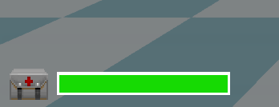
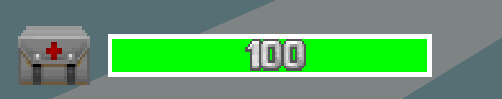

🟢 [<<< BACK TO START](README.md)

🔵 [<< Previous: Constants](14_Constants.md) 🔵 [>> Next: Appendix 1: Flow Control](17_HUD_and_statusbar.md)

------

*This chapter is a work-in-progress. To be revised/completed.*

# HUD and statusbar

- [Overview](#overview)
- [Creating a HUD](#creating-a-hud)
   * [Add the HUD in MAPINFO](#add-the-hud-in-mapinfo)
   * [Initialization](#initialization)
   * [Structuring Draw()](#structuring-draw)
      + [1. Super.Draw()](#1-superdraw)
      + [2. Check HUD state](#2-check-hud-state)
      + [3. Begin the HUD](#3-begin-the-hud)
      + [4. Start drawing](#4-start-drawing)
- [Drawing in the HUD](#drawing-in-the-hud)
   * [HUD element offsets](#hud-element-offsets)
      + [Statusbar offsets](#statusbar-offsets)
      + [Fullscreen offsets](#fullscreen-offsets)
         - [Text offsets](#text-offsets)
      + [HUD scaling](#hud-scaling)
      + [HUD aspect ratio](#hud-aspect-ratio)
   * [Drawing in the HUD](#drawing-in-the-hud-1)
      + [Setting up a font](#setting-up-a-font)
      + [DrawImage()](#drawimage)
      + [DrawTexture()](#drawtexture)
      + [DrawString()](#drawstring)
      + [DrawInventoryIcon()](#drawinventoryicon)
      + [Information functions](#information-functions)
      + [Force 1:1 aspect ratio without disabling UI scaling](#force-11-aspect-ratio-without-disabling-ui-scaling)
- [Making your first HUD from A to Z](#making-your-first-hud-from-a-to-z)
   * [Defining fonts to use in your HUD](#defining-fonts-to-use-in-your-hud)
   * [Drawing health and armor indicators](#drawing-health-and-armor-indicators)
   * [Colorizing health numbers](#colorizing-health-numbers)
   * [Colorizing armor numbers](#colorizing-armor-numbers)
   * [Drawing current ammo and weapon](#drawing-current-ammo-and-weapon)
   * [Colorizing ammo numbers](#colorizing-ammo-numbers)
   * [Drawing keys](#drawing-keys)
- [Advanced HUD systems](#advanced-hud-systems)
   * [Drawing all possessed ammo](#drawing-all-possessed-ammo)
   * [Multi-game compatibility](#multi-game-compatibility)
   * [Drawing inventory bar](#drawing-inventory-bar)
   * [Animated bars](#animated-bars)
   * [Animated graphic indicators](#animated-graphic-indicators)
   * [Smooth animation with delta time](#smooth-animation-with-delta-time)
         - [Explanation of delta time](#explanation-of-delta-time)
         - [Implementing delta time](#implementing-delta-time)
   * [Interpolated animation with fractional tics](#interpolated-animation-with-fractional-tics)
         - [Explanation of tic fraction](#explanation-of-tic-fraction)
         - [Implementing tic fraction](#implementing-tic-fraction)
		 
## Overview

A HUD (heads-up display) is various information displayed on the player's screen, such as health, armor and ammo reserves. The aiming reticle and the pop-up messages are also a part of the HUD.

HUDs exist in the [UI context](https://zdoom.org/wiki/Object_scopes_and_versions#Scoping_system), just like menus, which means they can read play-scope data but not modify it.

GZDoom supports 3 types of HUDs that can coexist and replaced: 

* Statusbar: usually the smallest HUD. GZDoom comes with a statusbar styled after the original Doom HUD that consists of a single graphic and some numbers drawn on top.

* Fullscreen: the typical fullscreen HUD. GZDoom's native fullscreen HUD doesn't have any sort of background, providing better visibility, and spread things on the screen (such as displaying keys in the top right corner).

* Alternative HUD: a special fullscreen HUD that is designed to override mod-specific HUDs. Uses custom scaling, so its size can't be used-controlled. A custom alt HUD *can* be defined in ZScript, however.

Note that statusbar and fullscreen HUDs are actually one HUD, just switching between different modes. If you create your own HUD, you're free to provide only one version of the HUD instead of two.

The alternative HUD, however, is a separate class that is drawn *on top* of the normal HUD. Properly defined regular and alt HUDs are designed in such a way that one of them simply stops displaying anything while the other is active, but they still exist at the same time.

## Creating a HUD

HUDs have to be based on the [BaseStatusBar](https://zdoom.org/wiki/Classes:BaseStatusBar) class (you can find its source [on GZDoom's Github](https://github.com/coelckers/gzdoom/blob/517e803b3e43dd88b54a66f26f3cce5b6137ca19/wadsrc/static/zscript/ui/statusbar/statusbar.zs#L105)). Despite the name, it's *not* just for statusbars, the fullscreen HUDs are also defined in it.

Alt HUD replacements, however, have to be based on the [AltHUD](https://zdoom.org/wiki/Classes:AltHUD) class. This class is generally not particularly flexible, and thus mods rarely use it or try to override Alt HUD.

If you only want to add minor changes to an existing HUD, you can inherit from one of the vanilla HUDs ([see GZDoom Github](https://github.com/coelckers/gzdoom/tree/master/wadsrc/static/zscript/ui/statusbar)), such as `DoomStatusBar`.

A HUD is a regular ZScript class, so there's nothing particularly special about its structure. Note that a HUD is *not* an actor, so it doesn't have properties or the Default block like actors do. What you need to do is override various virtual functions to add your own behavior to your HUD. The basic structure of a HUD looks like this:

```csharp
class MyCustomHUD : BaseStatusBar
{
    // As with all ZScript classes, here you can
    // declare class fields, constants and such.

    override void Init()
    {
        // This function is called once, when the
        // HUD is first created. Here you can
        // define various default values.
        // For example, HUD fonts are commonly
        // created here.
    }

    override void Draw(int state, double ticFrac)
    {
        // This is where you draw the things you can
        // see in the HUD. This function is called
        // every frame, so the frequency of its calls
        // depends on the player's framerate.
    }

    override void Tick()
    {
        // Similarly to actors, HUDs have this function,
        // and it's called every tic, i.e. 35 times per
        // second, regardless of framerate.
        // You can't draw anything here, but it's good
        // for things that need to happen on a fixed
        // timed basis.
    }
}
```

`Init()`, `Draw()` and `Tick()` are, of course, not all `BaseStatusBar`'s functions—you can find the full list and descriptions of the functions [on ZDoom wiki](https://zdoom.org/wiki/ZScript_virtual_functions#BaseStatusBar). Most important things will happen in `Draw()`, however.

### Add the HUD in MAPINFO

Technically, this should be done at the end of the whole thing, but I'll mention it right here just so it doesn't slip your attention: **HUDs need to be added via MAPINFO**. If you don't do that, you won't see your HUD.

There are 2 HUDs in the game that exist at the same time: the regular HUD and the alternative HUD. The latter gets drawn if the player enables the "Alternative HUD" option in GZDoom options menu. It's possible to replace only one of those or both, although arguably it's more common to only replace the base one and let the player use the classic alternative HUD if they desire.

In either case, you'll need to use [MAPINFO's Gameinfo block](https://zdoom.org/wiki/MAPINFO/GameInfo_definition) to add those HUDs as follows:

```csharp
Gameinfo
{
    StatusBarClass = "MyBaseHUD"
    AltHUDClass = "MyAltHUD"
}
```

...where "MyBaseHUD" and "MyAltHUD" are the actual class names of your HUD classes.

Note that GZDoom's alternative HUD can be enforced by the player if they set the `hud_althud_forceinternal` CVAR to `true`. 

Alternative HUD is a different type of HUD based on a different class: `AltHud` rather than `BaseStatusBar`. [GZDoom's alternative HUD](https://github.com/coelckers/gzdoom/blob/master/wadsrc/static/zscript/ui/statusbar/alt_hud.zs) is designed very differently from the classic HUD: it uses different scale and a bunch of custom functions for drawing. It's [documented on ZDoom Wiki](https://zdoom.org/wiki/Classes:AltHUD) but is rarely used for custom HUDs due to its fairly low flexibility. Most authors leave the players with an option to use AltHUD if they like. Note that both of these HUDs are drawn **at the same time**, and the base HUD has to explicitly stop drawing itself if AltHUD is enabled (this is covered further in the chapter).

### Initialization

The first virtual you need to deal with is `Init()`. It's called once, when the HUD is created (which is whenever the game is loaded) and is normally used to define various default values. 

### Structuring Draw()

There are several steps you need to take in order to properly draw things in your HUD.

#### 1. Super.Draw()

First, you *must* call `Super.Draw(state, ticFrac)` before doing anything anything custom. If you don't do that, the HUD will technically work, but a lot of things will be broken: messages won't display/disappear propertly, the crosshair's size won't increase when picking up items, and so on.

#### 2. Check HUD state

The second thing you need to do is check the value of `state`—it's the first argument of `Draw()`. `State` (not related to actor states) has the following values: `HUD_None`, `Hud_StatusBar`, `Hud_FullScreen` and `HUD_AltHud`.

Based on these values you'll need to decide what exactly to drawn since you can essentially have multiple variations of the same HUD. The basic idea is as follows:

* `HUD_None` — the HUD is disabled by the player (e.g. by pressing the + key on the keyboard twice). Normally with this state you don't want to draw anything, and you can simply call a `return` and stop everything there:

```csharp
override void Draw(int state, double TicFrac)
{
    super.Draw(state, TicFrac);
    if (state == HUD_None)
    {
        return;
    }

    // actual drawing stuff starts here
}
```

If you don't add this exception, the player won't be able to disable the HUD, it'll still be drawn even if they keep pressing +. There's no good reason to block this feature, so I don't recommend doing that.

* `HUD_StatusBar` — the player is using the minimal version of the HUD, aka the statusbar. In classic Doom this was the only existing HUD. In GZDoom statusbar is explicitly defined to only occupy the bottom part of the screen, 32 pixels tall (so, it's 200x32 by default). However, this state doesn't enforce any limitations by itself; it's up to you to decide what to do with it. You can draw a proper, classic-style statusbar, separate from the fullscreen HUD. You can also draw the same things for fullscreen and statusbar states, essentially merging them into one HUD. You can also just make two separate HUDs, or make them similar but make the "statusbar" one into a minimal version. 

* `HUD_FullScreen` — the player is using the fullscreen version of the HUD. This is arguably the most commonly used HUD nowadays and this is where you'll likely focus most of your efforts. 

* `HUD_AltHud` — the "Alternative HUD" option is enabled: the alternative HUD is being drawn. As mentioned earlier, the alternative HUD itself is a whole separate HUD class. What's important is that GZDoom doesn't switch between them; instead, when `state == HUD_AltHud`, the alternative HUD gets drawn *on top* of the base HUD, while the base HUD remains active. In other words, if you don't want the HUDs to overlap, you need to make sure that in this state your base HUD is not drawing anything (or only draws some specific elements that don't overlap the alternative HUD elements).

#### 3. Begin the HUD

After getting the `state` (or maybe even before it) you'll need to actually start the drawing process. Doing that requires calling one of the Begin* functions: `BeginHUD()` or `BeginStatusBar()`. These functions must be called before any of the actual drawing functions, such as `DrawImage()`. Let's take a look at them.

```csharp
void BeginStatusBar(bool forceScaled = false, int resW = -1, int resH = -1, int rel = -1)
```

`BeginStatusBar()` is used by the vanilla statusbar. This function defines a box area of specific size and places that box at the bottom center of the screen. The size of the box will adjust to screen size by default but it won't change its aspect ratio (e.g. a 320x200 box will always be 4:3, so with a wider screen you'll see a textured border at the sides).

What's also important is that `BeginStatusBar()` will move up the viewport: meaning, the whole image of what you can see in the game will be moved up to make space for the statusbar.

The arguments work as follows:

* `bool forceScaled` — if you pass `true`, the HUD will always be drawn at the same size, ignoring all scaling options (meaning, the player won't be able to scale the HUD using the "User interface scale" menu option). False by default.

* `int resW` — the width of the statusbar HUD box. The default value is `-1` which is interpreted as 320.

* `int resH` —the height of the statusbar HUD box. The default value is `-1` which is interpreted as 200.

* `int rel` — currently unused and shouldn't be modified (defaults to `-1`).

```csharp
void BeginHUD(double Alpha = 1., bool forcescaled = false, int resW = -1, int resH = -1)
```

`BeginHUD()` is normally used by the fullscreen HUD. In contrast to `BeginStatusBar()` it draws relative to screen corners (or center points of screen edges, if you prefer). This will give various drawing functions access to special flags that define relative positioning, which will guarantee your HUD will work in different aspect ratios (e.g. if you draw something in the bottom left corner, it'll be there both on 4:3 and all the way up to 21:9). This function also doesn't move the viewport.

The arguments are:

* `double Alpha` — the alpha of the HUD, lets you make it translucent. `1.0` by default (fully opaque).

* `bool forcescaled` — works the same way as with `BeginStatusBar()`: draws the HUD at a fixed resolution and disablesthe ability to scale it.

* `int resW` — the virtual width of the fullscreen HUD. The default value is `-1` which is interpreted as 320. Note, the HUD will still scale to match screen resolution and aspect ratio.

* `int resH` — the virtual height of the fullscreen HUD. The default value is `-1` which is interpreted as 200. Note, the HUD will still scale to match screen resolution and aspect ratio.

Which one you need is a matter of design. The vanilla Doom HUD uses both, calling `BeginStatusBar()` if the state is `HUD_StatusBar`, and `BeginHUD()` for `HUD_Fullscreen`:

```csharp
    override void Draw (int state, double TicFrac)
    {
        Super.Draw (state, TicFrac);

        if (state == HUD_StatusBar)
        {
            BeginStatusBar();
            DrawMainBar (TicFrac);
        }
        else if (state == HUD_Fullscreen)
        {
            BeginHUD();
            DrawFullScreenStuff ();
        }
    }
```

(See the full code on [GZDoom repository](https://github.com/coelckers/gzdoom/blob/master/wadsrc/static/zscript/ui/statusbar/doom_sbar.zs))

However, it's perfectly possible to only use `BeginHUD()` and then just manually decide what to draw based on the `state`. As mentioned in the previous point, your "statusbar" doesn't have to be a literal statusbar, it can be just some sort of a minimal HUD but drawn using the same methods as the fullscreen one.

#### 4. Start drawing

`BaseStatusBar` comes with [many functions](https://zdoom.org/wiki/Classes:BaseStatusBar#Non-static), but the ones you'll be using most of all are, arguably, `DrawString()`, `DrawImage()`, `DrawTexture()` and `DrawInventoryIcon()`. 

Note that often those functions are packed into other functions just for the sake of convenience. For example, if we look again at the `Draw()` call from DoomStatusBar:

```csharp
class MyHUD : BaseStatusBar
{
    override void Draw (int state, double TicFrac)
    {
        Super.Draw (state, TicFrac);

        if (state == HUD_StatusBar)
        {
            BeginStatusBar();
            DrawMainBar (TicFrac);
        }
        else if (state == HUD_Fullscreen)
        {
            BeginHUD();
            DrawFullScreenStuff ();
        }
    }

    void DrawMainbar(double TicFrac)
    {
        // custom code to draw something in statusbar mode
    }

    void DrawFullScreenStuff ()
    {
        // custom code to draw something in fullscreen
    }
}
```

The `DrawMainBar()` and `DrawFullScreenStuff()` functions are not drawing functions like `DrawImage()`; instead they're simple *custom* void functions added to better structure the drawing. You don't *have* to do it — there's nothing stopping you from shoving everything inside different code blocks in `Draw()` — but it's recommended to do something similar just to keep things more sensible. Of course, it's up to you how to structure and name those functions.

The actual drawing is covered in more detail in the next subchapter.

## Drawing in the HUD

Once your HUD class and `Draw()` are set up correctly, you can actually start drawing things, such as images, numbers, icons, bars, etc.

### HUD element offsets

First, let's talk about how elements (such as images, strings, etc.) are placed on the HUD. Note, for the examples we'll be using `DrawImage()`, which is the simplest `BaseStatusBar` function that is designed to draw images.

**All drawing functions have positions that define where the element will be drawn.** These positions are offsets from a certain drawing position (which by default is the top left corner of the screen). For example, `DrawImage()`'s second argument is the position/offsets (as a `vector2` value):

```csharp
DrawImage("MEDIA0", (0, 0));
```

This will draw a medikit sprite at the top left corner of the HUD area. The starting point of the offsets aka `(0, 0)`, is by default the top left corner. Positive X values will shift the point to the right, positive Y values shift it downwards — this is always true, regardless of the type of HUD and the use of offset-related flags.

As noted before, statusbar and fullscreen HUDs treat offsets differently. 

#### Statusbar offsets

Statusbar-type HUDs (prefaced with `BeginStatusBar()`) draw stuff in a box of specific size. Usually the elements are drawn with explicit offsets from the top left corner. For example, the Doom statusbar is drawn within a 320x200 box, and the bar graphic is drawn at `(0, 168)` since the bar is exactly 32 pixels tall, so it covers the 32 bottom pixels of the box (the graphic itself is drawn starting from its top-left corner). Elements drawn in that statusbar are offset relative to the statusbar area, which is what `BeginStatusBar()` sets.

When the user changes their HUD size using "User interface scale" GZDoom option, statusbars don't change their aspect ratio. For example, if you define a 320x200 statusbar but play on a 16:9 screen, you'll see empty space on the sides.

#### Fullscreen offsets

In contrast, fullscreen HUDs (prefaced with `BeginHUD()`) are drawn along the whole screen, so `(0, 0)` points to the top left corner of the *screen* (by default), not a specific area. The size of the fullscreen HUD specified through `BeginHUD()` only defines the virtual canvas initially allocated for the HUD elements but does *not* actually correspond to screen resolution or aspect ratio. For example, if you define a 320x200 fullscreen HUD, the 320x200 area should be basically treated as a guide to how much space you have for your elements, which means the graphic elements should be initially designed with a 320x200 canvas in mind; however, it does *not* correspond to how much space you will actually have available: even when it's scaled up to the screen size, the width will likely be above 320 and the height will be above 200 due to aspect ratio and screen size.

As such, explicit offsets like `(0, 168)`, **should never be used with fullscreen HUDs**. Instead, elements should be aligned against specific anchor points, such as screen corners and edges. This can be achieved with the use of the various `DI_SCREEN*` and `DI_ITEM*` flags. All of these flags can be seen can be found [in GZDoom GitHub repository](https://github.com/coelckers/gzdoom/blob/eb56eb380e5b35c9e1d4ba5323a4ec6a1dc0ae8c/wadsrc/static/zscript/engine/ui/statusbar/statusbarcore.zs#L27), but they're also documented on specific function pages on the wiki, for example [`DrawImage()`](https://zdoom.org/wiki/DrawImage_(BaseStatusBar)).

`DI_SCREEN*` flags define the starting point for the position coordinates. For example, `DI_SCREEN_LEFT_TOP` will define the left top corner as `(0, 0)`, while `DI_SCREEN_RIGHT_BOTTOM` will define right bottom as such. Note, it doesn't change the *direction* of the offsets: positive X is still down and positive Y is still right; it only changes the position of the starting point. This means that, if you use `DI_SCREEN_RIGHT_BOTTOM`, you basically have to use `(0, 0)` or negative values to go upward and leftward, since positive values will shift the element beyond the screen edges.

The flags can be combined using `|` to define both corner and edge offsets, e.g. `DI_SCREEN_LEFT|DI_SCREEN_TOP`. However, there are also pre-combined flags available, which are more commonly used (such as `DI_SCREEN_LEFT_TOP`); here's how they're positioned on the screen:


`DI_ITEM*` flags define where the HUD graphic itself will be placed relative to the specified coordinates. For example, with `DI_ITEM_LEFT_TOP` the anchor point will be placed at the top left corner of the image. Note, that **the graphic's own offsets are ignored when drawn on the HUD**, instead the `DI_ITEM*` flags define its relative position. This allows you to draw graphics on the screen, such as sprites, without worrying about their initial offsets.

Similarly to `DI_SCREEN*` flags, `DI_ITEM*` flags can be combined, but there are also some combinatory flags already available. Here's how they define anchor points of an element:


Combining `DI_SCREEN*` and `DI_ITEM*` flags, you can position graphics relative to screen corners, edges or center without worrying about the size of the image, or the screen. For example, let's say we want to draw a medikit sprite **at the center of the screen**:

```csharp
DrawImage("MEDIA0", (0,0), DI_SCREEN_CENTER);
```

Simply use `|` to append one of the `DI_ITEM*` flags, e.g.:

```csharp
DrawImage("MEDIA0", (0,0), DI_SCREEN_CENTER|DI_ITEM_LEFT_TOP);
```

The GIF below demonstrates how the different `DI_ITEM*` flags will move the image relative to its origin point (the origin is marked with a red circle):


To reiterate:

* The offsets (`(0, 0)` in this example) and the `DI_SCREEN*` flags define the *position of the origin point*.

* The `DI_ITEM*` flags define the *position of the image relative to the specified origin point*.

Using this knowledge, you can draw an image **at the top left corne**r:

```csharp
DrawImage("MEDIA0", (0,0), DI_SCREEN_LEFT_TOP|DI_ITEM_LEFT_TOP);
```


Conversely, if you need to place an element exactly **at the left *bottom* corner** and you don't want to worry about the size of the image or screen resolution, use this:

```csharp
DrawImage("MEDIA", (0,0), DI_SCREEN_LEFT_BOTTOM|DI_ITEM_LEFT_BOTTOM);
```


Note that in both cases we're using `(0, 0)` as offsets, meaning the image is drawn directly adjacent to the screen edges/corners. You can use offsets to adjust its relative position. For example, this will draw the Medikit sprite **at the bottom right corner, but 2 pixels away** from the bottom and the right edges:

```csharp
DrawImage("MEDIA", (-2,-2), DI_SCREEN_RIGHT_BOTTOM|DI_ITEM_RIGHT_BOTTOM);
```


Note that `DrawImage()` and most of the other drawing functions support their own scaling, sepate from the HUD size. For example, you can have a 320x200 HUD but draw the Medikit twice as large:

```csharp
DrawImage("MEDIA", (-2,-2), DI_SCREEN_RIGHT_BOTTOM|DI_ITEM_RIGHT_BOTTOM, scale: (2, 2));
```


As long as the flags are set up correctly, the image will remain at the same place but will change its size.

Note, scaling of a specific HUD element is unrelated to the HUD's own scale, which can be controlled by the user (explained below).

##### Text offsets

If you're drawing text or numbers, e.g. with `DrawString()`, `DI_ITEM*` flags are not applicable. Instead you'll need [DI_TEXT* flags](https://github.com/coelckers/gzdoom/blob/14fc2a011ed77cffc68f8599285e5228e03d9f01/wadsrc/static/zscript/engine/ui/statusbar/statusbarcore.zs#L75).

The principle is the same, except the only flags are `DI_TEXT_ALIGN_LEFT`, `DI_TEXT_ALIGN_RIGHT` and `DI_TEXT_ALIGN_CENTER`. By using them you'll define where the text is placed on the screen. For example:

```csharp
DrawString(mIndexFont, CPlayer.health, (0, 64), DI_SCREEN_CENTER|DI_TEXT_ALIGN_CENTER);
```

This will draw the player's current health 64 units under the center of the screen, with the text aligned to the center.

#### HUD scaling

By default the player can control the scale of their hud by using the -/= keyboard keys or the "User interface scale" menu option (found under *Options > HUD Options > Scaling Options*). 

For **statusbar HUDs**, the whole HUD area will be changed in size, and the elements in it will change their size with it.


> Left: x1UI scale. Right: x4 UI scale.

Since normally statusbars only include a single bar graphic at the bottom, it may seem like only that graphic changes. But in fact, the whole previously allocated area changes (relative to the bottom center of the screen), so if you put anything above the statusbar, it'll be moved as well.

For fullscreen HUDs, however, things are different. The area of a fullscreen HUD is always the whole screen and that fact doesnt change with the scaling. Instead, the visual size *and* position of every element is changed:


> Left: x1UI scale. Right: x4 UI scale. Note how the health and ammo indicators remain in the corners regardless of scale settings. Changing the resolution to a different aspect ratio will also not affect their placement.

As such, if you want to incorporate scaling properly, you once again must use the DI_SCREEN and DI_ITEM flags mentioned earlier, so that the elements of your HUD remain in the same relative places despite changing their size. As shown earlier, if you want to draw a Medikit sprite at the bottom left corner, use this:

```csharp
DrawImage("MEDIA", (0,0), DI_SCREEN_LEFT_BOTTOM|DI_ITEM_LEFT_BOTTOM);
```

With this the graphic will remain at the bottom left corner, regardless of UI scale.

However, if you define a 320x200 HUD and then try to achieve the same with explicit offsets like this:

```csharp
DrawImage("MEDIA", (0,292));
```

...this will break immediately when the player decides to use non-default UI scale, since the 292 position will be moved around relative to the scaling options. That's why using `DI_SCREEN*` and `DI_ITEM*` flags, as described in the previous section, is so important.

It is also possible to disable the option to scale the HUD completely by setting the `forceScaled` argument of the `BeginHUD()` and/or `BeginStatusBar()` to `true`, however, this basically robs the user of a feature they may find useful without a good reason, so I do not recommend doing that.

#### HUD aspect ratio

As you might know, [all of Doom graphics is vertically stretched by the factor of 1.2](https://zdoom.org/wiki/Aspect_ratio_correction). HUDs are not an exception: they are also vertically stretched by default. At the moment of writing this, the only way to disable that behavior for HUDs is to set the `forceScaled` argument of the `BeginHUD()` and/or `BeginStatusBar()` to `true`, however that also disables the ability for the user to change the size of the HUD, which is usually undesirable.

HUD aspect ratio is controlled by the `hud_aspectscale` console command: when set to true (default), the HUD graphics will be stretched.

Most of the time you don't need to worry about this, unles your HUD features circular elements, because those will be stretched or squished when the user switched to the other aspect ratio than the one the images were authored for.

### Drawing in the HUD

Finally, let's talk about how to draw things!

#### Setting up a font

If you're planning to draw text or numbers anywhere in the HUD, you'll first need to set up a HUD font. Fonts used by the HUD have to be cached to a field of the `HUDFont` type and created with the `HUDFont.Create()` function. But before that they also need to be obtained and cast to a `Font`-type variable.

This is normally done only once, in `Init()`:

```csharp
class MyHUD : BaseStatusBar
{
    // This will contain a reference to the font:
    HUDFont mIndexFont;

    override void Init()
    {
        super.Init();
        Font fnt = "Indexfont"; //obtain the font named "Indexfont"
        mIndexFont = HUDFont.Create(fnt); //create the font and cache it to mIndexFont
    }
}    
```

After this point you'll be able to use `mIndexFont` in functions like `DrawString()`. Note, the variable name, as usual, can be anything; I'm using `mIndexFont` as an example, since this is what is used in `DoomStatusBar`.

I should note that `HUDFont` is a whole separate class, whose purpose is to handle HUD fonts, and `Create()` is its only method. Among other things, `Create()` allows specifying monospaced fonts or defining custom spacing. The full list of arguments of this method goes like this:

```csharp
HUDFont.Create(Font fnt, int spacing = 0, bool monospaced = false, int shadowx = 0, int shadowy = 0)
```

You can find the documentation for this class [on ZDoom Wiki](https://zdoom.org/wiki/Classes:HUDFont).

#### DrawImage()

```csharp
native void DrawImage(String texture, Vector2 pos, int flags = 0, double Alpha = 1., Vector2 box = (-1, -1), Vector2 scale = (1, 1));
```

As you can see by the `native` keyword, this function is defined in C++. The arguments work as follows:

* `string texture` — the name of the texture. Despite being defined as a `string`, all graphic names are case-insensitive. Although the word "texture" is used, you can actually use any image here: textures, flats, graphics or sprites.

* `vector2 pos` — the position where the element will be drawn. See notes on the offsets above to learn how the position works with various offsets. Note that the graphic's offsets set via SLADE are ignored and do not affect its placement.

* `int flags` — a bit field for flags, such as `DI_SCREEN*` and `DI_ITEM*` flags.

* `double alpha` — the translucency of the element, from 0.0 to 1.0.

* `vector2 box` — allows defining a fixed-size area, and if the image's pixel dimensions are higher than it, it'll be automatically scaled to fit within that box. For example, if you use a 48x32 image but define the box argument as `(12, 12)`, the image will be scaled to fit 12x12 square (while still keeping its original aspect ratio). The default value is `(-1, -1)`, which means the box's size will be equal to the size of the image.

* `vector2 scale` — the individual scale of the element (independent from the general HUD scale); works pretty much like, for example, actor scale. Note, this is relative scale, e.g. at `(2, 2)` the element will appear x2 larger than it normally would.

#### DrawTexture()

```csharp
void DrawTexture(TextureID texture, Vector2 pos, int flags = 0, double Alpha = 1., Vector2 box = (-1, -1), Vector2 scale = (1, 1))
```

This function is largely identical to `DrawImage()`, with the exception of the first argument: instead of taking the name of a graphic as a `string`, it takes a `TextureID`-type argument. `TextureID` is a special [data type](07_Variables_and_data_types.md) that contains a reference to a texture, but not the actual texture name. TextureID can be obtained with the following syntax:

```csharp
TextureID tex = TexMan.CheckForTexture("BAL1A0"); // get a textureID for BAL1A0, the Imp's fireball graphic
```

The management of TextureID data type is relegated to a dedicated struct, [TexMan](https://zdoom.org/wiki/Structs:TexMan) (the name stands for "texture manager"). This struct contains methods to obtain a TextureID (`CheckForTexture()`), obtain a *name* of a texture for a given TextureID (`GetName()`), getting its size (`GetScaledSize()`) and others.

At the same time, TextureID is also [a separate struct](https://zdoom.org/wiki/Structs:TextureID) which defines methods for checking if an obtained texture is valid and existing. Primarily you will be using `IsValid()` to check that the TextureID you obtained is valid. `IsValid()` in that sense is an analog of `!= null` for class instances. E.g.:

```csharp
TextureID tex = TexMan.CheckForTexture("MYTEX");
// Only draw the texture if it's a valid texture:
if (tex.IsValid())
{
    DrawTexture(tex, (0, 0), DI_SCREEN_CENTER|DI_ITEM_CENTER);
}
```

#### DrawString()

```csharp
void DrawString(HUDFont font, String string, Vector2 pos, int flags = 0, int translation = Font.CR_UNTRANSLATED, double Alpha = 1., int wrapwidth = -1, int linespacing = 4, Vector2 scale = (1, 1))
```

This function draws a string of text. Note, it needs a HUDFont font to be set up before it can be used. The argumenst are:

* `HUDFont font` — pointer to a HUDFont instances you've created earlier with `HUDFont.Create()`.

* `String string` — the actual text to be displayed. Instead of writing the text literally, if you're using the [LANGUAGE lump](https://zdoom.org/wiki/LANGUAGE), you can pass `StringTable.Localize("$LANGUAGECODE")` to display the correct string as defined in LANGUAGE. You can also use various [String](https://zdoom.org/wiki/String) methods, such as `String.Format()` to format your string with numeric variables, color codes, etc.

* `Vector2 pos` — the position of the text element, just like in `DrawImage()`.

* `int flags` — a bit field for flags, such as `DI_TEXT_ALIGN_LEFT`, `DI_TEXT_ALIGN_RIGHT` and `DI_TEXT_ALIGN_CENTER` (determine how the text will be aligned relative to the specified position), as well as the DI_SCREEN* flags mentioned earlier.

* `int translation` — the color translation applied to the font. Note, this isn't a traditional color translation defined in the TRNSLATE lump, but rather a specific [Font color code](https://zdoom.org/wiki/Structs:Font#Font_colors), for example `Font.CR_Red`, `Font.CR_White`, etc. The default value, `Font.CR_UNTRANSLATED`, means the color of the font graphics will be used as is.

* `double alpha` — the translucency of the element, from 0.0 to 1.0.

* `int wrapwidth` — defines the length of the string in pixels at which it should wrap and start a new line. The default value is `-1` which disables wrapping.

* `int linespacing` — defines the spacing between lines if the text is wrapped.

* `vector2 scale` — the individual scale of the element (independent from the general HUD scale). Can be used to make the text appear larger or smaller relative to the size of its glyphs.

#### DrawInventoryIcon()

```csharp
void DrawInventoryIcon(Inventory item, Vector2 pos, int flags = 0, double alpha = 1.0, Vector2 boxsize = (-1, -1), Vector2 scale = (1.,1.))
```

This function is largely similar to `DrawImage()` but instead it takes a pointer to a specific `Inventory` class instance and obtains its icon. If the icon can't be found, it'll automatically try to obtain its Spawn state sprite, and it can optionally read Ready or Fire state sprites (which can be used for weapons), e.g.:

```csharp
let arm = CPlayer.mo.FindInventory("BasicArmor"); //a pointer to the class that handles armor
if (arm)
{
    DrawInventoryIcon(it, (0, 0), DI_SCREEN_RIGHT_BOTTOM|DI_ITEM_RIGHT_BOTTOM);
}
```

#### Information functions

`BaseStatusBar` defines many functions that can be used to retrieve various information. Some of them are:

* `int GetArmorAmount()` — returns the current amount of armor the player has.

* `int GetArmorSavePercent()` — returns the armor's `savepercent` value (damage absorption).

* `String GetWeaponTag()` — returns the select weapon's `Tag` property as a string (usually contains the weapon's name).

* `bool isInvulnerable()` — returns `true` if the player is currently invulnerable due to power-ups or other effects.

These are just some of the examples, but many more can be found on [ZDoom Wiki](https://zdoom.org/wiki/Classes:BaseStatusBar).

#### Force 1:1 aspect ratio without disabling UI scaling

If you're determined to create a HUD that supports UI scaling, yet looks identical regardless of aspect ratio, it's actually possible. You will have to check the value of the `hud_aspectscale` CVar and then divide Y position and Y size of all elements by 1.2 in order to counter aspect ratio changes. This can be achieved with a wrapper function. For example, for `DrawImage()` it'd look like this:

```csharp
// As with all constants, this constant can be 
// defined anywhere. It matches the default aspect
// correction value, which is 1.2:
const ASPECTBLOCK = 1.2;

// This wrapper function works just like DrawImage,
// except images drawn with it will always look as if
// 1:1 aspect ratio is used. It uses exactly the same
// arguments as the regular DrawImage():
void NoAspectDrawImage(String texture, Vector2 pos, int flags = 0, double Alpha = 1., Vector2 box = (-1, -1), Vector2 scale = (1, 1)) 
{
    // Check the value of the CVar (since it's a nosave CVar,
    // we can check its value directly, without CVar.GetCVar):
    if (hud_aspectscale == true) 
    {
        // If it's true, modify vertical scale and position
        // so it counteracts aspect scaling:
        scale.y /= ASPECTBLOCK;
        pos.y /= ASPECTBLOCK;
    }
    // Use the final values to draw the actual image:
    DrawImage(texture, pos, flags, Alpha, box, scale);
}
```

-----

## Making your first HUD from A to Z

Now, armed with all the knowledge above, let's make your first HUD! This section will cover the process step by step. The code for the *whole* HUD will be available with this guide, and you can find it [here](HUDguides/customHUD).

We'll focus on making a fullscreen HUD that contains all vital information and generally behaves similar to GZDoom's built-in fullscreen HUD. The HUD we'll make will display the following:

* Health and armor (with icons and colorized numbers)

* Selected weapon's ammo (with icons and colorized numbers)

* Possessed keys (in several rows/columns)

* All possessed ammo (not just for the selected weapon)

Let's start simple. First, we'll create a sample project with the following file and folder structure:

```
zscript.zs
MAPINFO.txt
MyScripts/
    hud.zs
```

In **zscript.zs** add:

```cs
version "4.14.0" //use your target minimum GZDoom version

#include "MyScripts/hud.zs"
```

In **MAPINFO.txt** add:

```json
GameInfo
{
    StatusBarClass = "MyFullscreenHUD"
}
```

Finally, go to the **MyScripts** folder and in **hud.zs** add an empty HUD:

```cs
class MyFullscreenHUD : BaseStatusBar
{
    override void Draw(int state, double TicFrac)
    {
        // Start with a super call:
        Super.Draw(state, TicFrac);

        // Don't draw anything if the HUD is disabled,
        // or if the Alternative HUD is used:
        if (state == HUD_None || state == HUD_AltHUD)
        {
            return;
        }

        // This is required before we can draw anything:
        BeginHUD();

        // We'll add our custom stuff here later.
    }
}
```

You can test this now: this HUD shows nothing because it doesn't call any drawing functions.

**Note:** for readability and to make sure we don't overlap with any variables or functions that are already defined in BaseStatusBar, we'll be prefixing *all* of our variables and functions with `my_` (you can use a different custom prefix, of course).

### Defining fonts to use in your HUD

First, we need to add a font, because we will, of course, need to draw things in the HUD. Doom comes with several fonts: SmallFont, NewSmallFont, ConsoleFont, NewConsoleFont and BigFont. Doom also supports BigUpper, which is a version of the classic Doom font that also supports lowercase letters (vanilla big font is uppercase-only). We'll be using BigFont here, so let's start by creating a HUDFont for BigFont.

To do this, we will need to define a new `HUDFont`-type field in our HUD, and then create a HUDFont object and store it in that field in the HUD's `Init()`.

In addition to that, we will have a separate `double`-type field which will store the font's height. We'll use it later to make sure icons placed next to text match its size, so trust me on this. Let's go:

```cs
class MyFullscreenHUD : BaseStatusBar
{
    HUDFont my_BigFont; // This will contain our hud font
    double my_BigFontHeight; // This will contain the font's height

    // This virtual is called once, when the HUD is
    // initalized:
    override void Init()
    {
        // Start with a super call, as usual:
        Super.Init();

        // Get a Font object for the font we
        // want to use:
        Font f = Font.FindFont('BigFont');
        // Now convert it into a HUDFont object,
        // which is a font that can be specifically
        // used in HUDs:
        if (f)
        {
            my_BigFont = HUDFont.Create(f); // Create a hud font
            my_BigFontHeight = f.GetHeight(); // Store our font's height into a separate field
        }
    }

    override void Draw(int state, double TicFrac)
    {
        Super.Draw(state, TicFrac);

        // Don't draw anything if the HUD is disabled,
        // or if the Alternative HUD is used:
        if (state == HUD_None || state == HUD_AltHUD)
        {
            return;
        }

        BeginHUD();

        // We'll add our custom stuff here later.
    }
}
```

Great, now we have a font that can be used by the `DrawString()` function—we'll just pass `my_BigFont` to it to draw text.

### Drawing health and armor indicators

Now we'll want to create a health and armor indicator. It'll consist of 4 elements: two icons (one for armor, one for health) and two numbers.

We'll add a separate function for each of our elements, so in this case we'll create a function named `My_DrawHealthArmor`. To make it flexible, we'll define a position argument and a flags argument in it, and we'll pass those to each of the elements.

Let's begin. Define this function anywhere inside your MyFullscreenHUD class:

```cs
void My_DrawHealthArmor(Vector2 pos, int flags)
{ }
```

And we'll also add it to the `Draw()` override. For now, we'll pass `(0, 0)` for position and `DI_SCREEN_LEFT_BOTTOM` to its arguments: we will want the elements to be drawn in the bottom left corner. Our HUD should look like this now:

```cs
class MyFullscreenHUD : BaseStatusBar
{
    HUDFont my_BigFont;
    double my_BigFontHeight;

    override void Init()
    {
        Super.Init();

        // Make font:
        Font f = Font.FindFont('BigFont');
        if (f)
        {
            my_BigFont = HUDFont.Create(f);
            my_BigFontHeight = f.GetHeight();
        }
    }

    override void Draw(int state, double TicFrac)
    {
        Super.Draw(state, TicFrac);
        if (state == HUD_None || state == HUD_AltHUD)
        {
            return;
        }
        BeginHUD();
        My_DrawHealthArmor((0, 0), DI_SCREEN_LEFT_BOTTOM);
    }

    void My_DrawHealthArmor(Vector2 pos, int flags)
    {
        // Does nothing (for now)
    }
}
```

At this point we want to draw a medikit icon—it'll serve as a health icon—and a number next to it. We'll use [`DrawImage()`](https://zdoom.org/wiki/DrawImage_(BaseStatusBar)) to draw the icon, and [`DrawString()`](https://zdoom.org/wiki/DrawString_(BaseStatusBar)) to draw the text.

But wait! How do we reconcile the size of the font with the size of the icon?

Don't worry. Remember that `my_BigFontHeight` field we defined earlier? We will use that and `DrawImage()`'s `box` argument to make sure the icon is made to fit into a box of specific size.

Let's begin by defining the size of the box and the position of the icon:

```cs
void My_DrawHealthArmor(Vector2 pos, int flags)
{
    // Define a Vector2 that stores the maximum size
    // of the health icon. This will be just font height X font height:
    Vector2 iconSize = (my_BigFontHeight, my_BigFontHeight);

    // Now, define the offsets from the base 'pos' at which
    // the icon will be drawn. We will draw the icon anchored
    // at its center, so its offsets will be half of its size:
    Vector2 iconOfs = (iconSize.x * 0.5, iconSize.y * -0.5);

    // ... 
```

You might wonder why the Y component of `iconOfs` is defined as `iconSize.y * -0.5`. Why negative? Well, remember how the positions work in a HUD (or in UI in general): **negative Y is *up*, positive Y is *down***. We are treating `pos` as the bottom left corner, and we're offseting the icon and the text to the *right* and *up* from it. Hence the offsets for the icon use positive X (right) and negative Y (up).

Okay, let's continue. Time to actually draw the icon:

```cs
void My_DrawHealthArmor(Vector2 pos, int flags)
{
    // Icon's target size (defined by font's height)
    Vector2 iconSize = (my_BigFontHeight, my_BigFontHeight);
    // Icon's offsets (50% of its width and height):
    Vector2 iconOfs = (iconSize.x * 0.5, iconSize.y * -0.5);

    DrawImage("MEDIA0", // Medikit icon
        pos + iconOfs, // Base position plus icon offsets as defined above
        flags|DI_ITEM_CENTER, // Base flags plus anchor image at its center
        box: iconSize // This will make sure the icon can't exceed given size
    );
```

Since `DrawImage()` has a lot of arguments, I'm splitting it into multiple lines, and the result goes like this:

* "MEDIA0" is the Doom's Medikit graphic we want to draw.
* The position at which the icon is drawn is defined as `pos + iconOfs`. `pos` is the base position, it's obtained from the functions's `pos` argument. `iconOfs` is what we defined earlier: it's 50% of the `iconSize` width and 50% of its height (negative, since we're moving upwards). We're using this, because we'll anchor the icon at its center (see next point).
* For `DrawImage()`'s flags we're using `flags|DI_ITEM_CENTER` — this passes flags as defined in the function's `flags` argument (in the example above we're passing `DI_SCREEN_LEFT_BOTTOM` there), and also adding `DI_ITEM_CENTER` to them so that the icon gets anchored at its center.
* Finally, we're passing `iconSize` to the function's `box` argument to determine the max size of the icon. Note the syntax: `box: iconSize`. In case you forgot, this is called a [named argument](https://zdoom.org/wiki/ZScript_named_arguments), and using this syntax we can pass the value to a specific argument (in this case the one called `box`), not worrying about the order of arguments, and not having to specify every single argument explicitly).

Here's visualization of what we're going for to help you get a better idea:


Before we move on, though, let's go ahead and add one important detail that can easily get overlooked: the Berserk icon. Fullscreen HUDs made for Doom normally replace the Medikit icon with a Berserk Pack icon while the player has the Berserk Pack. This is a simple change: first, check if the player has a PowerStrength in their inventory (this is the Powerup that handles the actual Berserk effect), and if so, instead of "MEDIA0" we'll draw "PSTRA0" (the Berserk sprite).

There are several ways we could structure this. For example:

```csharp
String hpIconName = "MEDIA0";
if (CPlayer.mo.FindInventory('PowerStrength'))
{
    hpIconName = "PSTRA0";
}
DrawImage(hpIconName,
    pos + iconOfs,
    flags|DI_ITEM_CENTER,
    box: iconSize
);
```

Or we could use a [ternary operator](A1_Flow_Control.md#logical-operators) inside the function itself:

```csharp
DrawImage(CPlayer.mo.FindInventory('PowerStrength')? "PSTRA0" : "MEDIA0",
    pos + iconOfs,
    flags|DI_ITEM_CENTER,
    box: iconSize
);
```

Awesome, but now we need to also draw the text next to it. How do we position it?

The horizontal offset is easy: we'll just use `pos.x + iconSize.x` so that the left side of the text begins at the right edge of the icon (you can optionally add a couple of pixels to it if you like). But the vertical positioning is a problem. Earlier in this chapter I said that the text drawn with `DrawString()` is always placed below the given position, but unfortunately, it's not *exactly* like that. Fonts' pixel size is a weird thing, where you can never exactly guess how the font is positioned, so usually it takes some eyeballing and guessing. For BigFont, which is what we're using, 75% of its height roughly takes it to the center, so that's what we'll use:

```cs
void My_DrawHealthArmor(Vector2 pos, int flags)
{
    // Define a Vector2 that stores the maximum size
    // of the health icon. This will be just font height X font height:
    Vector2 iconSize = (my_BigFontHeight, my_BigFontHeight);

    // Now, define the offsets from the base 'pos' at which
    // the icon will be drawn. We will draw the icon anchored
    // at its center, so its offsets will be half of its size:
    Vector2 iconOfs = (iconSize.x * 0.5, iconSize.y * -0.5);

    DrawImage(CPlayer.mo.FindInventory('PowerStrength')? "PSTRA0" : "MEDIA0",
        pos + iconOfs,
        flags|DI_ITEM_CENTER,
        box: iconSize
    );
    DrawString(my_BigFont, // Our BigFont HUDFont
        String.Format("%d", CPlayer.health), // Conver player's health to string
        pos + (iconSize.x, -my_BigFontHeight*0.75), // Add icon size to horizontal and 75% of font's height to vertical position
        flags
    );
}
```

Finally, let's integrate all of it into our HUD. I said that we want to draw it at `(0, 0)` at the lower left corner of the screen, but after taking a look I decided it's better to slightly offset it to the right, so we'll use `(4, 0)` instead:

```cs
class MyFullscreenHUD : BaseStatusBar
{
    HUDFont my_BigFont;
    double my_BigFontHeight;

    override void Init()
    {
        Super.Init();

        // Make font:
        Font f = Font.FindFont('BigFont');
        if (f)
        {
            my_BigFont = HUDFont.Create(f);
            my_BigFontHeight = f.GetHeight();
        }
    }

    override void Draw(int state, double TicFrac)
    {
        Super.Draw(state, TicFrac);
        if (state == HUD_None || state == HUD_AltHUD)
        {
            return;
        }

        BeginHUD();
        // Draw health and armor:
        My_DrawHealthArmor((4, 0), DI_SCREEN_LEFT_BOTTOM);
    }

    void My_DrawHealthArmor(Vector2 pos, int flags)
    {
        // Icon size:
        Vector2 iconSize = (my_BigFontHeight, my_BigFontHeight);
        // Icon offsets:
        Vector2 iconOfs = (iconSize.x * 0.5, iconSize.y * -0.5);

        // Draw health/Berserk icon:
        DrawImage(CPlayer.mo.FindInventory('PowerStrength')? "PSTRA0" : "MEDIA0",
            pos + iconOfs,
            flags|DI_ITEM_CENTER,
            box: iconSize
        );
        // Draw health text:
        DrawString(my_BigFont,
            String.Format("%d", CPlayer.health),
            pos + (iconSize.x, -my_BigFontHeight*0.75),
            flags
        );
    }
}
```

And with this we finally have a health display:


If you don't like that the numbers are smooshed very close to the icon, just add some offsets to it:

```cs
DrawString(my_BigFont,
    String.Format("%d", CPlayer.health),
    pos + (iconSize.x + 4, -my_BigFontHeight*0.75), // horizontal offsets is icon's width + 4 pixels
    flags
);
```

Great work! But now we need to draw armor.

We'll use the same function and just draw an armor icon and value above it.

We'll start by offsetting `pos` vertically because we want the icon to be drawn above health. Let's offset it so it's right above health, so we'll use `iconSize.y`:

```cs
void My_DrawHealthArmor(Vector2 pos, int flags)
{
    // Icon size:
    Vector2 iconSize = (my_BigFontHeight, my_BigFontHeight);
    // Icon offsets:
    Vector2 iconOfs = (iconSize.x * 0.5, iconSize.y * -0.5);

    // Draw health/Berserk icon:
    DrawImage(CPlayer.mo.FindInventory('PowerStrength')? "PSTRA0" : "MEDIA0",
        pos + iconOfs,
        flags|DI_ITEM_CENTER,
        box: iconSize
    );
    // Draw health text:
    DrawString(my_BigFont,
        String.Format("%d", CPlayer.health),
        pos + (iconSize.x + 4, -my_BigFontHeight*0.75),
        flags
    );

    pos.y -= iconSize.y; // Move the position up

    //...
}
```

Don't forget that to move *up* we use *negative* Y, hence `-=`, NOT `+=`.

Now, we'll need to get the current armor's icon. To do that you need to know how armor works in GZDoom, and it's like this:

* The player always has a [BasicArmor](https://zdoom.org/wiki/Classes:BasicArmor) item in their inventory, and it's the one that handles the actual armor.

* Whenever the player picks up an armor pickup or an armor bonus, those pickups modify that player's BasicArmor: they change its icon and amount. After that the *pickup* is removed, and BasicArmor is now updated with the new armor.

Since we need to read the armor's icon and amount, we'll need to [obtain a pointer](08_Pointers_and_casting.md) to it:

```cs
// Find BasicArmor in player's inventory:
let armr = BasicArmor(CPlayer.mo.FindInventory('BasicArmor', true));
// If there's no armor (for some reason), or there is
// but its amount is 0, stop here and do nothing else:
if (!armr || armr.amount <= 0) return;
```

Note that we're using `BasicArmor(CPlayer.mo.FindInventory('BasicArmor', true))` — we're looking for BasicArmor *and* items based on BasicArmor (using `true` for `FindInventory()`'s second argument lets it look for subclasses). This is important, because since GZDoom 4.13.0 it's now possible to use custom BasicArmor versions, but they'll still be based on the BasicArmor class, so we have to use subclass-sensitive search here.

After that we can use `DrawTexture()` to draw its icon, and `DrawString()` to draw its amount. **Note:** we're using `DrawTexture()`, NOT `DrawImage()`, because any item's `icon` is a TextureID, it's an itnernal identifier of a texture, it's not a name. In contrast, `DrawImage()` is a function that takes a graphic's *name* and then internally converts it to a TextureID to draw it. Since `icon` is already a TextureID, we just draw it with `DrawTexture()` directly. Other than that, this block is more or less identical to what we used for health:

```cs
// Draw armor icon:
DrawTexture(armr.icon, //the current armor's icon
    pos + iconOfs,
    flags|DI_ITEM_CENTER,
    box: iconSize
);
// Draw armor text:
DrawString(my_BigFont,
    String.Format("%d", armr.amount), //the current armor's amount
    pos + (iconSize.x + 4, -my_BigFontHeight*0.75),
    flags
);
```

And finally, let's take a look at our HUD again:

```cs
class MyFullscreenHUD : BaseStatusBar
{
    HUDFont my_BigFont;
    double my_BigFontHeight;

    override void Init()
    {
        Super.Init();

        // Make font:
        Font f = Font.FindFont('BigFont');
        if (f)
        {
            my_BigFont = HUDFont.Create(f);
            my_BigFontHeight = f.GetHeight();
        }
    }

    override void Draw(int state, double TicFrac)
    {
        Super.Draw(state, TicFrac);
        if (state == HUD_None || state == HUD_AltHUD)
        {
            return;
        }

        BeginHUD();
        // Draw health and armor:
        My_DrawHealthArmor((4, 0), DI_SCREEN_LEFT_BOTTOM);
    }

    void My_DrawHealthArmor(Vector2 pos, int flags)
    {
        // Icon size:
        Vector2 iconSize = (my_BigFontHeight, my_BigFontHeight);
        // Icon offsets:
        Vector2 iconOfs = (iconSize.x * 0.5, iconSize.y * -0.5);

        // Draw health/Berserk icon:
        DrawImage(CPlayer.mo.FindInventory('PowerStrength')? "PSTRA0" : "MEDIA0",
            pos + iconOfs,
            flags|DI_ITEM_CENTER,
            box: iconSize
        );
        // Draw health text:
        DrawString(my_BigFont,
            String.Format("%d", CPlayer.health),
            pos + (iconSize.x + 4, -my_BigFontHeight*0.75),
            flags
        );

        pos.y -= iconSize.y; // Move the base position up to draw armor

        // Find BasicArmor in player's inventory:
        let armr = BasicArmor(CPlayer.mo.FindInventory('BasicArmor', true));
        // If there's no armor (for some reason), or there is
        // but its amount is 0, stop here and do nothing else:
        if (!armr || armr.amount <= 0) return;

        // Draw armor icon:
        DrawTexture(armr.icon,
            pos + iconOfs,
            flags|DI_ITEM_CENTER,
            box: iconSize
        );
        // Draw armor text:
        DrawString(my_BigFont,
            String.Format("%d", armr.amount),
            pos + (iconSize.x + 4, -my_BigFontHeight*0.75),
            flags
        );
    }
}
```

You can test it in the game by finding or giving yourself some armor (e.g. with the `give all` console cheat):


### Colorizing health numbers

Usually health and armor numbers have colors. You can do that too: [`DrawString()`](https://zdoom.org/wiki/DrawString_(BaseStatusBar)), which we're using to draw the numbers, has an `int translation` argument which determines the color of the string. Note, text colors are not actual Color-type values (which can be given in RRGGBB format), but rather an `int` value that is associated with dedicated constants, such as `Font.CR_Red`, `Font.CR_White`, and others (you can see the full list [here on the wiki](https://zdoom.org/wiki/Structs:Font#Font_colors)). By default the color is set to `Font.CR_Untranslated`, which just uses the font's own color (and in case of the BigFont font that we're using, it's white).

So, how do we conditionally set that color?

Well, first, you will need to determine what logic you want to utilize, since usually it's an explicit value. A common approach would look something like this:

* 20 HP or below — red;

* 21–50 — orange;

* 51–75 — yellow;

* 76–100 — green;

* 101 HP or above — blue (or cyan).

Obviously, you can choose different colors and a different amount of ranges, but we'll use the above as an example. To handle health color conditions we'll create a simple separate function that returns an `int` for our HUD:

```cs
    int My_GetHealthColor(int health)
    {
        if (health <= 20)
        {
            return Font.CR_Red;
        }
        else if (health <= 50)
        {
            return Font.CR_Orange;
        }
        else if (health <= 75)
        {
            return Font.CR_Yellow;
        }
        else if (health <= 100)
        {
            return Font.CR_Green;
        }
        return Font.CR_Blue;
    }
```

And now we'll modify our `My_DrawHealthArmor` function to include the above function to get the color. The value of the function will be passed to `DrawString()`'s argument called `translation`—that's the font color (the name itself is kind of a misnomer, since it's not a traditional color translation).

```csharp
void My_DrawHealthArmor(Vector2 pos, int flags)
{
    // Icon size:
    Vector2 iconSize = (my_BigFontHeight, my_BigFontHeight);
    // Icon offsets:
    Vector2 iconOfs = (iconSize.x * 0.5, iconSize.y * -0.5);

    // Draw health/Berserk icon:
    DrawImage(CPlayer.mo.FindInventory('PowerStrength')? "PSTRA0" : "MEDIA0",
        pos + iconOfs,
        flags|DI_ITEM_CENTER,
        box: iconSize
    );
    // Draw health text:
    DrawString(my_BigFont,
        String.Format("%d", CPlayer.health),
        pos + (iconSize.x + 4, -my_BigFontHeight*0.75),
        flags,
        translation: My_GetHealthColor(CPlayer.health) //get font color from our new function
    );

    // continue to draw armor as usual; omitted for brevity
```

Boot into the game, and you'll see our health numbers are now colorized:


### Colorizing armor numbers

Okay, what about armor, then? Well, the approach is very simple, and technically, you could use the same ranges. However, in practice *traditionally* armor numbers are designed to reflect **armor absorption** rather than the **amount of armor**. You know how you can pick up blue armor and then, once you're damaged enough, its amount may fall below 100, but it's still a *blue* armor and offers higher absorption than green armor? Yeah, that's absorption, which is a separate value from amount.

Armor's absorption is stored in the BasicArmor's `savePercent` value. This is a `double` value in the 0.0–1.0 range. Alternatively, BaseStatusBar also comes with a dedicated function, `GetArmorAmount()`, which returns an `int` value in the 0–100 range, which is the percentage; you can use whichever works for you.

For this example, we'll be reading the `savePercent` field directly, because we're already obtaining a pointer to BasicArmor in `My_DrawHealthArmor()`. This means, that now we'll have to design a function that returns different font colors — much like `My_GetHealthColor()` we made earlier — but it'll take a `double` value in a 0.0–1.0 range.

Now, the question is, what colors we use and at what values. Again, this is up to you, but it's worth noting that Doom only comes with two armors: [GreenArmor](https://www.zdoom.org/wiki/Classes:GreenArmor), which has a savepercent of 33.335, and [BlueArmor](https://www.zdoom.org/wiki/Classes:BlueArmor), which has a savepercent of 50, so, those are the only two values worth checking for standard gameplay. As such, we could just do this:

```csharp
int My_GetArmorColor(double savepercent)
{
    // this will catch blue armor:
    if (savepercent >= 0.5)
    {
        return Font.CR_Blue;
    }
    // this will catch the rest (green armor);
    return Font.CR_Green;
}
```

But it might be worth extending it, if you want to account for gameplay mods which sometimes feature custom armors with custom savepercent values. So, perhaps it's worth checking for a few more conditions, just in case:

```csharp
int My_GetArmorColor(double savepercent)
{
    if (savepercent >= 0.8) //80% or more (doesn't exist in vanilla Doom)
    {
        return Font.CR_Red;
    }
    else if (savepercent >= 0.5) //50% or more (blue armor)
    {
        return Font.CR_Blue;
    }
    // this will catch the rest (including green armor);
    return Font.CR_Green;
}
```

Obviously, you can modify this to your needs. Now all we need is to modify our `My_DrawHealthArmor()` to include the above function into the part where we draw armor numbers. The whole function will now look like this (incorporating colorized health *and* armor numbers):

```csharp
void My_DrawHealthArmor(Vector2 pos, int flags)
{
    // Icon size:
    Vector2 iconSize = (my_BigFontHeight, my_BigFontHeight);
    // Icon offsets:
    Vector2 iconOfs = (iconSize.x * 0.5, iconSize.y * -0.5);

    // Draw health/Berserk icon:
    DrawImage(CPlayer.mo.FindInventory('PowerStrength')? "PSTRA0" : "MEDIA0",
        pos + iconOfs,
        flags|DI_ITEM_CENTER,
        box: iconSize
    );
    // Draw health text:
    DrawString(my_BigFont,
        String.Format("%d", CPlayer.health),
        pos + (iconSize.x + 4, -my_BigFontHeight*0.75),
        flags,
        translation: My_GetHealthColor(CPlayer.health) //colorize health numbers
    );

    pos.y -= iconSize.y;

    // Find BasicArmor in player's inventory:
    let armr = BasicArmor(CPlayer.mo.FindInventory('BasicArmor', true));
    // If there's no armor (for some reason), or there is
    // but its amount is 0, stop here and do nothing else:
    if (!armr || armr.amount <= 0) return;

    // Draw armor icon:
    DrawTexture(armr.icon,
        pos + iconOfs,
        flags|DI_ITEM_CENTER,
        box: iconSize
    );
    // Draw armor text:
    DrawString(my_BigFont,
        String.Format("%d", armr.amount),
        pos + (iconSize.x + 4, -my_BigFontHeight*0.75),
        flags,
        translation: My_GetArmorColor(armr.savepercent) //colorize armor numbers
    );
}
```

And here we go (full health and Blue Armor):


### Drawing current ammo and weapon

Now that we're finally done with health and armor display, we need to draw current ammo. This will be a separate element, and we'll draw it traditionally, in the **bottom right corner** of our HUD. Just like with `My_DrawHealthArmor()`, this will its own separate function:

```csharp
void My_DrawCurrentAmmo(Vector2 pos, int flags)
{
}
```

Now, the question is, what do we actually draw here? Obviously, current ammo, but there are many things we could draw:

* Ammo 1 amount for the current weapon

* Ammo 2 amount for the current weapon (many mods use multiple ammo types, and some vanilla games too, like Hexen)

* Ammo 1 icon

* Ammo 2 icon

* *Maximum* ammo amounts (for example, instead of just "25" we could display it as "25 / 100" (25 out of 100) for each ammo type.

* Optionally, the current weapon's icon.

For this example we'll skip the weapon icon, but we *will* draw both ammo types in the current / max format, *and* we'll draw their icons, too. This means, we'll need to draw 6 elements.

Since we're going to draw this element in the bottom *right* corner, our offsets will need to move right-to-left and upward—this means that both X and Y will be negative relative to the base `pos`.

The order of operations will also be slightly different. We'll be starting at the bottom-right corner of the element, but the things we draw will still need to be drawn left-to-right: icon, current amount, max amount. What's more, for cases when the weapon has two ammo types, we'll need to draw ammo 1 first, with ammo 2 below (in contrast to how we did health and armor, where health was below armor). As a result, we'll need to perform a number of pre-calculations here.

Our first step is getting pointers to the Ammo items used by the current weapon, and their amounts. BaseStatusBar has a dedicated function that does this — `GetCurrentAmmo()` — which returns 4 values: pointer to ammo 1, pointer to ammo 2, amount of ammo 1, amount of ammo 2. 

So, we'll start with this:

```csharp
void My_DrawCurrentAmmo(Vector2 pos, int flags)
{
    let [am1, am2, am1amt, am2amt] = GetCurrentAmmo();
    // Stop here if there's no current ammo
    // (which means we either don't have a weapon,
    // or the weapon uses no ammo):
    if (!am1 && !am2) return;

    // our actual code will be added here
}
```

Now that we have the beginning, we'll calculate the maximum ammo icon size and icon offsets just like we did with `My_DrawHealthArmor()`, basing it on BigFont's font height:

```csharp
        // Icon size and offsets:
        Vector2 iconSize = (my_BigFontHeight, my_BigFontHeight);        
```

Next, we need to move our position to the left and up to start drawing. The question is: by how much?

Well, first, let's figure out our mental template. It should look something like this:


`pos` is where we start, and we're going to move up and left to figure out the starting point for our draw calls.

The vertical height is easy: it's just going to be equal to two heights of the icon (or two heights of the font, which is the same thing, as we've calculated). The horizontal distance is going to be more difficult, though.

By far the *simplest* option is to just specify some kind of an explicit offset. And we can, of course, just do that, by basically guessing values that look okay. Let's add an offset of 128 units (negative, since we're going to the left of `pos`), and see how it looks:

```csharp
void My_DrawCurrentAmmo(Vector2 pos, int flags)
{
    let [am1, am2, am1amt, am2amt] = GetCurrentAmmo();
    // Stop here if there's no current ammo
    // (which means we either don't have a weapon,
    // or the weapon uses no ammo):
    if (!am1 && !am2) return;

    // Icon size and offsets:
    Vector2 iconSize = (my_BigFontHeight, my_BigFontHeight);
    // Offsets are positive on X and Y, since we're
    // now moving right and down:
    Vector2 iconOfs = (iconSize.x * 0.5, iconSize.y * 0.5);

    // Move left and up from the base position:
    pos -= (128, iconSize.y*2);
    // From here on, we're going to be moving right
    // and down, so the offsets will be directed that way.

    // Check if ammo 1 is valid:
    if (am1)
    {
        // Draw an icon:
        DrawTexture(am1.icon,
            pos + iconOfs,
            flags|DI_ITEM_CENTER,
            box: iconSize);
        // Draw the amounts, reading values
        // off the am1 pointer:
        DrawString(my_BigFont,
            String.Format("%d / %d", am1amt, am1.maxamount),
            // Offset the text horizontally by the icon's width,
            // and vertically by 25% of the height:
            pos + (iconsize.x, my_BigFontHeight*0.25),
            flags);
    }
    // Move down:
    pos.y += iconSize.y;
    // Draw ammo 2's icon and text the same way:
    if (am2)
    {
        DrawTexture(am2.icon,
            pos + iconOfs,
            flags|DI_ITEM_CENTER,
            box: iconSize);
        DrawString(my_BigFont,
            String.Format("%d / %d", am2amt, am2.maxamount),
            pos + (iconsize.x, my_BigFontHeight*0.25),
            flags);
    }
}
```

Now just make sure this function is called in our `Draw()` override, of course:

```csharp
override void Draw(int state, double TicFrac)
{
    Super.Draw(state, TicFrac);
    if (state == HUD_None || state == HUD_AltHUD)
    {
        return;
    }

    BeginHUD();
    // Draw health and armor:
    My_DrawHealthArmor((4, 0), DI_SCREEN_LEFT_BOTTOM);
    // Draw current ammo:
    My_DrawCurrentAmmo((-4, 0), DI_SCREEN_RIGHT_BOTTOM);
}
```

...and lets test it in the game (I'm using an example dummy weapon which uses two ammo types for demonstrative purposes):


It *works*, but objectively it's not great. Here are some things to consider:

* the `/` character doesn't align between two strings, which doesn't look that great;

* if the maximum amount of ammo is a 4-number figure (which is totally possible in gameplay mods), these numbers aren't gonna fit.

So, we're now going to use something a little more complex. Here are the steps we'll need to take:

1. Find which of the current ammo types (if there are two) has the *biggest* maximum amount.

2. Get the numeric length of that max amount (for example, if it's 600, its length will be 3).

3. We'll pad each ammo string with spaces using that length, so that they both have the same size — this will line them up horizontally.

4. We'll also calculate the *pixel width* of that "current / max" string, and use that pixel width to offset the starting point from `pos`.

But there's a problem: the font we set up is not monospaced, i.e. each character in that font has a different width. This makes string pixel width calculations imprecise, and makes it difficult to align things together. So, our first step here will be to make another version of the font, this time monospaced. We'll need to declare another `HUDFont`-type field and create a separate HUDFont version of the BigFont font:

```csharp
class MyFullscreenHUD : BaseStatusBar
{
    HUDFont my_BigFont;
    double my_BigFontHeight;
    HUDFont my_BigFontMono; //monospaced version of BigFont

    override void Init()
    {
        Super.Init();

        // Make font:
        Font f = Font.FindFont('BigFont');
        if (f)
        {
            // Create normal version:
            my_BigFont = HUDFont.Create(f);
            my_BigFontHeight = f.GetHeight();
            // Now create monospaced version, where every
            // character has the same width as the "0" character:
            my_BigFontMono = HUDFont.Create(f, f.GetCharWidth("0"), Mono_CellLeft);
        }
    }

    // the rest of the HUD code as usual
```

Now we can continue. We've already calculated `iconSize` and `iconOfs`. Next step:

```csharp
// Find out which of the current ammo types has the
// biggest maximum amount:
int biggestAmt = max (am1? am1.maxamount : 0, am2? am2.maxamount : 0);
// Now construct a dummy string using that max amount
// representing the structure of our final "current / max"
// string:
String dummyString = String.Format("%d/%d", biggestAmt, biggestAmt);
// And get the pixel width of that string with BigFont:
int ammoStringWidth = my_BigFontMono.mFont.GetCharWidth("0") * dummyString.Length();
```

You might be wondering about `GetCharWidth()`. This is a Font method that gets the pixel width of a given character. Since we defined this monospaced font to use the width of "0" as the base, we will get the width of the same character. One note though: this is a Font function, not a HUDFont function, so it can't be called on a HUDFont object directly. But this isn't a problem, because every HUDFont object has an `mFont` field which actually contains the Font object it was created from. Hence, `my_BigFontMono.mFont` gives us access to the font object, and we can call `GetCharWidth()` on it, to get the pixel width of the desired character in the BigFont font.

So, we get the maximum amount of the currently selected ammo (let's assume it's 600), construct a dummy string (in this example, "600/600") and get its pixel width.

Now we shift the *horizontal* position of the coordinates leftward by a combined width of the icon and the pixel width of the string:

```csharp
pos.x -= ammoStringWidth + iconSize.x;
```

Now we need to shift the vertical position up. By how much? Well, that's simple: we already checked if the current weapon is using ammo at all, now we need to check which ones. A weapon may use either only ammo 1, or only ammo 2, or both, so we'll perform a quick calculation:

```csharp
int ammoTypes;
if (am1) ammoTypes++;
if (am2) ammoTypes++;
```

And we'll shift the vertical position up by the vertical size of the icon multiplied by the number of types:

```cs
pos.y -= iconSize.y * ammoTypes;
```

One advantage of this method is, for example, if you're going to make a very custom weapon mod where your weapons may have more than 2 ammo types, you'll be able to easily extend this code and add any number here.

Now, don't forget, we'll also need to pad the string with spaces. We calculated the longest ammo amount earlier — `biggestAmt` — and we'll need to pad every ammo amount string to that length. For example, if the longest amount is 600, we'll want *all* displayed amounts to be padded to 3, so for example `45` will become ` 45`, and so on. So, calculate that padding by converting `biggestAmt` to a string and calling `Length()` on it:

```csharp
int padding = String.Format("%d", biggestAmt).Length();
```

At this point you might need to learn how padding works, if you don't know yet. For that, take a look at [this section of the wiki page on String methods](https://zdoom.org/wiki/String#Padding). Basically, `String.Format` allows you to pad strings with spaces to a given length. For example, `String.Format("%*d", padding, myInt)` will print the value of your integer `myInt` and pad it with `padding` number of spaces; e.g. if `myInt` is 45 and `padding` is 4, this expression will construct a string `"  45"` (two spaces and 45, padded to 4 characters in total). 

Finally, we can do the drawing.

```csharp
// Check if ammo 1 is valid:
if (am1)
{
    // Draw an icon:
    DrawTexture(am1.icon,
        pos + iconOfs,
        flags|DI_ITEM_CENTER,
        box: iconSize);
    // Draw the amounts, and pad them with spaces:
    DrawString(my_BigFontMono,
        String.Format("%*d/%*d", padding, am1amt, padding, am1.maxamount),
        // Offset the text horizontally by the icon's width,
        // and vertically by 25% of the font's height:
        pos + (iconsize.x, my_BigFontHeight*0.25),
        flags);

    // Shift the vertical position at the end,
    // in case ammo 2 also exists and will need
    // to be drawn after this:
    pos.y += iconSize.x;
}
// Draw ammo 2's icon and text the same way:
if (am2)
{
    DrawTexture(am2.icon,
        pos + iconOfs,
        flags|DI_ITEM_CENTER,
        box: iconSize);
    DrawString(my_BigFontMono,
        String.Format("%*d/%*d", padding, am2amt, padding, am2.maxamount),
        pos + (iconsize.x, my_BigFontHeight*0.25),
        flags);
}
```

Let's review the whole function:

```csharp
void My_DrawCurrentAmmo(Vector2 pos, int flags)
{
    let [am1, am2, am1amt, am2amt] = GetCurrentAmmo();
    // Stop here if there's no current ammo:
    if (!am1 && !am2) return;

    // Icon size and offsets:
    Vector2 iconSize = (my_BigFontHeight, my_BigFontHeight);
    Vector2 iconOfs = (iconSize.x * 0.5, iconSize.y * 0.5);

    // Find out which of the current ammo types has the
    // biggest maximum amount:
    int biggestAmt = max (am1? am1.maxamount : 0, am2? am2.maxamount : 0);
    // Construct a dummy "current/max" string using that amount:
    String dummyString = String.Format("%d/%d", biggestAmt, biggestAmt);
    // And get that string's pixel width in our font:
    int ammoStringWidth = my_BigFontMono.mFont.GetCharWidth("0") * dummyString.Length();
    // Shift draw position left by ammo string width + icon width:
    pos.x -= ammoStringWidth + iconSize.x;

    // Check how many ammo types we have:
    int ammoTypes;
    if (am1) ammoTypes++;
    if (am2) ammoTypes++;
    // Shift draw position up by icon height multiplied by ammo types:
    pos.y -= iconSize.y * ammoTypes;

    // Calculate how much we'll need to pad strings based
    // on the length of the largest amount string:
    int padding = String.Format("%d", biggestAmt).Length();

    // Check if ammo 1 is valid:
    if (am1)
    {
        // Draw an icon:
        DrawTexture(am1.icon,
            pos + iconOfs,
            flags|DI_ITEM_CENTER,
            box: iconSize);
        // Draw the amounts, and pad them with spaces:
        DrawString(my_BigFontMono,
            String.Format("%*d/%*d", padding, am1amt, padding, am1.maxamount),
            pos + (iconsize.x, my_BigFontHeight*0.25),
            flags);

        // Shift vertical position for the next ammo type:
        pos.y += iconSize.x;
    }
    // Draw ammo 2's icon and text the same way:
    if (am2)
    {
        DrawTexture(am2.icon,
            pos + iconOfs,
            flags|DI_ITEM_CENTER,
            box: iconSize);
        DrawString(my_BigFontMono,
            String.Format("%*d/%*d", padding, am2amt, padding, am2.maxamount),
            pos + (iconsize.x, my_BigFontHeight*0.25),
            flags);
    }
}
```

Just like before, don't forget to make sure it's actually present in your `Draw()` override:

```cs
    override void Draw(int state, double TicFrac)
    {
        Super.Draw(state, TicFrac);
        if (state == HUD_None || state == HUD_AltHUD)
        {
            return;
        }

        BeginHUD();
        // Draw health and armor:
        My_DrawHealthArmor((4, 0), DI_SCREEN_LEFT_BOTTOM);
        // Draw current ammo:
        // (we'll push it a little to the left so it's not
        // completely flush with the screen's edge):
        My_DrawCurrentAmmo((-4, 0), DI_SCREEN_RIGHT_BOTTOM);
    }
```

Let's take a look at it in the game:


Success!

### Colorizing ammo numbers

Just like with health and armor numbers earlier, you might want to colorize your ammo numbers. However, this is a little more complex with the approach we've chosen, because the `translation` parameter of `DrawString()` applies to the *whole* string, and you *probably* want to colorize the current and the max amounts separately. Inline string colorization can only be done with `\c` color codes as described [here on the wiki](https://zdoom.org/wiki/String#Colorization).

Thankfully, these color codes can be added to the string dynamically, using `String.Format()`. So, first, we'll need to make a function that returns a color code. We'll make this function so it takes amount and maximum amount as input values, and then returns one of the colors based on the ratio of amount to maxamount:

```csharp
// Amount and maxamount will be the function's
// input values:
String My_GetAmmoColorCode(int amount, int maxamount)
{
    // half or more:
    if (amount >= maxamount*0.5)
    {
        return "\cd"; //green
    }
    // quarter or more:
    else if (amount >= maxamount*0.25)
    {
        return "\ck"; //yellow
    }
    // less than a quarter but more than 0:
    else if (amount > 0)
    {
        return "\cg"; //red
    }
    // 0 ammo left:
    return "\cr"; //dark red
}
```

Now, let's take a look at how we've been printing the ammo amount strings so far:

```csharp
String.Format("%*d/%*d", padding, am1amt, padding, am1.maxamount)
```

This will output something like "475/600" if `am1amt` is 475 and `am1.maxamount` is 600. Now we want to colorize this. I want to colorize only the first part; then I want to make the `/` character dark-gray, and the maxamount (which is a fixed value) — gray.

We'll be using the following expression:

```csharp
String.Format("%s%*d\cu/\cc%*d", My_GetAmmoColorCode(am1amt, am1.maxamount), padding, am1amt, padding, am1.maxamount),
```

Here's what's happening:

* the first color code is `%s`, which pulls a string from `My_GetAmmoColorCode(am1amt, am1.maxamount)` — this `%s` will get converted into our color code, such as `\ck`, `\cg` and so on;

* it's followed by `%*d` which is our number (`am1amt`) padded to the `padding` number of spaces (just like we already did before);

* then `\cu/` prints a "/" character, colored dark-gray;

* then `\cc` sets color to gray;

* and it's followed by `%*d` which is our second number (`am1.maxamount`) padded to `padding` number of spaces.

We'll use the same format for the second ammo string. Here's how our ammo drawing function looks now:

```csharp
void My_DrawCurrentAmmo(Vector2 pos, int flags)
{
    let [am1, am2, am1amt, am2amt] = GetCurrentAmmo();
    // Stop here if there's no current ammo:
    if (!am1 && !am2) return;

    // Icon size and offsets:
    Vector2 iconSize = (my_BigFontHeight, my_BigFontHeight);
    Vector2 iconOfs = (iconSize.x * 0.5, iconSize.y * 0.5);

    // Find out which of the current ammo types has the
    // biggest maximum amount:
    int biggestAmt = max (am1? am1.maxamount : 0, am2? am2.maxamount : 0);
    // Construct a dummy "current/max" string using that amount:
    String dummyString = String.Format("%d/%d", biggestAmt, biggestAmt);
    // And get that string's pixel width in our font:
    int ammoStringWidth = my_BigFontMono.mFont.GetCharWidth("0") * dummyString.Length();
    // Shift draw position left by ammo string width + icon width:
    pos.x -= ammoStringWidth + iconSize.x;

    // Check how many ammo types we have:
    int ammoTypes;
    if (am1) ammoTypes++;
    if (am2) ammoTypes++;
    // Shift draw position up by icon height multiplied by ammo types:
    pos.y -= iconSize.y * ammoTypes;

    // Calculate how much we'll need to pad strings based
    // on the length of the largest amount string:
    int padding = String.Format("%d", biggestAmt).Length();

    // Check if ammo 1 is valid:
    if (am1)
    {
        // Draw an icon:
        DrawTexture(am1.icon,
            pos + iconOfs,
            flags|DI_ITEM_CENTER,
            box: iconSize);
        // Draw the amounts, colorized and padded:
        DrawString(my_BigFontMono,
            String.Format("%s%*d\cu/\cc%*d", My_GetAmmoColorCode(am1amt, am1.maxamount), padding, am1amt, padding, am1.maxamount),
            pos + (iconsize.x, my_BigFontHeight*0.25),
            flags);

        // Shift vertical position for the next ammo type:
        pos.y += iconSize.x;
    }
    // Draw ammo 2's icon and text the same way:
    if (am2)
    {
        DrawTexture(am2.icon,
            pos + iconOfs,
            flags|DI_ITEM_CENTER,
            box: iconSize);
        // Draw the amounts, colorized and padded:
        DrawString(my_BigFontMono,
            String.Format("%s%*d\cu/\cc%*d", My_GetAmmoColorCode(am2amt, am2.maxamount), padding, am2amt, padding, am2.maxamount),
            pos + (iconsize.x, my_BigFontHeight*0.25),
            flags);
    }
}
```

And here are the results in-game:


### Drawing keys

It's very important to remember that you need to draw keys in your HUD. Doing this is easy, we'll mostly be using BaseStatusBar's [`DrawInventoryIcon()`](https://zdoom.org/wiki/DrawInventoryIcon) function. However, there are a couple of rules here. The [Key class](https://zdoom.org/wiki/Classes:Key) comes with a couple of special functions that you will need to utilize here:

* `Key.GetKeyTypeCount()` returns the total number of valid keys defined for the current game.

* `Key.GetKeyType(int index)` returns a `class<Key>` (class type) at a given internal index — the total number of those indexes is obtainde with the aforementioned `Key.GetKeyTypeCount()`.

As such, to obtain the list of valid keys, you will need a FOR loop (see [Flow Control](A1_Flow_Control.md)), where you will obtain each key class one by one, and then check if the player has that key with `CPlayer.mo.FindInventory()`.

We'll define the function as follows:

```csharp
void My_DrawKeys(Vector2 pos, int flags, Vector2 iconSize, int indent = 0)
```

It'll have arguments for position and flags, like our other functions, but I also decided to define `iconSize` and `indent` as the function's argument. `iconSize`, similarly to our previous functions, will define the maximum size of the icon, and `indent` will determine how many empty pixels there will be between the icons horizontally and vertically, so they're not completely smushed together.

Now, here's the function itself:

```csharp
void My_DrawKeys(Vector2 pos, int flags, Vector2 iconSize, int indent = 0)
{
    // We'll draw key icons from the center, so, as with our previous functions,
    // 'iconOfs' will store the offset we'll draw the icon at, relative to
    // the current draw position — which is half of the icon's size:
    Vector2 iconOfs = iconSize*0.5;
    // We'll track the current column separately, starting at 1:
    int column = 1;
    // 'kpos' will hold the position to draw the icon at. Initial position is
    // same as 'pos':
    Vector2 kpos = pos;
    // Now the actual loop where we start drawing things:
    for (int i = 0; i < Key.GetKeyTypeCount(); i++)
    {
        // This obtains the key class in the list of valid keys:
        class<Key> keyclass = Key.GetKeyType(i);
        // Now try finding that key in player's inventory:
        let k = CPlayer.mo.FindInventory(keyclass);
        // If found, draw its icon:
        if (k)
        {
            DrawInventoryIcon(k, kpos + iconOfs, flags|DI_ITEM_CENTER, boxSize: iconSize);
        }
        // Now handle rows and columns.
        // If we're still at column 1 or 2, just move the horizontal drawing
        // position to the left, and increment 'column':
        if (column < 3)
        {
            kpos.x += iconSize.x + indent;
            column++;
        }
        // Otherwise (we've reached column 3), reset horizontal drawing position
        // and move vertical drawing position down, thus starting the next row;
        // also reset 'column' to 1 since we're back at 1st column:
        else
        {
            kpos.x = pos.x;
            kpos.y += iconSize.y + indent;
            column = 1;
        }
    }
}
```

We'll go ahead and add it to our `Draw()` override:

```csharp
override void Draw(int state, double TicFrac)
{
    Super.Draw(state, TicFrac);
    if (state == HUD_None || state == HUD_AltHUD)
    {
        return;
    }

    BeginHUD();
    // Draw health and armor:
    My_DrawHealthArmor((4, 0), DI_SCREEN_LEFT_BOTTOM);
    // Draw current ammo:
    My_DrawCurrentAmmo((-4, 0), DI_SCREEN_RIGHT_BOTTOM);
    // Draw keys:
    My_DrawKeys((-(8 + 2)*3, 0), DI_SCREEN_RIGHT_TOP, (8, 8), 2);
}
```

This will draw the keys in the top left corner, each key will have a 8x8 icon and 2 pixels of indentation between them. Note that we're defining the X component of `pos` as `-(8 + 2)*3` — this is because we'll draw the keys in 3 columns, and since each column with have an icon 8 pixels wide and 2 pixels of indent, this is how much we need to shift `pos.x` to the left to make them all fit.

If you launch the game now and get all the keys, you'll see this in the top right corner:


And here's what you'll see if you only have blue keycard and yellow skull key:


Key positions are always the same, the missing keys are represented by empty spaces — like in GZDoom's own fullscreen HUD.

Overall, this works fine, but it's worth noting that if you're making a HUD for something other than Doom, in some games keys don't actually have icons — for example, in Heretic. In this case you can use their Spawn sprite instead.  This also has another benefit: sprites have higher resolution that most icons, which you might prefer.

There are several ways to do it, but the simplest one is to use BaseStatusBar's [`GetInventoryIcon()`](https://zdoom.org/wiki/GetInventoryIcon) function and explicitly tell it to skip the icon; in this case it'll try obtaining the Spawn sprite instead.

The changes to the function are minimal: we'll just need to call `GetInventoryIcon()`, and we'll use `DrawTextre()` instead of `DrawInventoryIcon()`:

```csharp
void My_DrawKeys(Vector2 pos, int flags, Vector2 iconSize, int indent = 0)
{
    Vector2 kpos = pos;
    Vector2 iconOfs = iconSize*0.5;
    int column = 1;
    for (int i = 0; i < Key.GetKeyTypeCount(); i++)
    {
        class<Key> keyclass = Key.GetKeyType(i);
        let k = CPlayer.mo.FindInventory(keyclass);
        // check if player has this key:
        if (k)
        {
            // If so, obtain its sprite (skip the icon):
            TextureID tex = GetInventoryIcon(k, DI_SKIPICON);
            // And draw that sprite:
            DrawTexture(tex, kpos + iconOfs, flags|DI_ITEM_CENTER, box: iconSize);
        }
        if (column < 3)
        {
            kpos.x += iconSize.x + indent;
            column++;
        }
        else
        {
            kpos.x = pos.x;
            kpos.y += iconSize.y + indent;
            column = 1;
        }
    }
}
```

Considering sprites are rather big, I'll also change how this function is called in `Draw()`  to use bigger icon size:

```csharp
override void Draw(int state, double TicFrac)
{
    Super.Draw(state, TicFrac);
    if (state == HUD_None || state == HUD_AltHUD)
    {
        return;
    }

    BeginHUD();
    // Draw health and armor:
    My_DrawHealthArmor((4, 0), DI_SCREEN_LEFT_BOTTOM);
    // Draw current ammo:
    My_DrawCurrentAmmo((-4, 0), DI_SCREEN_RIGHT_BOTTOM);
    // Draw keys:
    My_DrawKeys((-(12 + 1)*3, 0), DI_SCREEN_RIGHT_TOP, (12, 12), 1);
}
```

We're now using 12x12 icons with 1px of indentation. Here's how it'll look in the game:


## Advanced HUD systems

In this subsection we'll cover some slightly more advanced HUD systems that you may want to add but aren't necessarily an obligatory part of the HUD.

### Drawing all possessed ammo

You might've used GZDoom's Alternative HUD: it's a fullscreen-only HUD that is based on the [AltHUD class](https://zdoom.org/wiki/Classes:AltHUD) (not BaseStatusBar) and uses [Screen struct methods](https://zdoom.org/wiki/Structs:Screen) to draw things. Among others, it has one neat feature where it'll draw *all* ammo currently in player's possession, not just ammo they currently have. How would we add this neat feature?

Well, the basics will be vaguely similar to the `My_DrawCurrentAmmo()` function we designed earlier, but a lot of it will work differently. While we could just iterate over player's inventory and find all items based on the Ammo class, the main trick here is that this "all ammo" element in AltHUD orders ammo according to the *order of weapons slots*. If you just iterate over player's inventory, items will be oredered there in the order they were picked up, which doesn't look very good.

Hence, here's what we'll need to do:

* First, iterate over weapon *slots* for our player, and find what weapon classes are assigned to those slots. Slots are handled through a special struct, [WeaponSlots](https://zdoom.org/wiki/Structs:WeaponSlots), and one is always attached to every PlayerInfo. From a HUD, you can access it via the `CPlayer.weapons` pointer (the name might be weird, but that's the pointer we need).

* The aforementioned WeaponSlots struct has two special functions we'll need to use:
  
  * `SlotSize(int slot)` takes an index (i.e. slot, like 1) and returns how many weapons are assigned to this slot. Remember, GZDoom and the games it supports allow assigning multiple weapons to the same slot.
  
  * `GetWeapon(int slot, int index)` — this one takes a slot *and* its index and returns `class<Weapon>` — the Weapon class associated with this slot and this index. Index is for cases when there are multiple weapons assigned to a slot; each will have a sub-slot index. For example, in Doom SuperShotgun will have index 0, and Shotgun will have index 1, but noth willl have slot 3.

* We'll need to declare a separate [array](13_Arrays.md) of Ammo classes. When we iterate over weapon slots, we'll find the weapons, and then the ammo classes they use, and add those ammo classes into the array. Normally this can be done once, since slots can't be reassigned dynamically.

* Once that array is non-empty, we iterate over it and just draw icons and amounts for every ammo class.

Let's get to work. We'll separate this behavior into two functions: one will handle drawing, the other will retrieve information. Start by declaring a `class<Ammo>`-type array as a new field of our HUD:

```csharp
class MyFullscreenHUD : BaseStatusBar
{
    array< class<Ammo> > my_ammoToDisplay;
    // the rest of the hud
```

Now we'll create our functions. They will be structured as follows:

```csharp
// This will retrieve information about ammo classes
// associated with the weapons in the player's slots:
void My_UpdateAmmoClasses()
{
    // If the array is already non-empty, we should be done,
    // so stop here:
    if (my_ammoToDisplay.Size() > 0) return;

    // The data retrieval code will be here
}

// This will handle drawing. Similar to our previous functions,
// we're declaring arguments for position, flags, and icon size:
void My_DrawAllAmmo(Vector2 pos, int flags, Vector2 iconSize)
{
    // First, check if the player has ANY items based on the
    // Ammo class (second argument is true, which makes the
    // check inheritance-sensitive). If they have no ammo,
    // we don't need to do anything, so stop here:
    if (!CPlayer.mo.FindInventory('Ammo', true)) return;
    // At this point, we unconditionally call a function
    // to update ammo class information:
    My_UpdateAmmoClasses();
    // If after retrieving data for some reason the array is
    // still empty (this shouldn't happen, but who knows),
    // do nothing and stop here:
    if (my_ammoToDisplay.Size() == 0) return;

    // The actual drawing will happen here
}
```

This is our overall structure. Now, let's get into the nitty-gritty of the functions themselves.

Before we do that, one important note about slots. Slots are like an array, their indexes go from 0 to 9 — since this is how many numeric buttons we have to assign weapons to. HOWEVER, note that on the keyboard button 0 goes *after* 9, while button 1 is the first one. So, we will not be iterating from 0 to 9; we will be iterating in the order of 1, 2, 3, 4, 5, 6, 7, 8, 9, 0. I.e. 0 is at the end. This requires a few extra conditions.

Now, let's look at our data retrieval function:

```csharp
void My_UpdateAmmoClasses()
{
    if (my_ammoToDisplay.Size() > 0) return;

    // Get a pointer to the WeaponSlots struct associated
    // with our player's PlayerInfo:
    let weapSlots = CPlayer.weapons;

    // Start iterating over the slots:
    for (int slot = 1; slot <= 10; slot++)
    {
        // Remember, there's no slot 10. The slot that is 10th
        // in order has an index 0, so, if we reached 10, reassign
        // it to 0:
        if (slot == 10) slot = 0;

        // Get how many weapons are in the slot:
        int slotSize = weapSlots.SlotSize(slot);
        // If there are no weapons in this slot...
        if (slotSize <= 0)
        {
            // ...and this is the last slot, stop here.
            if (slot == 0)
            {
                break;
            }
            // ...and this isn't the last slot, skip
            // and continue to the next slot:
            else
            {
                continue;
            }
        }

        // We know there are weapons in this slot. Now,
        // iterate over all weapons assigned to it:
        for (int slotId = 0; slotId < slotSize; slotId++)
        {
            // Get the weapon class at this slot and this index:
            class<Weapon> weapCls = weapSlots.GetWeapon(slot, slotId);
            // Check it's a valid class:
            if (weapCls)
            {
                // Declare local varaiables am1cls and am2cls; we'll
                // store ammo classes for ammo 1 and ammo 2 in them:
                class<Ammo> am1cls, am2cls;
                // First, try finding the weapon in player's inventory:
                let weap = Weapon(CPlayer.mo.FindInventory(weapcls));
                // If found, store its ammo types in previously declared
                // variables:
                if (weap)
                {
                    am1cls = weap.ammotype1;
                    am2cls = weap.ammotype2;
                }
                // If the player doesn't have this weapon (but they may have
                // ammo for it), instead find the default definition for this
                // weapon class, and read ammo types as defined by default:
                else
                {
                    let weapDef = GetDefaultByType(weapcls);
                    am1cls = weapDef.ammotype1;
                    am2cls = weapDef.ammotype2;
                }
                // If ammo type 1 exists and isn't yet present in the array
                // of ammo classes, add it there:
                if (am1cls && my_ammoToDisplay.Find(am1cls) == my_ammoToDisplay.Size())
                {
                    my_ammoToDisplay.Push(am1cls);
                }
                // Similarly, if ammo type 2 exists, is not the same as ammo
                // type 1, and isn't yet present in the array, add it there:
                if (am2cls && am2cls != am1cls && my_ammoToDisplay.Find(am2cls) == my_ammoToDisplay.Size())
                {
                    my_ammoToDisplay.Push(am2cls);
                }
            }
        }
        // If this was the last slot (the 10th slot, which we remapped
        // to 0), stop the FOR loop here, otherwise it'll loop forever:
        if (slot == 0)
        {
            break;
        }
    }
}
```

This may seem like a lot, but indeed, this is the method to obtain the data we need. In case you need a refresher, here are some extra notes:

* The ammo a weapon uses can actually be changed dynamically, at runtime. While this isn't used too often, it's totally possible, and some gameplay mods do utilize this (for example, letting the player swap ammo used by a certain weapon, like a shotgun that cycles between shells, slugs, etc.). That's why we need to try reading ammo types off a weapon *instance* in player's inventory first (hence `let weap = Weapon(CPlayer.mo.FindInventory(weapcls))`), and only then, if it isn't found, we'll read it of the weapon's *class* definition.

* [`GetDefaultByType()`](https://zdoom.org/wiki/GetDefaultByType) is what gets us a default class definition. This function returns a readonly instance of a given class that contains all of its default definitions, without any physical instance having to exist in the game. As mentioned, if a given weapon isn't present in the player's inventory, we'll read the weapon class's default definition instead to find what ammo types it uses.

* To add the found ammo types into an array we're using `Push()`. Note that we don't want *duplicate* ammo types appearing there, so we first check that a given ammo class isn't yet present. Note that if you call `Find(<pointer to data>)` on an array, and that data is *not* present in the array, `Find()` will just returns the array's size — the one you can get with `Size()`. That's why we're doing `if (am1cls && my_ammoToDisplay.Find(am1cls) == my_ammoToDisplay.Size())` (and then again with `am2cls`): if `am1cls` is an ammo class that is *already present* in our array, `Find()` will return a value smaller than `Size()` and the check will fail; if it's *not* present, it'll return the same value as `Size()`.

Now that we've obtained all relevant data, let's look at the separate function we're going to use for drawing this data:

```csharp
void My_DrawAllAmmo(Vector2 pos, int flags, Vector2 iconSize)
{
    if (!CPlayer.mo.FindInventory('Ammo', true)) return;
    My_UpdateAmmoClasses();
    if (my_ammoToDisplay.Size() == 0) return;

    // We want to scale our font here so it matches the vertical
    // height of the icon. By dividing this vertical icon height
    // by font's own height, we get the scale value we need:
    double fontscale = iconSize.y / my_BigFontHeight;

    // Now, we'll iterate over the ammo class array to draw
    // everything:
    for (int i = 0; i < my_ammoToDisplay.Size(); i++)
    {
        // Get the class at the current index. If it's for
        // SOME reason not valid, skip this index:
        class<Ammo> amcls = my_ammoToDisplay[i];
        if (!amcls) continue;

        // Then, check if the player actually HAS an instance
        // of this ammo class in possession. If they don't, we
        // don't need to draw it! (and thus, we'll skip this
        // index as well)
        Ammo ownedAmmo = Ammo(CPlayer.mo.FindInventory(amcls));
        if (!ownedAmmo) continue;

        // Draw the ammo icon. Like before, we'll draw it from
        // the center, so we'll add half of icon's size to the
        // position (since the position is at the top left corner):
        DrawInventoryIcon(ownedAmmo,
            pos + iconSize*0.5,
            flags|DI_ITEM_CENTER,
            boxSize: iconSize
        );

        // And now, draw the ammo amount. We'll offset it horizontally
        // by the icon's width + 1 pixel for some empty space. Don't
        // forget to scale the font (it's a Vector2, so we'll need to
        // pass our 'fontscale' double to both x and y components):
        DrawString(my_BigFontMono,
            String.Format("%d/%d", ownedAmmo.amount, ownedAmmo.maxamount),
            pos + (iconsize.x + 1, my_BigFontHeight*fontscale*0.25),
            flags,
            scale: (fontscale, fontscale)
        );
        // Move the position down for the next ammo type:
        pos.y += iconSize.y;
    }
}
```

Finally, let's add our drawing function to our Draw override:

```csharp
override void Draw(int state, double TicFrac)
{
    Super.Draw(state, TicFrac);
    if (state == HUD_None || state == HUD_AltHUD)
    {
        return;
    }

    BeginHUD();
    // Draw health and armor:
    My_DrawHealthArmor((4, 0), DI_SCREEN_LEFT_BOTTOM);
    // Draw current ammo:
    My_DrawCurrentAmmo((-4, 0), DI_SCREEN_RIGHT_BOTTOM);
    // Draw keys:
    My_DrawKeys((-(12 + 1)*3, 0), DI_SCREEN_RIGHT_TOP, (12, 12), 1);
    // Draw all possessed ammo:
    My_DrawAllAmmo((-50,0), DI_SCREEN_RIGHT_CENTER, (8, 8));
}
```

This will draw this element at the right center of the screen.

And let's look at the result in the game:


It's good enough, except current/max amounts are not aligned, and also, if the biggest ammo amount turns out to be too long, it'll clip into the right side of the string (notice how we used a horizontal offset of -50 when calling `My_DrawAllAmmo()` in `Draw()`; this offset is just a guess, and it might not work for all ammo string lengths). So, we will need to fix this by:

* padding the ammo numbers in such a way that all numbers are aligned;
* moving the initial draw position left based on the length of the biggest possible string, so it doesn't end up beyond the screen.

In other words, we'll use the same approach here as we used in `My_DrawCurrentAmmo()`!

So, here's our modified draw function:

```csharp
void My_DrawAllAmmo(Vector2 pos, int flags, Vector2 iconSize)
{
    if (!CPlayer.mo.FindInventory('Ammo', true)) return;
    My_UpdateAmmoClasses();
    if (my_ammoToDisplay.Size() == 0) return;

    // Iterate over the array once to figure out which
    // of the ammo classes has largest maximum amount:
    int biggestAmt;
    for (int i = 0; i < my_ammoToDisplay.Size(); i++)
    {
        // Check if the class is valid:
        class<Ammo> amcls = my_ammoToDisplay[i];
        if (!amcls) continue;

        // Now, find it in player's inventory. We always need
        // to read maxamount off the instance of ammo in
        // player's inventory!
        let am = Ammo(CPlayer.mo.FindInventory(amcls));
        if (am)
        {
            // If found and bigger than 'biggestAmt',
            // record that:
            biggestAmt = max(biggestAmt, am.maxamount);
        }
    }

    // Calculate the number of spaces to pad from
    // the length of the number string:
    int padding = String.Format("%d", biggestAmt).Length();

    // Now for pixel-width stuff. Start by setting our font scale:
    double fontscale = iconSize.y / my_BigFontHeight;
    // Just like in My_DrawCurrentAmmo(), construct a dummy string
    // that represents the longets possible current/max ammo string:
    String dummyString = String.Format("%d/%d", biggestAmt, biggestAmt);
    // Get its pixel width, and don't forget to multiply it
    // by our font scale:
    int ammoStringWidth = my_BigFontMono.mFont.GetCharWidth("0") * dummyString.Length() * fontscale;
    // Finally, shift the initial draw position left:
    pos.x -= ammoStringWidth + iconSize.x;

    for (int i = 0; i < my_ammoToDisplay.Size(); i++)
    {
        class<Ammo> amcls = my_ammoToDisplay[i];
        if (!amcls) continue;

        Ammo ownedAmmo = Ammo(CPlayer.mo.FindInventory(amcls));
        if (!ownedAmmo) continue;

        DrawInventoryIcon(ownedAmmo,
            pos + iconSize*0.5,
            flags|DI_ITEM_CENTER,
            boxSize: iconSize
        );

        DrawString(my_BigFontMono,
            // Insert our precalculated padding both into current
            // and max amount strings:
            String.Format("%*d/%*d", padding, ownedAmmo.amount, padding, ownedAmmo.maxamount),
            pos + (iconsize.x + 1, my_BigFontHeight*fontscale*0.25),
            flags,
            scale: (fontscale, fontscale)
        );
        pos.y += iconSize.y;
    }
}
```

And don't forget to modify the `My_DrawAllAmmo()` call in `Draw()` to remove that -50 offset we used. We'll use -2 instead:

```csharp
override void Draw(int state, double TicFrac)
{
    Super.Draw(state, TicFrac);
    if (state == HUD_None || state == HUD_AltHUD)
    {
        return;
    }

    BeginHUD();
    // Draw health and armor:
    My_DrawHealthArmor((4, 0), DI_SCREEN_LEFT_BOTTOM);
    // Draw current ammo:
    My_DrawCurrentAmmo((-4, 0), DI_SCREEN_RIGHT_BOTTOM);
    // Draw keys:
    My_DrawKeys((-(12 + 1)*3, 0), DI_SCREEN_RIGHT_TOP, (12, 12), 1);
    // Draw all possessed ammo:
    My_DrawAllAmmo((-2,0), DI_SCREEN_RIGHT_CENTER, (8, 8));
}
```

Re-check the result in-game:


Nice, everything is neatly aligned. Remember: read `maxamount` of an Ammo instance in player's inventory, not of its default definition obtained with `GetDefaultByType()`, because the ammo the player owns can have its maxamount changed (this is what the Backpack does, for example).

Optionally, you can colorize these numbers just like we [colorized ammo for the current weapon earlier in the chapter](#Colorizing-ammo-numbers).

### Multi-game compatibility

So far we've been making this HUD in a fairly universal manner, so that it could work not just with Doom, but with other GZDoom-supported games as well. Well, *mostly*, but not completely. For example, our health icon uses a Medikit or a Berserk sprite, but those only exist in Doom. So, how do we work around it?

The primary method of making something compatible with multiple games is **abstraction**. This means, we retrieve all relevant data dynamically rather than setting something explicitly. For example our current ammo and all ammo blocks are like that: they dynamically iterate over the ammo possessed by the player, and dynamically retrieve their icons and amounts, so, as long as the player possesses some ammo with valid icons assigned, it'll be displayed properly in any game.

Our health display isn't like that, but it's kind of problematic in the sense that we can't easily abstract it. There are several ways to work around it.

One easy solution is to simply retrieve different icons based on which game we're playing. For that, we could start by making a dedicated function that returns a `TextureID` containing the graphic based on the game. As for detecting the game itself, it's accessible globally through the GameInfo struct—you just need to read the value of `GameInfo.GameType`, which can be one of the following:

- **GAME_Any** — anything else besides the other Doom engine games
- **GAME_Doom** — any of the Doom games
- **GAME_Heretic** — Heretic
- **GAME_Hexen** — Hexen
- **GAME_Strife** Strife
- **GAME_Chex** — any of the Chex Quest games
- **GAME_Raven** — either Heretic or Hexen
- **GAME_DoomChex** — any of the Chex Quest or Doom games
- **GAME_DoomChexStrife** — any of the Chex Quest games, or Doom games, or Strife

With that in mind, let's make a function that retrieves a health icon for the valid game. Note, `GameInfo.GameType` is a bit field, so we will need [bitwise operators](A1_Flow_Control.md#bitwise-operators):

```cs
TextureID My_GetHealthIcon()
{
    TextureID tex;
    // Cache gametype or a shorter local variable:
    let type = GameInfo.GameType;
    // Doom or Chex Quest - return Medikit or Berserk sprite:
    if (type & GAME_DoomChex)
    {
        if (CPlayer.mo.FindInventory('PowerStrength'))
        {
            tex= TexMan.CheckForTexture("PSTRA0");
        }
        else
        {
            tex = TexMan.CheckForTexture("MEDIA0");
        }
    }
    // Heretic/Hexen vial (this is a shared asset):
    else if (type & GAME_Raven)
    {
        tex = TexMan.CheckForTexture("PTN1A0");
    }
    // Strife med kit:
    else if (type & GAME_Strife)
    {
        tex = TexMan.CheckForTexture("MDKTA0");
    }
    // Return the result:
    return tex;
}
```

And now it's time to modify our `My_DrawHealthArmor()` function to utilize `my_HealthIcon`:

```csharp
void My_DrawHealthArmor(Vector2 pos, int flags)
{
    // Icon size:
    Vector2 iconSize = (my_BigFontHeight, my_BigFontHeight);
    // Icon offsets:
    Vector2 iconOfs = (iconSize.x * 0.5, iconSize.y * -0.5);

    // Draw health icon:
    TextureID healthIcon = My_GetHealthIcon();
    if (healthIcon.IsValid())
    {
        DrawTexture(healthIcon,
            pos + iconOfs,
            flags|DI_ITEM_CENTER,
            box: iconSize
        );
    }
    // Draw health text:
    DrawString(my_BigFont,
        String.Format("%d", CPlayer.health),
        pos + (iconSize.x + 4, -my_BigFontHeight*0.75),
        flags,
        translation: My_GetHealthColor(CPlayer.health)
    );

    // the rest of the function is unchanged
```

But wait. What if *somehow* this HUD ends up being used in a custom project that doesn't feature *any* of these graphics? Who knows!

The easiest solution is to just provide your own graphic. But we also can use pseugraphics. BaseStatusBar comes with a [`Fill()`](https://zdoom.org/wiki/Fill) function which fills a given rectangle with a flat color. We could use it to draw a simple cross shape in case a health icon wasn't found. To check if it wasn't found, we'll need to call `IsValid()` on the TextureID field we declared in our HUD. Overall, the portion where we draw the icon will look as follows:

```csharp
// Draw health icon:

// If the icon is valid, just draw it:
TextureID healthIcon = My_GetHealthIcon();
if (healthIcon.IsValid())
{
    DrawTexture(healthIcon,
        pos + iconOfs,
        flags|DI_ITEM_CENTER,
        box: iconSize
    );
}
// Otherwise we'll draw a flat white cross:
else
{
    // Offset the initial cross position
    // to the center of where the icon would be:
    Vector2 crossPos = pos + iconOfs;
    // Declare the width and length of cross bars:
    double crossWidth = 4;
    double crossLength = 10;
    // Draw horizontal bar:
    Fill(0xffffffff,
        crossPos.x - crossLength*0.5,
        crossPos.y - crossWidth*0.5,
        crossLength,
        crossWidth,
        flags);
    // Draw vertical bar:
    Fill(0xffffffff,
        crossPos.x - crossWidth*0.5,
        crossPos.y - crossLength*0.5,
        crossWidth,
        crossLength,
        flags);
}
```

If the positions look a bit odd to you, remember that `Fill()` simply draws a color bar from it's x, y position, always directed to the right and down.

### Drawing inventory bar

The inventory bar is something you might've seen in Heretic, Hexen or Strife. Doom by default doesn't have any items that *aren't* used immediately on pickup, but some mods for it may use them. For any of those cases, you might want an inventory bar in your HUD.

An inventory bar is a row of icons that represent items in player's inventory that have the `+Inventory.INVBAR` flag set in their Default block. The bar draws their icon in the order the items are placed in player's inventory, draws their amounts, and also draws a selector for the currently selected item.

In addition to the inventory bar. normally HUDs will also display the currently selected item separately, while the bar itself will only be draw when the player presses "next item"/"previous item" keys, and will disappear shortly after if there's no input. The PlayerPawn class has an `Inventory InvSel` field which contains a pointer to the currently selected item, so, from a HUD we can reach it with `CPlayer.mo.InvSel`.

By default, most of the inventory bar functionality is handled through a separate ui-scoped class: InventoryBarState. You can find its definition in GZDoom at [zscript/ui/statusbar/statusbar.zs](https://github.com/ZDoom/gzdoom/blob/master/wadsrc/static/zscript/ui/statusbar/statusbar.zs), but normally you don't need to know the details, since the purpose of this class is that you just create an instance of it in your HUD's `Init()`, and then it handles the data for you. To draw the data stored in InventoryBarState you have a dedicated BaseStatusBar function: [`DrawInventoryBar`](https://www.zdoom.org/wiki/DrawInventoryBar_(BaseStatusBar)).

While this approach comes with some limitations, it makes things very simple, since you don't need to worry about building a complex visual element for your inventory bar. To draw the bar using this method, you need to do the following:

1. Declare an `InventoryBarState`-type field in your HUD class

2. Create an instance of InventoryBarState and store it in the aforementioned field

3. In your `Draw()`, override check if the inventory bar display is allowed with `if (!level.NoInventoryBar)`

4. Call `IsInventoryBarVisible()` in your HUD to check if the bar is supposed to be visible (meaning, the player is currently cycling through it); if so, call `DrawInventoryBar` to draw it.

5. Use `DrawInventoryIcon()`/`DrawString()` to draw the currently selected item.

Overall, we're looking at something like this:

```csharp
class MyFullscreenHUD : BaseStatusBar
{
    HUDFont my_BigFont;
    double my_BigFontHeight;
    HUDFont my_BigFontMono;
    InventoryBarState my_invbar;

    override void Init()
    {
        Super.Init();

        // Make InventoryBarState:
        my_invbar = InventoryBarState.Create();

        Font f = Font.FindFont('BigFont');
        if (f)
        {
            my_BigFont = HUDFont.Create(f);
            my_BigFontHeight = f.GetHeight();
            my_BigFontMono = HUDFont.Create(f, f.GetCharWidth("0"), Mono_CellLeft);
        }
    }

    override void Draw(int state, double TicFrac)
    {
        Super.Draw(state, TicFrac);
        if (state == HUD_None || state == HUD_AltHUD)
        {
            return;
        }

        BeginHUD();

        [...] // Draw your ammo, health, etc. here (omitted for brevity)

        // Draw inventory bar:

        // First, check if it's allowed to be displayed:
        if (!level.NoInventoryBar)
        {
            // This function returns true when the player is cycling
            // through the inventory bar, i.e. we need to draw it:
            if (IsInventoryBarVisible())
            {
                // This will draw inventory bar, using our previously
                // created InventoryBarState instance. This bar can display
                // up to 7 items, and will be drawn 40 units above the
                // center bottom of the screen:
                DrawInventoryBar(my_invbar, (0, -40), 7, DI_SCREEN_CENTER_BOTTOM);
            }
            // Now, additionally we'll draw the currently selected item.
            // First, try casting and null-checking it:
            Inventory selectedItem = CPlayer.mo.InvSel;
            if (selectedItem)
            {
                // If so, we'll draw selected item next to our health/armor
                // indicator: bottom left corner, 80 pixels to the right:
                DrawInventoryIcon(selectedItem,
                    (80, -2),
                    DI_SCREEN_LEFT_BOTTOM|DI_ITEM_BOTTOM
                );
                // And we'll draw its amount right above it:
                DrawString(my_BigFont,
                    String.Format("%d", selectedItem.amount),
                    (80, -34),
                    DI_SCREEN_LEFT_BOTTOM|DI_TEXT_ALIGN_CENTER, //horizontally centered
                    scale: (0.5, 0.5) //scaled down to fit better
                );
            }
        }
    }

    [...] // Draw the rest of your HUD (omitted for brevity)
}
```

To test this, I'll load up Heretic, since Doom doesn't come with carriable items by default. Use the `give all` cheat to give yourself all items.

In the bottom left, next to our health/armor display, we can see a Morph Ovum icon with an amount (16) above it — this is our currently selected item:


And if we press "next item"/"previous item" button, the inventory bar will show up:


Note that we don't have to do anything manually here. InventoryBarState automatically handles sizes, icon backgrounds, the movable selector, the little blue arrow on the right that shows that there are more than 7 items, etc. All we needed to do was `InventoryBarState.Create()` and then `DrawInventoryBar()`, basically.

### Animated bars

Animated bars representing something, like player's stamina or health, is a pretty common concept in HUDs and a common request from people who start working on their own HUDs. Let's learn how to do that.

First, let's think for a minute about the design. A bar can be a graphic, or it can be just a flat color rectangle that gradually shrinks horizontally. Many games use essentially two bars: a colorized rectangle that instantly changes its size to represent a value that changes, and then another white/gray rectangle behind it that moves gradually. This is something you'll often see in fighting games.

BaseStatusBar offers a bunch of ways to draw a bar. For one, there's a dedicated function: [`DrawBar()`](https://zdoom.org/wiki/DrawBar_(BaseStatusBar)), it's specifically designed to draw a graphic-based bar. Personally, though, I don't find it super useful, because it makes a lot of assumptions, mainly that we are going to use graphics for everything, including the background; it doesn't offer a lot of control.

So, instead we'll mainly talk about creating flat-color bars, and we'll do that manually. We will be mainly using the [`Fill()`](https://zdoom.org/wiki/Fill) function, which takes positions, width and height, and fills a rectangle from the given position, aimed right and downward, with flat color.

We'll start by making a simple rectangle whose width is scaled based on player's health. To do that we'll need the following:

* Base width and height values (for example, 128x8 pixels)

* Player's current health and max health

* We'll divide current health by max health to get a fraction: if health is equal to maxhealth, this division will return 1.0; if health is below max health, it'll return a smaller value, up to 0.

* Then we'll multiply the base width by the above mentioned fraction, and that'll be our final width.

Let's make a dedicated function that does this:

```csharp
void My_DrawHealthBar(Vector2 pos, int width, int height, int flags)
{
    // First get health and max health. We'll get them
    // as doubles, to avoid integer division and truncation:
    double health = CPlayer.mo.health;
    double maxHealth = CPlayer.mo.GetMaxHealth();
    // Multiply current width by a fraction obtained by
    // dividing current health by max health. We'll round
    // the result and cast it to int, since Fill()'s width
    // argument is an integer:
    width = int(round( width * health / maxHealth ));
    // Draw a flat green rectangle with the given values:
    Fill(0xff00ff00, pos.x, pos.y, width, height, flags);
}
```

Now, let's modify our previously defined `My_DrawHealthArmor()` and replace this bit, where it draws the leaht number:

```csharp
// Draw health text:
DrawString(my_BigFont,
    String.Format("%d", CPlayer.health),
    pos + (iconSize.x + 4, -my_BigFontHeight*0.75),
    flags,
    translation: My_GetHealthColor(CPlayer.health)
);
```

...with a call to our bar-drawing function:

```csharp
// Draw health bar:
My_DrawHealthBar(
    (pos.x + iconSize.x + 4, pos.y - iconSize.y),
    128,
    iconSize.y,
    flags
);
```

...and leave the rest of `My_DrawHealthArmor()` unchanged.

If we load the game now, we'll see this:


Clearly, these values don't work very well!

First, let's adjust the sizes. We'll reduce the width to something that looks like reasonable, e.g. 72, and we'll have to reduce its height—which means we'll also need to adjust the vertical position.

We'll make the height equal to *half* of `iconSize.y`, and we'll offset it vertically to 0.75 of `iconSize.y` to match:

```csharp
My_DrawHealthBar(
    (pos.x + iconSize.x + 4, pos.y - iconSize.y*0.75),
    72,
    iconSize.y*0.5,
    flags
);
```


This looks much more reasonable. However, it's also extremely simplistic. For example, there's no background, so at 50% of health the bar will look like this:


So, now let's work on improving how this looks. First, let's add a background. We could also add an outline as well. To do this, we'll just need to add more `Fill()` calls to our bar-drawing function:

```csharp
void My_DrawHealthBar(Vector2 pos, int width, int height, int flags)
{
    // First, fill all the given area with pure white,
    // this will be our outline:
    Fill(0xffffffff, pos.x, pos.y, width, height, flags);
    // The rest of the bar will be drawn inside of it,
    // so we'll need to reduce the width and height by 2
    // and move the position by 1; this will create a
    // 1px-wide indentation:
    width -= 2;
    height -= 2;
    pos.x += 1;
    pos.y += 1;

    // Now, fill the remaining space with dark gray, it'll
    // serve as the background for the bar when it's not full:
    Fill(0xff151515, pos.x, pos.y, width, height, flags);

    // And now, finally draw the actual health bar:
    double health = CPlayer.mo.health;
    // We'll also add this check, so that at 0 health
    // the whole thing is skipped:
    if (health > 0)
    {
        double maxHealth = CPlayer.mo.GetMaxHealth();
        width = int(round( width * health / maxHealth ));
        Fill(0xff00ddf00, pos.x, pos.y, width, height, flags);
    }
}
```

Let's check what we got. Full health:



Animated:


This looks very decent, but it's still missing colors. Wouldn't it be great if the color of the bar progressively changed to red?

We could try creating a function that takes two basic Color values (for example, green and red) and then interpolates between them based on a 0.0-1.0 distance value. Note, writing a *good* color interpolation function is pretty difficult and invlues RGB>HSV>RGB conversion, which is rather beyond the scope of this guide. A very simple approximation could look like this:

```csharp
Color My_GetInterColor(Color from, Color to, double distance)
{
    distance = clamp(distance, 0.0, 1.0);
    // Get a color between 'from' and 'to' based on
    // the provided 'distance' value:
    Color finalColor = Color(
        int(round(from.a + (to.a - from.a)*distance)),
        int(round(from.r + (to.r - from.r)*distance)),
        int(round(from.g + (to.g - from.g)*distance)),
        int(round(from.b + (to.b - from.b)*distance))
    );
    return finalColor;
}
```

Which we can then inject into our bar-drawing function:

```csharp
void My_DrawHealthBar(Vector2 pos, int width, int height, int flags)
{
    Fill(0xffffffff, pos.x, pos.y, width, height, flags);
    width -= 2;
    height -= 2;
    pos.x += 1;
    pos.y += 1;

    Fill(0xff151515, pos.x, pos.y, width, height, flags);

    double health = CPlayer.mo.health;
    if (health > 0)
    {
        double maxHealth = CPlayer.mo.GetMaxHealth();
        // Calculate the distance from health to maxHealth
        // as a 0.0-1.0 value first:
        double frac = health / maxhealth;
        // Get the necessary color based on that fraction:
        Color healthColor = My_GetInterColor(0xffff0000, 0xff00ff00, frac);
        // Now multiply the width by that fraction:
        width = int(round( width * frac ));
        // And draw the rectangle with the desired color and size:
        Fill(healthColor, pos.x, pos.y, width, height, flags);
    }
}
```

This is the result:


> Important note: **red-green color blindness is the most common type of color blindness**. So, hardcoding those colors like that might not be a very good idea. You could possibly let the user modify them with custom CVARs, or just provide different values, such as light-blue to orange.

Now, we can take this a couple of steps further. Earliner I mentioned how a lot of games, especially fighting games, utilize essentially two bars: one updates instantly, while the other moves smoothly when the value changes. We can do this here too.

The trick here, of course, is not going to be about *drawing* two color rectangles — we're already drawing three, what's one more? — but rather about making the lower one interpolate. To do that, we'll need to make sure its value updates gradually rather than instantly, and that requires a separate system.

One easy value to do that is to use an interpolator class. For this case, we'll look at [LinearValueInterpolator](https://zdoom.org/wiki/Classes:LinearValueInterpolator) which works as follows:

* First, you need to create an instance of it and cache it in a class field (we can do that in our HUD's `Init()`).

* When creating, we'll need to set its start value (which will be equal to max health).

* We will then need to call `Update()` on a pointer to that interpolator to tell it that it now needs to move to a new value. This will have to be done at regular intervals, so this is where we will use our HUD's `Tick()` override.

* Finally, to get the current value, we need to call `GetValue()` on a pointer to the interpolator.

First, let's set up the interpolator:

```csharp
class MyFullscreenHUD : BaseStatusBar
{
    // This will be a pointer to the interpolator:
    LinearValueInterpolator my_healthIntr;
    // Other HUD fields (omitted for brevity)

    override void Init()
    {
        Super.Init();

        // Create the health bar interpolator. It'll use a base
        // value of 100, and it'll update up to 1 step per tic:
        my_healthIntr = LinearValueInterpolator.Create(100, 1);

        // The rest of Init() (omitted for brevity)
    }

    override void Tick()
    {
        Super.Tick();

        // Update the interpolator the current player
        // health value every tic:
        if (CPlayer.mo)
        {
            my_healthIntr.Update(CPlayer.mo.health);
        }
    }

    // The rest of the HUD code (omitted for brevity)
}
```

Now that we have that set up, we'll need to modify our `My_DrawHealthBar()` function to utilize it:

```csharp
void My_DrawHealthBar(Vector2 pos, int width, int height, int flags)
{
    // Outline:
    Fill(0xffffffff, pos.x, pos.y, width, height, flags);
    width -= 2;
    height -= 2;
    pos.x += 1;
    pos.y += 1;

    // Dark-gray background:
    Fill(0xff151515, pos.x, pos.y, width, height, flags);

    double health = CPlayer.mo.health;
    if (health > 0)
    {
        // Start by getting max health:
        double maxHealth = CPlayer.mo.GetMaxHealth();
        // Divide interpolator's current value by
        // max health, to get a fraction for the lower,
        // interpolated bar:
        double interFrac = my_healthIntr.GetValue () / maxHealth;
        // And draw the lower bar at the given position, multiplying
        // its width by the interpolated fraction:
        Fill(0xffcccccc, pos.x, pos.y, int(round( width * interFrac )), height, flags);

        // Continue to calculate the top bar's fraction
        // and draw it, like before:
        double frac = health / maxhealth;
        Color healthColor = My_GetInterColor(0xffff0000, 0xff00ff00, frac);
        width = int(round( width * frac ));
        Fill(healthColor, pos.x, pos.y, width, height, flags);
    }
}
```

Let's check the result in-game (we're being shot by a Shotgun Guy here):


As you can see, the colorized bar moves instantly, while the lower bar is updated gradually.

As a final adjustment, you can draw both the bar and the text number above it. In this case, it probably makes sense to *not* colorize the text. Note, you will need to fiddle with the text position so it looks correct next to the bar. We could modify our `My_DrawHealthArmor()` as follows, so it draws both:

```csharp
My_DrawHealthBar(
    (pos.x + iconSize.x + 4, pos.y - iconSize.y*0.75),
    72,
    iconSize.y*0.5,
    flags
);
DrawString(my_BigFont,
    String.Format("%d", CPlayer.health),
    // Move at the center of the bar; change vertical
    // offset since we'll scale the text down:
    pos + (iconSize.x + 40, -my_BigFontHeight*0.7),
    // Center the text at the given position:
    flags|DI_TEXT_ALIGN_CENTER,
    // Scale it down to fit within bar's height:
    scale: (0.5, 0.5)
);
```

Here's the result:



### Animated graphic indicators

So far everything we've discussed concerned static drawing. The HUD elements we've created do not animate; their appearance can *update* dynamically, but there's no actual animation happening.

But we certainly *can* animate things in UI/HUD, it just takes more work than something like a regular actor sprite animation. Here's some basic information on this topic:

* Like everything in the engine, HUD code can read ANIMDEFS, so if you want a simple animated graphic, you just need to define an animation sequence in ANIMDEFS and then draw the base graphic with any drawing function—it'll animate.

* For anything that needs to start and stop at a specific time, changing gradually between two values — for example, something that appears and then fades out in the HUD — you need to handle all the value yourself. For instance, you will need to have a separate field that functions as a timer; you will need to update it manually at fixed time intervals (for example, in the HUD's `Tick()` override), and you will then need to adjust whatever you're drawing (the element's position, or alpha, or whatever) based on the value of that timer.

* When it comes to updating a value (for the purpose of fading, moving or performing other types of animation), the animation must progress at a fixed pace, which means, whatever timer you set up, it has to be updated/incremented at fixed time intervals. This means that by definition this can't be done in `Draw()`, because `Draw()` is called every *frame*, and every GZDoom user has different framerate, and generally framerate is not fixed. As a result, it either has to be done in `Tick()` (which is called with fixed frequency, every game tic), or you need to utilize what's known as **delta time** to update at fixed time intervals that can be higher than the game's ticrate (and, thus, can update more smoothly).

That last bit might sound a bit confusing if you've never done something like this before, but we'll get to that.

As an example of a basic programmatic animation, we'll create a weapon icon that rolls below the screen and then back when the weapon is cycled. This is the result we want to get:


This system will require the following components:

* HUD class fields: a timer and a pointer to a weapon

* A function that detects when a weapon is being swapped and sets the timer to a non-zero value

* Code run in `Tick()` that tics down said timer

* A function that draws the weapon icon and uses the timer to add vertical offset to it, to create a scrolling animation.

Before we continue, however, we'll add a new math function that will help is deal with the whole thing. It's a linear map function, which takes a value and a set of from/to numbers, then converts them to another set of from/to numbers. It's an extremely useful function that has lots of applications in ZScript.

You can put it into your HUD, but generally it's something you'd put in a separate class and utilize it elsewhere, so for this case we'll do it like that. Let's make a separate empty class with this function:

```csharp
class My_Math
{
    static clearscope double LinearMap(double val, double source_min, double source_max, double out_min, double out_max, bool clampResult = false) 
    {
        double sourceDiff = source_max - source_min;
        if (sourceDiff == 0)
        {
            return 0;
        }
        double d = (val - source_min) * (out_max - out_min) / sourceDiff + out_min;
        if (clampResult)
        {
            double truemax = out_max > out_min ? out_max : out_min;
            double truemin = out_max > out_min ? out_min : out_max;
            d = Clamp(d, truemin, truemax);
        }
        return d;
    }
}
```

Don't worry if you don't have a very clear understanding of how it works. The most important thing is what it does. You provide a numeric value as the first argument, and then two sets of values, where one numeric range will be converted to another numeric range. For example, if you do this:

```csharp
double normHealth = My_Math.LinearMap(CPlayer.mo.health, 0, 100, 0.0, 1.0);
```

...Player's health will be mapped from 0-100 to a 0.0-1.0 range. As a result, if player's health is 0, `normHealth` will be 0.0; if player's health is 100, `normHealth` will be 1.0; at 50 health it'll be 0.5, and so on. The nice part is that you can map any value in any direction, e.g.:

```cs
double ang = My_Math.LinearMap(mo.mass, 500, 1000, 360, 50, true);
```

...where `mo` is a pointer to some kind of actor, with this example its mass in the 500-1000 range will be linearly mapped to a 360-50 range, thus at 500 mass `ang` will be 360, at 1000 mass it'll be 50, and at 750 mass `ang` will be 155.

Okay, that's enough detour. Now that we have our very useful (I promise) linear mapping function, time to get back to our moving icon.

First, let's declare the following fields in our HUD:

```csharp
class MyFullscreenHUD : BaseStatusBar
{    
    // This is the duration of our animation. We'll store it
       // in a constant for convenience. You can change this
    // value as desired, if you find it too slow/fast:
    const MY_WEAPONSWAPTIME = 20;
    // This will be our timer. When it's non-zero, the icon
    // will be offset:
    int my_WeaponSwapTics;
    // This will be a pointer to a weapon, used to track when
    // the weapon gets changed:
    Weapon my_currentWeapon;

    // The rest of the HUD code continues 
```

Now, we will need a function that detects when weap swap happens and updates the `my_WeaponSwapTics` timer.

In case you aren't familiar with how weapon swap changes, it works as follows:

* A pointer to the player's current weapon is stored in the PlayerPawn's `readyWeapon` field. From a HUD this is accessible as `CPlayer.mo.readyWeapon`.
* PlayerPawn also has another field, `pendingWeapon`, which contains a pointer to a weapon *about to be selected*. When a weapon change is initiated, `pendingWeapon` becomes a pointer to the new weapon the player is swapping to.
* If no weapon change is happening, `pendingWeapon` doesn't become `null`; rather, it becomes equal to a special internal value represted by a constant `WP_NOCHANGE`.

With that in mind, let's make our new function:

```csharp
void My_UpdateWeaponSwapTics()
{
    // Get short pointers to currently selected
    // and pending weapons:
    Weapon selected = CPlayer.readyWeapon;
    Weapon pending = CPlayer.pendingWeapon;

    // If there's no weapon selected, we don't need
    // to do anything, so, stop here:
    if (!selected) return;

    // If our 'my_currentWeapon' field is empty (this
    // will be true at game start, for example), set it
    // to the currently selected weapon:
    if (!my_currentWeapon)
    {
        my_currentWeapon = selected;
    }
    // Otherwise check that pending weapon is valid (i.e.
    // it's not WP_NOCHANGE), and also we haven't cached it
    // yet. If this is true, weapon change just got initiated:
    else if (pending && pending != WP_NOCHANGE && pending != my_currentWeapon)
    {
        // So, cache the pending weapon (so this code block doesn't
        // get triggered again until the next weapon change)
        // and set our timer:
        my_currentWeapon = pending;
        my_WeaponSwapTics = MY_WEAPONSWAPTIME;
    }
    // Otherwise, if our timer is non-zero, simply count it down:
    else if (my_WeaponSwapTics > 0)
    {
        my_WeaponSwapTics--;
    }
}
```

This function is implied to be called every tic, so, we will need to insert it into our `Tick()` override:

```csharp
    override void Tick()
    {
        Super.Tick();

        if (CPlayer.mo)
        {
            My_UpdateWeaponSwapTics();
        }

        // The rest of Tick() unchanged
    }
```

Great, we have the information now, and now it's time to actually draw things. We'll make a new function dedicated to drawing the icon. Like our other functions, it'll take a `pos`, a `flags` argument, and a `box` argument that will determine the size of the icon:

```csharp
{
    // Start by getting a pointer to the current weapon
    // again. If it's null, we don't need to draw anything,
    // so we'll stop here:
    Weapon selected = CPlayer.readyWeapon;
    if (!selected) return;

    // Now to calculate our vertical offsets. We start with 0:
    double vertOfs = 0;

    // Check if our timer is non-zero. If so, this means weapon
    // change is happening, so we'll need to modify our icon's
    // vertical offsets:
    if (my_WeaponSwapTics > 0)
    {
        // For the first half of the time (from max to half)
        // we will convert the timer to a 0.0-1.0 value, where at
        // max time it's 0.0, and at half time it's 1.0. This means
        // the icon will fully move downward at half time:
        if (my_WeaponSwapTics >= MY_WEAPONSWAPTIME * 0.5)
        {
            vertOfs = box.y * My_Math.LinearMap(my_WeaponSwapTics, MY_WEAPONSWAPTIME, MY_WEAPONSWAPTIME * 0.5, 0.0, 1.0, true);
        }
        // For the second half of the time (from half to 0)
        // we convert the timer to a 1.0-0.0 value, where at
        // half time it's 1.0, and at 0 time it's 0.0, making
        // the icon slide from below:
        else
        {
            vertOfs = box.y * My_Math.LinearMap(my_WeaponSwapTics, MY_WEAPONSWAPTIME * 0.5, 0, 1.0, 0.0, true);
        }
    }
    // We'll use Fill() to draw an outline. It'll be 1px
    // wider and taller than the icon, so we'll add some
    // indentation:
    Fill(0xffcccc00, pos.x - 1, pos.y + vertOfs - 1, box.x + 2, box.y + 2, flags);
    // And, finally, draw the icon. We'll draw it from its
    // center, so we'll add half of the box height to the
    // position, and then we'll ad vertOfs to its vertical
    // component on top:
    DrawInventoryIcon(selected,
        pos + box*0.5 + (0, vertOfs),
        flags|DI_ITEM_CENTER,
        boxsize: box
    );
}
```

To quickly break down how it works:

* The vertical offset is only applied when `my_WeaponSwapTics` is non-zero.

* When `my_WeaponSwapTics` is going from `MY_WEAPONSWAPTIME` (which is 20) to *half* of `MY_WEAPONSWAPTIME` (which is, naturally, 10), `vertOfs` will gradually change from 0 to `box.y` (the total height of our icon's box). Since `vertOfs` is then added to `pos.y` later, this will mean that for the first half of the timer the vertical position of the icon will be gradually pushed down.

* Conversely, when `my_WeaponSwapTics` is going from *half* of `MY_WEAPONSWAPTIME` (i.e. 10) to 0, `vertOfs` will be mapped in reverse: from `box.y` to 0. This will mean that during the second half the icon will be pushed upward.

Now, add it to our `Draw()` override:

```csharp
override void Draw(int state, double TicFrac)
{
    Super.Draw(state, TicFrac);
    if (state == HUD_None || state == HUD_AltHUD)
    {
        return;
    }

    BeginHUD();

    // Draw weapon icon:
    My_DrawWeaponIcon((-144, -24), DI_SCREEN_RIGHT_BOTTOM, (32, 24));

    // The rest of your Draw() override (omitted for brevity)
}
```

We set the icon to be drawn in the bottom left corner, but pushed 144 units to the left (so it doesn't overlap with our current ammo block, which we created earlier in the guide). We set the size of the icon's box to 32x24 — it's rectangular, because most weapon icons are wider than they are long. And we offset it 24 units up, so it's just at the edge of the screen.

Finally, this is the result you'll see when you load the game:


Once again, as a quick review:

* When weapon change is initiated (`CPlayer.mo.pendingweapon` becomes a valid pointer), a timer (`my_WeaponSwapTics`) is set to 20.

* When the aforementioned timer is above 0, the weapon's icon is offset vertically.

* Said offset gradually changes from 0 to `box.y` (the total size of the icon) for the first 10 tics; then from `box.y` to 0 for the remaining 10 tics.

Using the same approach, you can just as easily make things gradually fade in/out (by modifying their alpha), scale up and down, move across the screen, and so on.

### Smooth animation with delta time

We've already talked about how the key aspect of animating something is making sure that the timer for your animation updates at fixed intervals. At the same time, updating them per tic can look rather twitchy, since 35 times per second is not a lot.

There's a method that lets you achieve fixed frequency while having that frequency being higher than 35 Hz. This method can also be used to still update something at 35 Hz *but* make it appear smoother. This is achieved with **delta time**.

##### Explanation of delta time

Let's imagine we want to update a value like the position of a moving icon from the example above, but we want it to move smoothly. If we do this from `Tick()`, the value will only be updated 35 times per second, which isn't a lot. At the same time, we can't just increment/decrement it in `Draw()`, because `Draw()` is called every time GZDoom outputs a frame, which is both a very high value, and a *fluctuating* value (both between different users, and between different moments in the game, since framerate is not fixed).

The solution here is to actually update our timer value every frame (so, from `Draw()`), but change *how much* we update it. I.e. instead of reducing our timer by 1 every frame, we'll reduce by a smaller value, calculated every frame, to account for the fact that the number of frames per second is not fixed. That's where delta time comes into play.

Delta time is a value in a 0.0-1.0 range that we will be calculating and then reading every frame, and every frame it'll tell us where this frame lies between our desired frequency points. For instance, let's assume GZDoom is running at 200 frames per second, and we have a timer that should be incremented 35 times per second, each time by 1. Instead of incrementing it by 1 every tic, we will increment it by roughly 0.175 every frame, or, expressed differently, it'll be incremented by `1.0 * deltaTime`, where `deltaTime` will be the *exact* multiplier we need that is calcualted irrespective of the *actual* framerate (which can be different from 200).

##### Implementing delta time

Calculating and using delta time requires the following:

* all of our timers will have to be `double`s rather than `int`s, since they will be incremented by values smaller than 1;

* we will need `MSTimeF()`, which is a special UI-scoped function that gets us time in *milliseconds* since engine startup;

* by tracking and caching MSTimeF from previous frame, and comparing it to MSTimeF from *current* frame, we will be able to calculate delta time for the current frame.

First, we will need to add new fields and one new constant to our HUD:

```csharp
class MyFullscreenHUD : BaseStatusBar
{
    // This will be used in delta time calculation.
    // to determine that the target update frequency
    // is still equal to TICRATE, i.e. 35:
    const MY_DELTAFREQ = 1000.0 / TICRATE;
    // This will store MSTimeF from the previous frame:
    double my_prevMSTimeF;
    // This will contain our delta time for this frame:
    double my_deltaTime;

    // The rest of the HUD code
}
```

After that, we will implement a separate function that updates delta time:

```csharp
void My_UpdateDeltaTime()
{
    // First, get the current MSTimeF:
    double curMSTimeF = MSTimeF();
    // If previous MSTimeF hasn't been set yet,
    // set it to current here:
    if (my_prevMSTimeF == 0)
    {
        my_prevMSTimeF = curMSTimeF;
    }

    // Get the difference between current MSTimeF
    // and MSTimeF from previous frame that we
    // cache in the 'my_prevMSTimeF' field:
    double msdiff = curMSTimeF - my_prevMSTimeF;
    // Calculate delta time based on the MSTimeF
    // difference and target frequency:
    my_deltaTime = msdiff / MY_DELTAFREQ;
    // Cache the current MSTimeF:
    my_prevMSTimeF = curMSTimeF;
}
```

Now, this function has to run in our `Draw()` override unconditionally all the time:

```csharp
override void Draw(int state, double TicFrac)
{
    Super.Draw(state, TicFrac);
    if (state == HUD_None || state == HUD_AltHUD)
    {
        return;
    }

    BeginHUD();
    // Update delta time first:
    My_UpdateDeltaTime();

    // the rest of our Draw() override
}
```

And this is it. Now, all we need to do is convert our timers to `double`s, move them to `Draw()` and multiply all incrementation by `my_deltaTime`.

Let's use our weapon icon animation discussed in the section above. Previously we declared this field as a timer:

```csharp
int my_WeaponSwapTics;
```

We now need to change it to a `double`:

```csharp
double my_WeaponSwapTics;
```

Next, we will need to modify our functions. Previously we had `My_UpdateWeaponSwapTics()` in `Tick()` and `My_DrawWeaponIcon()` in `Draw()`, but now both things are going to happen in `Draw()`, so there's no reason to split the functions.

So, we will *remove* `My_UpdateWeaponSwapTics()` and move most of its contents to `My_DrawWeaponIcon()` instead, with one simple change:

```csharp
void My_DrawWeaponIcon(Vector2 pos, int flags, Vector2 box)
{
    // As before, start by drawing everything:
    Weapon selected = CPlayer.readyWeapon;
    if (!selected) return; // Do nothing if no weapon is selected

    double vertOfs = 0;
    if (my_WeaponSwapTics > 0)
    {
        if (my_WeaponSwapTics >= MY_WEAPONSWAPTIME * 0.5)
        {
            vertOfs = box.y * My_Math.LinearMap(my_WeaponSwapTics, MY_WEAPONSWAPTIME, MY_WEAPONSWAPTIME * 0.5, 0.0, 1.0, true);
        }
        else
        {
            vertOfs = box.y * My_Math.LinearMap(my_WeaponSwapTics, MY_WEAPONSWAPTIME * 0.5, 0, 1.0, 0.0, true);
        }
    }
    Fill(0xffcccc00, pos.x - 1, pos.y + vertOfs - 1, box.x + 2, box.y + 2, flags);
    DrawInventoryIcon(selected,
        pos + box*0.5 + (0, vertOfs),
        flags|DI_ITEM_CENTER,
        boxsize: box
    );

    // And this part is what we previously had in My_UpdateWeaponTics():
    Weapon pending = CPlayer.pendingWeapon;
    if (!my_currentWeapon)
    {
        my_currentWeapon = selected;
    }
    else if (pending && pending != WP_NOCHANGE && pending != my_currentWeapon)
    {
        my_currentWeapon = pending;
        my_WeaponSwapTics = MY_WEAPONSWAPTIME;
    }
    else if (my_WeaponSwapTics > 0)
    {
        // Here's the change: instead of subtracting 1, we are now
        // subtracting 1 multiplied by delta time:
        my_WeaponSwapTics -= 1.0 * my_deltaTime;
    }
}
```

Now, just make sure this is called in `Draw()` after updating delta time:

```csharp
override void Draw(int state, double TicFrac)
{
    Super.Draw(state, TicFrac);
    if (state == HUD_None || state == HUD_AltHUD)
    {
        return;
    }

    BeginHUD();
    // Update delta time first:
    My_UpdateDeltaTime();
    // Draw weapon icon (using delta time):
    My_DrawWeaponIcon((-144, -24), DI_SCREEN_RIGHT_BOTTOM, (32, 24));

    // the rest of our Draw() override
}
```

The rest of the HUD code stays the same, except don't forget to *remove* `My_UpdateWeaponSwapTics()` from your `Tick()` override, since we are no longer using that function.

And this is it. Now, thanks to delta time, `my_WeaponSwapTics` (which is now a `double`) will be updated every frame, each time to a different value, so it's not affected by the game's framerate.

Unfortunately, I can't put a GIF here that would show you the result, because GIFs' framerate is too low to see the difference, but trust me, it's *very* noticeable in-game: the icon will roll with the same speed, but it'll happen much more smoothly.

### Interpolated animation with fractional tics

We've talked about interpolating a value that is supposed to change at a fixed pace. But there are cases where you don't actually care about the pace, and instead you simply want to interpolate whenever possible. This is where fractional tics come into play.

##### Explanation of tic fraction

For example, imagine you have something like a compass in your HUD: an element that rotates relative to player's facing angle, to show where they're facing on the map. The key value in an element like this is going to be `CPlayer.mo.angle`, which is our global facing angle. But there's one problem with it: while the engine itself has subtic interpolation (and thus, rotating the camera feels smooth), the actual `angle` value only updates with the engine's ticrate (i.e. 35 times per second), and even if we try to read it every frame, from our HUD's `Draw()`, the value will still only update 35 times per second. This means that our rotating element won't update particularly smoothly.

The solution here is to introduce *our own* subtic interpolation. How do we do that? Well, actually, it's a fairly simple process, and it goes like this:

* cache the player's `angle` from previous tic in a variable;

* whenever `angle` changes, compare the new value (from the current tic) with the value from the previous tic we've cached;

* when drawing our rotating element, don't pass the `angle` directly, but rather pass an intermediary `angle` between the value from the current tic and the value from the previous tic.

So, how do we get that intermediary angle value? Well, we've already determined that we're going to do this in `Draw()`. This means that our code will be executed multiple times per tic (since, of course, framerate is normally much higher than ticrate). All we need to know is *how far* a specific frame is from the beginning of the current game tic. And, thankfully, that value is already directly available in `Draw()`: it's the function's `TicFrac` argument, which indeed stands for "tic fraction."

At this point you probably realize we're dealing with a situation similar to delta time from the previous section, which is true, because both cases are about subtic inteprolation. However, there's a key difference: delta time is used when we need to update a value so it reaches a next value over a specific amount of time (for example, we need it to increase by 1.0 over exactly 1 tic). Here, however, we already *know* both values (it's the angle value during the previous tic and angle during the current tic), we're not updating anything; all we need is to get the interpolated value between them for the current frame, and to do this each frame all we need is the distance (i.e. the fraction of a tic) between them.

Thus, all we need is this:

```
interpolatedValue = previousValue + (currentValue - previousValue) * fraction
```

i.e., in our case, angle from previous tic plus the difference between angle from current tic and angle from previous tic multiplied by tic fraction. This is what is called linear interpolation, aka "lerp".

Alternative, often-cited version of the smae formula is:

```
interpolatedValue = (previousValue * (1.0 - fraction)) + (currentValue * fraction)
```

but there's no functional difference between them (the second one may be impercetably more computationally expensive due to having two multiplications vs one, but may be a little more stable in terms of float-point precision, but this is something you'll likely never have to worry about in modding).

##### Implementing tic fraction

We'll start with the compass itself. Since this is a very simple example, we'll just create a simple 128x128px image:


(This image is included with this example guide, you can find it [here](HUDguides/customHUD/graphics)).

We will be using [`DrawImageRotated()`](https://zdoom.org/wiki/DrawImageRotated) to draw this image. This function is similar to `DrawImage()` but it can also rotate the provided graphic. *However*, there are some important notes about it:

* `DrawImageRotated()` is one of the few BaseStatusBar functions that DO care about the graphic's offsets as set in SLADE, and it ignores `DI_ITEM*` flags. This function specifically rotates the image around its (0, 0) position, so, since we want to rotate it around its center, we need to set its offsets in slade to half of its dimensions, i.e. -64, -64 (because this is a 128x128px image).

* This function's `scale` argument is also unique in that it uses inverse scale: i.e. `(0.25, 0.25)` scale is 4 times *larger*, while `(4, 4)` is 4 times *smaller*.

Now, we will need to add a few more fields into our HUD:

```csharp
class MyFullscreenHUD : BaseStatusBar
{
    // This will track player's angle from current
    // and previous tics:
    double my_currPlayerAngle;
    double my_prevPlayerAngle;
    // This will track level time, i.e. when we last
    // updated player's angle:
    int my_currLevelTime;
    int my_prevLevelTime;

    // the rest of your HUD code
}
```

We will need to update those fields in your HUD's `Tick()` (NOT `Draw()`!), so add them there:

```csharp
override void Tick()
{
    Super.Tick();

    // Make sure PlayerPawn exists first:
    if (CPlayer.mo)
    {
        // Check if current level time is higher than
        // last cached time:
        if (Level.mapTime > my_currLevelTime)
        {
            // Order is important! Update prev values
            // before current ones!

            // Set prev angle to currently tracked one:
            my_prevPlayerAngle = my_currPlayerAngle;
            // Set current angle to the actual current one:
            my_currPlayerAngle = CPlayer.mo.angle;
            // Set prev time to currently tracked one:
            my_prevLevelTime = my_currLevelTime;
            // Set current one to the actual current one:
            my_currLevelTime = Level.mapTime;
        }
    }
}
```

With that, we can finally make our compass-drawing function. Like our other custom functions, it'll have `pos` and `flags` arguments, but also `TicFrac` argument, where we will pass `TicFrac` from our HUD's `Draw()` override:

```csharp
void My_DrawCompass(Vector2 pos, int flags, double TicFrac)
{
    // Calcualte the interpolated angle, interpolating lienarly
    // from previous angle to current angle by tic fraction:
    double lerpedAngle = my_prevPlayerAngle + (my_currPlayerAngle - my_prevPlayerAngle) * TicFrac;
    // And to project it to the screen, so the top is up,
    // and rotate it so N points to the north of the map,
    // we need to negate it and add 90:
    double pAngle = -lerpedAngle + 90;

    // Finally, draw the rotated graphic, using 'pAngle'
    // for the rotation:
    DrawImageRotated("graphics/myHudCompass.png",
        pos,
        flags,
        pAngle,
        scale: (4, 4)
    );
}
```

Finally, add it to `Draw()`:

```csharp
override void Draw(int state, double TicFrac)
{
    Super.Draw(state, TicFrac);
    if (state == HUD_None || state == HUD_AltHUD)
    {
        return;
    }

    BeginHUD();

    // Other Draw() functions

    // Draw at the top center of the screen, offset 20px down,
    // so it's close to the top edge:
    My_DrawCompass((0,20), DI_SCREEN_CENTER_TOP, TicFrac);

    // Other Draw() functions
}
```

And with that we're done! The vertical offset will need to be adjusted if you decide to change the `scale` value of `DrawImageRotated()`, but you get the idea. 

This compass will rotate very smoothly, updating with every frame. The last thing you might want to do, though, is disable aspect ratio correction for this element, as described [earlier in the guide](#force-11-aspect-ratio-without-disabling-ui-scaling). Since this element is circular, it looks rather bad when stretched to due to aspect scaling, so you can modify it like this:

```csharp
void My_DrawCompass(Vector2 pos, int flags, double TicFrac)
{
    double lerpedAngle = my_prevPlayerAngle + (my_currPlayerAngle - my_prevPlayerAngle) * TicFrac;
    double pAngle = -lerpedAngle + 90;

    // Start with a base scale of (4, 4):
    Vector2 cScale = (4, 4);
    // Check if player's HUD is being aspect-corrected:
    if (hud_aspectscale == true)
    {
        // If so, divide Y position by 1.2:
        pos.y /= 1.2;
        // ...and multiply Y scale by 1.2 (we need multiplication
        // instead of division because DrawImageRotated uses 
        // inverse scaling):
        cScale.y *= 1.2;
    }

    DrawImageRotated("graphics/myHudCompass.png",
        pos,
        flags,
        pAngle,
        scale: cScale
    );
}
```

This will force the compass to be drawn always circular.

------

🟢 README.md

🔵 [<< Previous: Constants](14_Constants.md)
