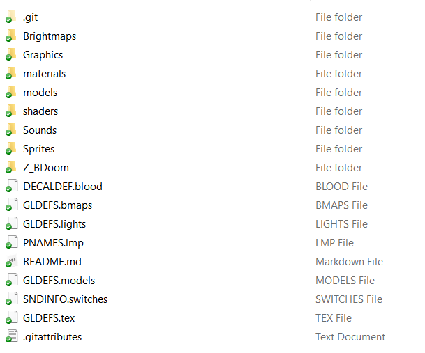

# Best Practices and Rules of Thumb

Even in our day and age there are lot of important best practices that are either unknown to many or often being overlooked. This section describes some of them—most of them are related to ZScript, but some are concerned with modding in general.


## Using a consistent indentation style

Indentation is using tabs and/or spaces to mark the start of a new code block. They're covered in surprising detail [on Wikipedia](https://en.wikipedia.org/wiki/Indentation_style), so go have a look. Many new coders, and sometimes even the not-so-new ones, including people who have been working with DECORATE for years, have little respect for indentation, which causes a *very* serious issue: their code is hard to read.

Your instinctive reaction, most likely, is to say, "I can read it just fine!" This, however, isn't the point. Lack of consistent indentation leads to messy code, which leads to major problems:

1. You'll have problems reading your own code. You may think you won't, and perhaps you don't—for now. But when you decide to come back to some code you wrote months or years earlier, you'll be surprised how hard it is to navigate that crap.
2. You'll have a much harder time getting help from others—and not because everyone is a snob who only wants to read well-written code, but because it's *genuinely* hard to read somebody else's code that isn't well-organized.
3. While an average player may not be concerned with it, clean code will make a good impression on other modders and creators.

In short: check out [existing indentation styles](https://en.wikipedia.org/wiki/Indentation_style), pick K&R or Allman (the vast majority are using one of those) and use it consistently. Remember, this is how it should look (using K&R because this is the style I use in my mod and throughout this guide):

```csharp
Class MyClass : Actor {		//level 1 header
	int foo;				//level 2 code
	string bar;
	property bar : bar;
	Default {				//level 2 header
		property1;			//level 3 code
		property2;
		property3;
		+FLAGNAME
	}						//end of level 2 block
	states {				//level 2 header
	Spawn:					
		SPRT A 1;			//level 3 code
		loop;
	Death:
		SPRT B 5 A_Function;
		SPRT CD 5 {			//level 4 header
            	A_Function1();	//level 4 code
            	A_Function2();
        }					//end of level 4 block
		SPRT E -1;
		stop;
	}						//end of level 2 block
}							//end of level 1 block
```

There *is* some discussion regarding how to indent the contents of the `states` block though, but both of these options should be fine:

```csharp
//considers state labels as new-level code:
	states {
        Spawn:            
            SPRT A 1;
            loop;
        Death:
            SPRT E -1;
            stop;
    } //all makes sense except this awkward closing brace that is too far

//only considers state contents as new-level code, but not the labels:
    states {
    Spawn:
		SPRT A 1;
		loop;
	Death:
		SPRT E -1;
		stop;
	}
//^ this is how switch statements are formatted in true C-style K&R
```

Final notes:

- GZDoom rather consistently uses Allman, same goes for most examples on ZDoom Wiki.
- This guide uses K&R style simply because I've grown to use that in my mods. The only reason I use it is because it's *a bit* faster since there are fewer Enter presses to start a new block. At the same time I consider Allman a bit easier to read.
- Other styles exist, but consider ZScript is styled after C# / Unrealscript, it makes sense to choose one of the two most popular styles.
- If you copy-paste a snippet of code from somewhere, don't be lazy and change its indentation to your style if they don't match.


## Using PK3 instead of WAD

For some reason people keep using WAD files instead of PK3. Avoid this! WAD files should only be used for maps—because this is the only format that maps accept. Everything else—textures, sounds, models, any sort of assets, *and* your code—should be inside a PK3 for ease of use and access. [ZDoom wiki describes how to structure a PK3 in detail](https://zdoom.org/wiki/Using_ZIPs_as_WAD_replacement).

However, a next-level strategy would be using a *folder* instead of an archive. Specifically, instead of having a packed PK3 (which, remember, is just a zip file), you can unpack it and keep it as an unpacked folder that uses the same internal structure as PK3 would. For example, this is how a development version of Beautiful Doom looks in a folder on my PC:



GZDoom can run folders in the same way it can run archives:

```
gzdoom.exe -iwad doom2.wad -file FOLDERNAME
```

SLADE can also open folders using File > Open Directory.

So, what are the advantages of this method? Basically, there are two. 

First, you can stop using SLADE. Or rather, you'll likely still need to use it to set sprite offsets, optimize PNGs and use [TEXTURES](https://zdoom.org/wiki/TEXTURES) visual editor, but otherwise you can easily use other software to edit your files. You can use something like Notepad++ with [ZScript syntax highlighting](https://forum.zdoom.org/viewtopic.php?f=37&t=46674) to edit your scripts—while they won't have pop-up tips, like SLADE does, you will have a much easier time saving them and switching between tabs. In fact, you won't have to worry that you forgot to save something before closing the archive, saving changes will be faster, and there won't be any chance of SLADE corrupting data (which *can* happen sometimes).

Second, you'll be able to upload your mod to a GitHub repository.


## Using GitHub

