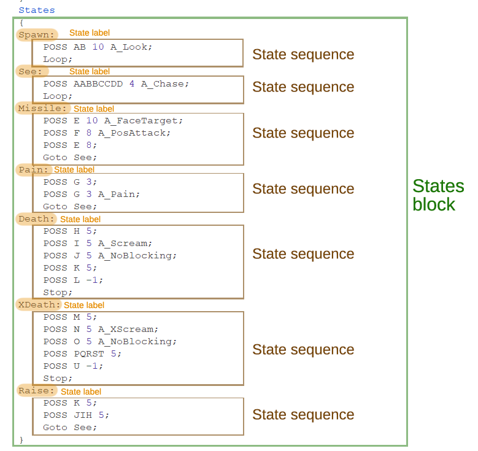

🟢 [<<< BACK TO START](README.md)

🔵 [<< Previous: Arrays](Arrays.md)

------

# Flow Control

When you call functions, change values and do other things within a code block (an anonymous function, a virtual function override, etc.), these changes are executed in a certain order, following the specified conditions. To control this flow, you need to know how to use **statements** and **operators**.

This chapter will also cover flow control in **actor states**, which work similarly to functions but not exactly in the same way.

- [Flow Control](#flow-control)
- [Operators and operands](#operators-and-operands)
  * [Arithmetic operators](#arithmetic-operators)
    + [Note on placement of increment/decrement operators](#note-on-placement-of-increment-decrement-operators)
  * [Assignment operators](#assignment-operators)
  * [Relational operators](#relational-operators)
  * [Logical operators](#logical-operators)
  * [Bitwise operators](#bitwise-operators)
  * [Miscellaneous operators](#miscellaneous-operators)
- [Statements](#statements)
  * [Conditional blocks](#conditional-blocks)
    + [if](#if)
    + [else](#else)
    + [if else](#if-else)
  * [Loop control](#loop-control)
    + [while](#while)
    + [for](#for)
    + [break](#break)
    + [continue](#continue)
  * [Return and return values](#return-and-return-values)
  * [Switch](#switch)
- [State control](#state-control)
  * [stop](#stop)
  * [loop](#loop)
  * [wait](#wait)
  * [goto](#goto)
    + [Using `goto` and inheritance](#using--goto--and-inheritance)
    + [Using `goto` with offset](#using--goto--with-offset)
  * [fail](#fail)

# Operators and operands

**Operators** are symbols that define relationships and interactions between **operands**. In the expression `A + B` A and B are operands, while `+` is the <u>operator of addition</u>. In the expression `if (A == B)` A and B are operands, and `==` is a <u>relational operator</u> that checks if operands' values are equal to each other.

Operators used in ZScript are similar to the ones used in the C-family languages. They can be split into the following categories:

* Arithmetic operators
* Relational operators
* Logical operators
* Assignment operators
* Bitwise operators
* Miscellaneous operators


## Arithmetic operators

Basic arithmetic operations like addition, subtraction, multiplication, division, modulus operations, increment, and decrement. They're used to change the value of a numeric operand.

- `+` — **addition**:

    ```csharp
    int i = health + 100; //defines an integer variable i equal to the actor's current health value plus 100
    ```

```csharp
  A_SetHealth(health + target.health); //sets the actor's health to its current value plus the actor's target's current health value
```

- `-`  — **subtraction**:

    ```csharp
    SetZ(ceilingz - 1); //moves the actor vertically and places it 1 unit below the height of the current sector's ceiling
    ```

    ```csharp
    int i = pos.z - target.pos.z; //defines an integer variable i that is the difference between the absolute vertical positions of this actor and this actor's target
    ```

- `*` — **multiplication**:

    ```csharp
    scale = scale * 0.5; //changes the actor's current scale so that it's reduced by 50%
    ```

    ```csharp
    A_SetHealth(health * 0.8); //change's the actor's health value so that it's reduced by 20%
    ```

- `/` — **division**:

    ```csharp
    double projvel = Distance3D(target) / 35; //defines a double value 'projvel' that is equal to the distance to target divided by 35 
    ```

    (If a projectile is then fired at the `target` with velocity `projvel`, it'll reach the goal within 35 tics, i.e. a second)

    **IMPORTANT NOTE:** In many programming languages there are two separate division operators: one for integer division and one for float-point (or double) division. In ZScript there's only one, which means that if both numbers are integers, the result will be an integer as well, and the part of the number after the point will be automatically truncated (removed). So, for example, `5 / 2` in ZScript equals `2`, not `2.5`.

    This can be avoided by making sure that one or both operands are doubles, by doing one of the following:

    - giving it a point, optionally followed by a zero, i.e. `5.0` or `5.`;
    - explicitly defining it as a double by doing `double(5)`.

    So, `5. / 2`, as well as `5 / 2.` equals `2.5`.

- `%`  — **modulus operation** returns the remainder after dividing the first operand by the second operand:

    ```csharp
    if (level.time % 35 == 0) 
    //this check will return true every time the current level.time can be divided by 35 without a remainder, i.e. every 35 tics (1 second)
    ```

- `++` — **increments** the value (adds 1 to it):

    ```csharp
    int steps;	//defines an integer variable 'steps'
    if (steps < 10) {	//checks if the value of 'steps' is under 10
    	steps++;	//if true, adds 1 to the current value of 'steps'
    }
    ```

    (`steps++` is the same as doing `steps = steps + 1`)

- `--` — **decrements** the value (decreases it by 1):

    ```csharp
    int steps;	//defines an integer variable 'steps'
    if (steps > 0) {	//checks if the value of 'steps' is over 0
    	steps--;	//if true, subtracts 1 from the current value of 'steps'
    }
    ```

    (`steps--` is the same as doing `steps = steps - 1`)

### Note on placement of increment/decrement operators

Operators of incrementation can be placed both after and before a value. So, both `value++` and `++value` are correct. The difference only occurs if you perform multiple operations, such as incrementing and checking the value at the same time. For example:

```csharp
int myVal = 5;
bool isBigger = myVal++ > 5;
```

In the above example `myVal` is *first* checked against 5, and *after that* `myVal` is incremented. As a result, boolean `isBigger` will be false, because at the moment of checking `myVal` will still be equal to 5.

Compare:

```csharp
int myVal = 5;
bool isBigger = ++myVal > 5;
```

In this example `myVal` is *first* incremented, and *after that* checked against 5. As such, `isBigger` will be true, because `myVal` will be equal to 6 before the check.

It's a relatively niche case, but it's something important to be aware of.


## Assignment operators

Assignment operators are used to *set* a value. They don't check or compare, they simply change the value. You'll normally use them to change the values of variables.

* `=` — **assigns** a certain value to the operand:

    ```csharp
    int i = 10; //defines integer variable i and sets its value to 10
    ```

    ```csharp
    gravity = 0.4; //sets the calling actor's gravity to 0.4
    ```

    ```csharp
    mass = health; //sets the calling actor's mass to be equal to their current health value
    ```

* `+=` — **adds** a value to the current value of the operand:

    ```csharp
    mass += 1000; //adds 1000 to the current mass value of the calling actor
    ```

    ```csharp
    vel.z += frandom(1,4); //increases the calling actor's current vertical velocity by a random double value betweem 1.0 and 4.0
    ```

    `a += b`is a shorter version `a = a + b`:

    ```csharp
    //These do the same thing:
    
    gravity += 0.5;
    gravity = gravity + 0.5;
    ```

* `-=` — **subtracts** a value from the current value of the operand:

    ```csharp
    angle -= 45; //decreases the calling actor's angle by 45, which will turn the actor 45 degrees to the left
    ```

* `*=` — **multiplies** the current value of the operand by the given value:

    ```csharp
    scale *= 0.99; //decreases the calling actor's scale (sprite size) by 1%
    ```

* `/=` — **divides** the current value of the operand by the given value:

    ```csharp
    alpha /= 2; //reduces the calling actor's alpha (translucency) by 50%
    
    //same as doing this:
    alpha *= 0.5;
    ```

    Note: changing alpha will only work on if actor's `renderstyle` is of type that supports translucency (e.g. `'add'` or `'translucent'`).

* `%=` — gives the **remainder** of dividing the first operator by the second operand:

    ```csharp
    int i = 10;
    i %= 2; 
    //i will be equal to 0, because 10 equals 2 * 5 without remainder
    ```

    ```csharp
    int i = 10;
    i %= 3;
    //i will be equal to 1, because 10 equals 3 * 3 plus 1 as remainder
    ```

    

## Relational operators

Used to *check* whether two values are equal, or whether one is greater than, less than, greater than or equal to, or less than or equal to one another. These operators are used in checks, such as `if`, `while`, `for`, etc. (more on those below).

* `==` — checks if operands are **equal** to each other. This can be used for integers, doubles, bools and pointers.

    * For numeric (**integer** and **double**) values this operator check the actual numbers against each other:

    ```csharp
    if (health == 100) 
    //returns true if health value is exactly equal to 100
    ```

    With **boolean** values this operator can be used to check if they're `true` or `false`:

    ```csharp
    if (target.bISMONSTER == true)
    // Returns true if the calling actor's target has ISMONSTER flag
    ```

    ```csharp
    bool mybool;
    if (mybool == false) {
    	mybool = true;
    }
    ```

    Note that true/false checks can be shortened as follows:

    ```csharp
    if (target.bISMONSTER) //this is the same as if (target.bISMONSTER == true)
    ```

    This operator can also be used with [pointers](Pointers_and_casting.md) to check if they're the pointers to the same actor:

    ```csharp
    if (victim == target)
    // This check is used in SpecialMissileHit overrides to check if 'victim' (the actor hit by the projectile) is the same as projectiles 'target' (the actor who shot it). It makes sure projectiles can never hit their shooters.
    ```

    Checking pointers against `null` allows to check if that pointer is empty (you already know this as null-checking):

    ```csharp
    if (target == null)
    // Will return true if the calling actor doesn't have a target
    ```

    Note: make sure you do NOT confuse `==` with with `=` — an operator used to actually *change* values. (See Assignment Operators above.)

* `!=` — checks if operands are **not equal** to each other (the inverse of the above):

    ```csharp
    if (mass != 0)
    // Will return true when the mass of the calling actor isn't equal to 0
    ```

    ```csharp
    if (master != target.master)
    // Will return true if the calling actor's master is not the same 
    ```

    This operator is often used in null-checks:

    ```csharp
    if (target != null) {
    	//this block will be executed if the calling actor has a target
    ```

    Note that null-checks can be shortened, just like boolean checks, as follows:

    ```csharp
    if (target)	//this is the same as if (taget != null)
    if (!target)	//this is the same as if (target == null)
    ```

    `!` is actually separate operator that is covered below, under Logical operators.

* `~==` — checks if the first operand is ***approximately* equal to** the second one: this is the same check as `==` but it can be used with doubles to add a very small margin of error to the check. It's very often used with velocity checks (as you remember, `vel` is a vector3 that consists of 3 doubles):

    ```csharp
    if (vel ~== (0,0,0))
    // Will return true if the calling actor's velocity is approximately equal to zero
    ```

    For all intents and purposes this check is pretty much the same as `if (vel == (0,0,0))`, but edge cases are possible, so for doubles it's recommended. It's slightly less performance efficient than `==`, but most of the time the difference is negligible.

    Doesn't work with integer values.

* `>` — checks if the first operand is **greater than** the second:

    ```csharp
    if (health > 0)
    ```

* `<` — checks if the first operand is **less than** the second:

    ```csharp
    if (mass < 500)
    ```

* `>=` — checks if the first operand is **greater than or equal to** the second:

    ```csharp
    int i = pos.z - target.pos.z;
    if (i >= 0) {
    	//execute this block if the calling actor's vertical position is above or equal to the target's position
    }
    else {
    	//otherwise execute this block
    }
    ```

* `<=` — checks if the first operand is **less than or equal to** the second:

    ```csharp
    if (pos.z <= 0) {
    	destroy();
    }
    // This will destroy the calling actor if their position is at or under the current sector's floor
    ```


## Logical operators

These operators are used to combine multiple checks.

* `&&` — logical AND. This operator is used to check if *all* operands or statements are true:

    ```csharp
    if (target && target.health > 0)
    // Returns true if the calling actor has a target and that target's health is above 0
    ```

    ```csharp
    if (i > 0 && i <= 100)
    // Returns true if the (previously defined) variable i is above zero and under or equal to 100
    ```

Note, in case there are multiple checks, the game won't proceed to the next check unless the previous one is true. So, for example in this case:

```cs
override void DoEffect() {
	super.DoEffect();
    if (owner && owner is "PlayerPawn") {
        [...]
    }
}
```

...if `owner` is null, the string of checks will stop there. As such, the following `owner is "PlayerPawn"` check will not result in a VM abort, because if `owner` is null, the next check simply won't be executed.

What it means, always put the most important and the simplest check first, because this will be both safe *and* more performance efficient.

* `||` — logical OR. This operator is used to check if *any* of the operands/statements is true:

    ```csharp
    if (target is "PlayerPawn" || target.bISMONSTER)
    // This check will return true both if the target of the calling actor is a player pawn (a player-controlled actor) or if it has a ISMONSTER flag (i.e. is likely a monster)
    ```

    ```csharp
    if (vel ~== (0,0,0) || pos.z <= floorz)
    // Returns true if the calling actor is not moving or if it's on the floor (or, for some reason, below it)
    ```

    OR checks work the same way as AND checks, just inverted. Which means, if the first condition is true, it won't proceed to the second condition.

* `!` — logical NOT. This operator allows to **invert** *any* check or even a whole statement. For example:

    ```csharp
    if (!target) // Checks if target pointer is null, same as 'if (target == null)'
    ```

    ```csharp
    if (!(vel == (0,0,0)) || !bNOGRAVITY)
    // Returns true if the calling actor's velocity is NOT zero OR the calling actor does not have a NOGRAVITY flag
    ```

    ```csharp
    if (!master && target))
    // This will true if the calling actor does NOT have a master but does have a target
    ```


All logical operators can be combined with the help of parentheses:

```csharp
if (target && !target.bKILLED && (target is "PlayerPawn" || target.bISMONSTER))
// This check will pass if target exists, AND target isn't killed (doesn't have KILLED flag), AND it's either a PlayerPawn OR a monster
```

```csharp
if ((target && target is "PlayerPawn") || (master && master.target && master.target is "PlayerPawn"))
// This will pass if the calling actor has a target and that target is PlayerPawn, OR if the calling actor has a master, that master has a target, and the master's target is PlayerPawn.
```


## Bitwise operators

Bitwise operators are used to deal with [**bit fields**](https://en.wikipedia.org/wiki/Bit_field). Many of them are likely to appear only in rather advanced code, but it's still important to understand at least the general concepts behind them, and some of these operators are actually very useful and common.

Bit fields are a specific type of data structure. In GZDoom their primary application is function flags. For example, `A_WeaponReady` supports various flags, such as `WRF_NOPRIMARY`, `WRF_NOSECONDARY`, `WRF_NOSWITCH`. The flags argument is special, because it's a single argument that can have multiple values combined in any order and number. It's possible because the flags argument is actually an integer value that functions as a **bit field**: what it means is that internally each flag is a number, those numbers are added to each when you define the flags, and the final number tells the game which combination of flags to use. The flag names, such as "WRF_NOPRIMARY", are just aliases for the actual numeric values.

It's important to know that, because as a result you can't use operators such as `==` with flags; instead they need special **bitwise operators** that can interact with the bit field that contains the flags.

Another common example of a bit field is player input: whenever player presses a button, the bit field that contains the inputs is changed. Obviously, multiple buttons can be pressed at the same time, so the field dynamically stores those values. You can get access to the player's input bit field either by using `GetPlayerInput()` function or just by accessing the `cmd.buttons` field when you have a pointer to the player (so, for example, from a weapon state it'll be `player.cmd.buttons`).

* `|` — **bitwise OR**. Most commonly used to combine flags together, for example:

    ```csharp
    A_WeaponReady(WRF_NOSECONDARY|WRF_NOSWITCH); //this will make the weapon ready for fire but won't let you either fire the secondary attack or switch the weapon
    ```

* `|=` — a combination of OR and a setter, it's primarily used to set flags. It functions by appending flags to the bit field, so that you can set multiple flags this way without clearing the field:

    ```csharp
    int fflags = DMG_THRUSTLESS;
    if (random(1,3) == 3) {
    	fflags |= DMG_NO_PAIN;
    }
    target.DamageMobj(self,self,10,'normal',flags:fflags);
    ```

    This block first defines a flag field `fflags` that already contains `DMG_THRUSTLESS` flag (a flag of `DamageMobj` function that makes it not push the actor when damaging them). After that with a randomized chance it'll *add* `DMG_NOPAIN` flag (the damaged actor won't enter its Pain state sequence) to the same field, and then call `DamageMobj` on the `target`. As a result, this block will always deal damage without any thrust, but will only sometimes also not cause pain.

* `&` — **bitwise AND**. Most commonly used to check if a value is present in the bit field. For example:

    ```csharp
    if (player.cmd.buttons & BT_FIRE)
    //will return true if the player is currently pressing the Fire key, among others
    ```

    As mentioned above, `==` won't work here because the `cmd.buttons` field contains all currently pressed keys. By using `&` you check if the player is pressing anything *as well as* the key you're checking for.

* `&=` — a combination of **bitwise AND** and assignment operator `=`. It's most common application is to unset flags in combination with `~` (see below).

* `~`  — **bitwise NOT**. It's most commonly used in combination with `&=` to unset flags as follows:

    ```csharp
    myflags &= ~FLAGNAME; //This will remove `FLAGNAME` flag from the myFlags field
    ```

    Below is an inverted way to define the same block used in the example above, except here the flag field already contains both flags, and with a randomized chance we remove one of them before calling `DamageMobj()`:

    ```csharp
    int fflags = DMG_THRUSTLESS|DMG_NO_PAIN;
    if (random(1,3) > 1) {
    	fflags &= ~DMG_NO_PAIN;
    }
    target.DamageMobj(self,self,10,'normal',flags:fflags);
    ```

## Miscellaneous operators

* `is` — checks whether the operand is a specific class *or* is a class that inherits from the given class:

    ```csharp
    Class Imp1 : DoomImp { }
    
    
    //in some other place in the code:
    actor a = Spawn("Imp1",pos);
    if (a is "DoomImp") {
    	//this check will return true because the spawned Imp1 inherits from DoomImp
    }
    ```

    A restrictive alternative to this operator is `GetClassName()` function which returns true only if the operand is the specific class provided:

    ```csharp
    Class Imp1 : DoomImp { }
    
    
    //in some other place in the code:
    actor a = Spawn("Imp1",pos);
    if (a.GetClassName() == "DoomImp") {
    	//this will return false because Imp1 and DoomImp are different class names
    }
    else if (a is "DoomImp") {
    	//this will return true
    }
    ```

* `?` — **ternary operator**, functions as a shorter version of an if/else block. Doesn't affect performance and is only used for convenience. 

    The syntax for using a ternary operator is as follows:

    ```csharp
    booleanvalue = condition ? valueiftrue : valueiffalse
    ```

    Examples:

    ```csharp
    //regular if/else block:
    int i;
    if (bNOGRAVITY) {
        i = 10;	//sets the value to 10 if the calling actor has +NOGRAVITY flag
    }
    else {
        i = 5;	//otherwise sets the value to 5
    }
    
    //ternary operator:
    int i = bNOGRAVITY ? 10 : 5;
    ```

    Among other things, using it can be convenient in function arguments:

    ```csharp
    //all three variants below will set the calling actor's mass to 1000 if they have +BOSS flag, otherwise the mass will be set to 100
    
    //basic if/else:
    if (bBOSS) {
        A_SetMass(1000);
    }
    else {
        A_SetMass(100);
    }
    
    //a more versatile but longer version:
    int i;
    if (bBOSS) {
        i = 1000;
    }
    else {
        i = 100;
    }
    A_SetMass(i);
    
    //ternary operator:
    A_SetMass(bBOSS ? 1000 : 100);
    ```

# Statements

Statements in ZScript (similarly to C# and other C-style languages) are special keywords that make sure that specific **code blocks** are executed only if specific conditions are met. Statements define those conditions.

Every statement is defined as follows:

```cs
keyword (condition) {
	code;
}
```

...where `keyword` is a statement (`if`, `else`, `for` and others), `condition` is the condition that should be met for the code to execute (it must be defined within parentheses and must *not* end with a semicolon), and a pair of curly braces following it define a new code block.

If you have experience with ACS, it's important to know at this point that **ZScript doesn't have a `delay` function**. The reason for that is actually very simple: whereas ACS is used to define a sequence of events that happens in a map (and those events can be relatively disconnected, e.g. a monster spawns here, a platform raises there, a wall changes its texture, etc.), ZScript is predominantly used to define behavior for specific classes. As such, it's not a set of abstract instructions but rather a set of actions that class has to perform. ZScript code is primarily called as follows:

1. Every game tic: this goes for the code defined in `Tick()` or `DoEffect()` and many other virtual functions that need to be called every tic so that the actor would be able to collide with other actors, move, be subjected to gravity, and such.
2. Every frame: this is true for everything related to user interface (UI), such as in-game menus and HUDs that need to be drawn (and *updated*) every frame.
3. Once when a specific condition is met: for example the code in a `WorldThingDied()` event is called once, every time an actor dies in a map. 
4. Once when a specific frame is drawn in an actor state: e.g. when you call `PIST F 5 A_FireBullets()` in a weapon state, the function `A_FireBullets()` will be called once when PISTF frame is drawn on the screen.

In all of those cases all of the code defined in a specific function/override is executed from top to bottom but *instantly*, within a single tic (or frame). If you want to delay some of the code, you have to find a way to manually call it later, in a different game tic.

_**Note:** there's no completely fixed terminology regarding the classification of statements, and it's also important to remember that ZScript contains fewer statements than C# and other C-style languages. As such, the classification used in this guide may be purposefully simplified for the sake of clarity and beginner-friendliness._

## Conditional blocks

### if

`if` statement is the most basic statement that defines a condition. It works as follows:

```csharp
//pseudocode:
if (condition == true) {
	DoStuff();
}
```

```cs
//Real code:
int num = random(0,100);
if (num >= 80) {
    A_Explode();
}
```

In this example `num >= 80` is the condition. If `num` (a previously defined random integer value between 0 and 100) ends up being more than or equal to 80, `A_Explode()` will be called.

It can be simplified as follows:

```csharp
if (random(0,100) >= 80) {
	A_Explode();
}
```

Note that in the example above `random` automatically creates an integer value, you don't need to define a separate variable for that. If you want a double instead of an integer, you need to use `frandom`.

### else

`else` is a statement that is meant to follow `if` and defines another block that will be executed if the original condition isn't met:

```cs
//pseudocode:
if (condition == true) {
    DoThis();
}
else {
    DoThat();
}
```

The `else` block must be defined immediately after the end of the `if` block; you can't insert anything between them.

**You don't *have* to** define an `else` block.:

```cs
if (condition) {
    Do();
}
else {} //don't do this, it's pointless!
```

### if else

`if else` is a combined statement that also follows an `if` block and is called when the original condition is false, but it also defines an extra condition:

```cs
if (condition1 == true) {
    DoThis();
}
else if (condition2 == true) {
    DoThat();
}
```

In the above example `DoThat()` will only be called if `condition` is false AND `condition2` is true.

`if else` can be followed by an `else` block:

## Loop control

You can define various types of loops within ZScript code, and there are special statements used to control those loops. As mentioned earlier, ZScript doesn't have a `delay` function, so all loops that happen within a function (be it an anonymous, virtual or custom function) happen instantly. Loops are convenient when you need to call the same function multiple times (e.g. when you want to spawn a bunch of objects by calling `A_SpawnItemEx` but don't want to copy-paste it 20 times), or when you need to iterate over some sort of data.

### while

`while` is a statement that begins a loop which will be executed as long as the condition in that loop is true:

```cs
while (condition == true) {
    DoStuff();
    //if the 'condition' becomes false in the process, the loop will end
}
```

Example:

```cs
int i = random(10,15);
while (i > 0) {
	A_SpawnItemEx("CustomDebris",xvel:frandom(-5,5),yvel:frandom(-5,5),zvel:frandom(3,6));
	i--;
}
```

In the above block the function `A_SpawnItemEx` is designed to spawn a custom debris actor and give it randomized velocity. The way it's set up, it'll be called randomly between 10 and 15 times.

The condition doesn't have to be a custom value, it can also be a part of what you're doing in the loop:

```cs
while (pitch > -45) {
	A_SpawnProjectile("DoomImpBall",flags:CMF_AIMDIRECTION,pitch:pitch);
	pitch -= 10;
}
```

In this block the calling actor will fire an Imp fireball using its own pitch, then will move its pitch by 10 units. The block will loop only as long as pitch is above -45 units (since negative pitch means the actor is looking up, this will result in the actor shooting a bunch of projectiles in front of itself, some of them aimed upward).

You can also set up an **endless** loop by doing `while (true)` (since, well, `true` is always true), but if you do that, you need to use `break` at some point to stop it see [break](break)).

### for

`for` is a more robust loop-starting statement that can be used similarly to `while`:

```cs
//psuedocode:
for (<counter value>; <condition>; <change>)
```

In a `for` loop the "counter value" is an initial value (e.g. an integer number) that will define the number of iterations. "Condition" normally defines what to check the counter value against, "change" is how the counter value will be changed with every iteration of the loop.

A typical `for` loop looks like this:

```cs
for (int i = 10; i > 0; i--) {
    //this block will be repeated 10 times
}
```

In the block above the loop first defines an integer value `i` that is equal to 10. Then it defines the condition: the loop will repeat as long as `i` is larger than 0 (`i > 0`). The last point defines that with every iteration of the loop `i` should decrease by 1 (`i--`).

You can invert the values, it won't make any difference:

```cs
for (int i = 0; i < 10; i++) {
    //this block will be repeated 10 times
}
```

The order of iteration in a `for` loop works like this:

1. The initial value (e.g. `int i = 0`) is defined and used only once.
2. At the start of each iteration the loop will check the condition (e.g. `i < 10`). If the condition is false, the loop won't execute. If it's true, it'll start executing the code block.
3. After everything in the code block has been executed, the `for` loop will *automatically* perform the change (e.g. `i++`) and will go back to #2.

Note that a `for` loop will first execute everything in it, and *after* that it'll change the counter value (`i` in this example), after which it'll check if the counter value still fulfills the condition. That means that in the example at the first iteration `i` will be equal to 0, and at the 10th iteration `i` will be equal to 9. Once the 10th iteration ends, `i` will become equal to 10, which means the condition `i < 10` will no longer be true. You can change the condition to  be `i <= 10`, but in this case the loop will execute **11 times**. This distinction may be important in specific conditions (described further below).

There are multiple convenient applications for `for` loops. The simplest one is to use them as a shorter version of `while` loops:

```cs
//this will repeat 10 times:
int i = 10;
while (i > 0) {
	A_SpawnItemEx("RandomDebris",xvel:frandom(-5,5),yvel:frandom(-5,5),zvel:frandom(3,5));
	i--;
}

//this will also repeat 10 times:
for (int i = 10; i > 0; i--) {
	A_SpawnItemEx("RandomDebris",xvel:frandom(-5,5),yvel:frandom(-5,5),zvel:frandom(3,5));
}
```

Note that you can make the initial value randomized if you want a random number of repetitions. For example, if you want to spawn some sort of debris/particles and you want to spawn a random number of them each time:

```cs
//this loop will execute between 8-12 times:
for (int i = random(8,12); i > 0; i--) {
	A_SpawnItemEx("RandomDebris",xvel:frandom(-5,5),yvel:frandom(-5,5),zvel:frandom(3,5));
}
```

Note that normally **you should only randomize the counter value**, not the condition value, because, as described above, the condition is checked with every iteration of the loop. Which means, if you randomize the condition, it'll actually check against a random number every time:

```cs
/*	This will check i against a random value between 8-12 with every iteration of the loop.
	Normally this is not a good idea, since it offers you less control over how many
    repetitions you'll actually have. It'll also be slightly less peformance-efficient
    since a random value will need to be defined with every iteration, and that requires
    some CPU resources.
*/
for (int i = 0; i < random(8,12); i++) {
	A_SpawnItemEx("RandomDebris",xvel:frandom(-5,5),yvel:frandom(-5,5),zvel:frandom(3,5));
}
```

The counter value `i` is a variable that exists within the loop itself and can be used literally there:

```cs
for (int i = 0; i < 5; i++) {
    /*	Spawnheight of the spawned projectile is defined as i * 8, which means
    	that 5 imp orbs will be fired, each spawned 8 units above the previous one:
    */
	A_SpawnProjectile("DoomImpBall", i * 8);
}
```

While usually the change is defined as incrementing `i` by 1, it's also perfectly possible to use a different value. For example, in this block `i` is increased by 30 with every iteration, and the loop is repeated until it reaches 360:

```cs
// This will fire imp fireballs in a circle, a new fireball every 30 degrees (i.e. 12 fireballs in total):
for (int i = 0; i < 360; i += 30) {
	A_SpawnProjectile("DoomImpBall", angle: i);
}
```

One of the most common advanced applications of `for` loops is iterating through [arrays](#Arrays.md). For example:

```cs
// This zombie will drop a trap every 10 seconds.
// Once it's killed, all existing traps will be destroyed.
Class ZombieTrapper : Zombieman {
	array Actor traps; //array of pointers to traps
	override void Tick() {
		super.Tick();
		//spawn a trap if zombie isn't frozen, and its age is divisible by 350
		if (!isFrozen() && GetAge() % 350 == 0) {
			let trp = Spawn("ZombieTrap",pos);
			if (trp)
				traps.Push(trp); //push the trap into array
		}
	}
	States {
	Death:
		TNT1 A 0 {
			//iterate through the array:
			for (int i = 0; i < traps.Size(); i++) {
				let trp = traps[i]; //get a pointer to the trap
				if (trp) //check the pointer isn't null (trap still exists)
					trp.Destroy(); //if so, destroy it
			}
		}
		goto super::Death;
	}
}
```

Note, it's very important to remember that an array's **size** is always larger than the index of the last item in it. So, for example, if there are 5 actors in an array, the size of that array will be 5, but **indexes** of actors in that array will go from 0 to 4 (0 being the first actor, 4 being the last). That's why when creating `for` loops that iterate through arrays, they must always use one of the two templates:

```cs
//either this:
for (int i = 0; i < arrayname.Size(); i++) {
	arrayname[i].DoSomething();
}
    
//or this:
for (int i = arrayname.Size() - 1; i >= 0; i--) {
	arrayname[i].DoSomething();
}
```

In other words:

1.  `i` must never be equal to the array's size if you use it as an index, because you'll get an "out of bounds" error.
2.  Also, if you use the second template the condition must be `i >= 0`, because if you make it `i > 0`, the loop won't iterate through the first item in the array, since its index is 0.

### break

`break` stops the execution of a loop and continues whatever comes next after it. It can be used in `while` or `for` loops. 

In the following example let's assume you previously created a dynamic array `monsters` that contains pointers to various monsters. Now you want to check if *any* of those monsters is currently targeting the player:

```cs
bool playerIsTargeted;
for (int i = 0; i < monsters.Size(); i++) {
	if (monsters[i] && monsters[i].target && monsters.[i].target.player) {
            playerIsTargeted = true;
            break;
    }
}
```

`playerIsTargeted` will be set to true immediately as the first monster who has player as its `target` is found in the array.

In the following example a `for` loop is used inside a custom function to find if any of the players in the game have a red key card:

```cs
bool hascard;
for (int i = 0; i < MAXPLAYERS; i++) {
	if (players[i] && players[i].mo && players.[i].mo.FindInventory("RedCard")) {
            hascard = true;
            break;
    }
}
```

Notes:

- `players` is a global GZDoom array that contains `PlayerInfo` type pointers to all players in the game.
- `MAXPLAYER` is a global GZDoom variable that is equal to the total number of players in the game.
- `mo` (short for "map object") is a pointer to the PlayerPawn controlled by a specific player (a PlayerPawn is a separate entity from the player); if you need to check if a player has something in their inventory, you need to use that.

### continue

`continue` is in a way a "reverse" of `break`: it tells the loop to stop executing and move on to the next iteration without doing anything else inside the loop block. 

```cs
bool playerIsTargeted;
for (int i = 0; i < monsters.Size(); i++) {
	if (!monsters[i])
		continue; //do nothing if that item in the array is null
	if (!monsters[i].target)
		continue; //do nothing if the monster has no target
	if (!monsters.[i].target.player)
		continue; //do nothing if that monster's target isn't player
	playerIsTargeted = true; //OTHERWISE set the bool to true
}
```

## Return and return values

`return` keyword has two uses: it tells ends the execution of a function, and, if possible, it also defines a return value. The use of `return` is mostly covered in the [Custom functions](Custom_functions.md#non-void-functions-and-return-values) chapter. To briefly reiterate, `return` can be used to stop the execution of a function—be it a custom function or an override of an existing virtual function:

```cs
override void Tick() {
	super.Tick();
	if (isFrozen())
		return; //stop execution if the monster is frozen
	Warp(self,frandom(-1,1),frandom(-1,1),0); //this will make the monster constantly jitter slightly
}
```

It's important to note that `return` can't be used to stop the execution of a specific conditional code block (like an `if` block); it'll abort the execution of the whole function. This can actually be useful when working with non-void functions that need to iterate over something:

```cs
//this function will return true only if ALL players have the desired item:
bool CheckAllPlayersHaveItem(Class<Inventory> item) {
	for (int i = 0; i < MAXPLAYERS; i++) {
		if (!players[i] || !players[i].mo)
			continue; //do nothing if that player in the players array isn't valid and continue checking
		if (!players.[i].mo.FindInventory(item))
			return false; //if the player doesn't have the item, immediately return false
	}
	return true;
}
```

In the example above as soon as `return false;` is called, the `for` loop will stop and the rest of the function or the loop won't be executed; the return value will be set to `false`. If each player iterated through has the item, the function will return `true`.

Anonymous functions in actor states also have a return value—the next state to jump to, which can be obtained via `ResolveState(<state label>)`:

```cs
TNT1 A 0 {
	if (CountInv("Clip") <= 0)
		return ResolveState("Reload"); //if no ammo, jump to Reload sequence
	return ResolveState(null); //otherwise, don't jump, move on to the next frame
}
```

## Switch

A `switch` block is essentially a shorthand for creating multiple `if`/`else if` blocks that simply looks better. There are a few rules regarding `switch` blocks you need to know to effectively utilize them, however.

The structure of a `switch` block in comparison to a series of `if`/`else if` blocks looks as follows:

```cs
//if/else:
if (condition1)
	DoStuff1();
else if (condition2)
	DoStuff2();
else if (condition3)
	DoStuff3();

//switch:
switch {
case (condition1): 
	DoStuff1(); 
	break;
case (condition2): 
	DoStuff2();
	break;
case (condition3): 
	DoStuff3(); 
	break;
}
```

In terms of structure a `switch` block is very similar to a `States` block of an actor (see [State control](#State-control) below for details): 

- `case` keyword defines a sub-block (which in case of an actor would be a state sequence);
- `break` defines where that specific `case` block should end (similarly to how in state sequences we use `stop`);
- if `break` is omitted, the execution will just fall through to the next case (that's why using it is important!)

A `switch` block, unfortunately, is limited in what data types you can use in it: it can only check for names and integer values. One good application for it is, for example, in a `CheckReplacement` event, if you use it to handle actor replacements in your mod instead of the `replaces` keyword:

```cs
override void CheckReplacement(replaceEvent e) {
	let classname = e.Replacee.GetClassName();
	switch (classname) {
	case 'Zombieman':
		e.Replacement = "MyZombieman";
		break;
	case 'ShotgunGuy':
		e.Replacement = "MyShotgunGuy";
		break;
	case 'ChaingunGuy':
		e.Replacement = "MyChaingunGuy";
		break;
	[...]//and so on
    }
}
```

You can insert randomization inside a switch block as well:

```cs
	switch (classname) {
	case 'Zombieman':
		if (frandom(0,10) > 8.5)
			e.Replacement = "Cyberdemon";
		else 
			e.Replacement = "MyZombieman";
		break;
	[...]
    }
```

# State control

Actor states in ZScript can be compared to a code block, but they have a number of peculiarities. Before we dive in, it's important to note that there's a lot of confusion surrounding what exactly the term "state" means, so here's a quick overview of the key terms:

- Everything that starts after the `States` header in an Actor definition is a **states block**.
- The titles such as `Spawn`, `See`, `Death` are called a **state labels**. 
- Everything that goes after a state label and until an operator (such as `stop`, `loop`, `wait`, `goto`) is called a **state sequence**.
- *Every separate frame* inside a state sequence is called a **state**.



(Separate states not highlighted because it'd make the image too noisy, but each frame, such as POSSA, POSSB, etc., is a separate state.)

As you know, you can attach functions and code blocks (i.e. [anonymous functions](Anonymous_functions.md)) to states inside the states block. The state sequences inside a state block, however, have their own flow operators. They're the same as in DECORATE, but it's still important to understand how they work and what peculiarities they have.

## stop

Ends the sequence and removes whatever called it. If `stop` is used in an actor, the actor will be immediately destroyed. If it's used in a weapon sprite, the layer where it was called, will be destroyed (which means, if this is done from the main weapon layer, the weapon will essentially become unusable).

Arguably the most common application is in missiles:

```cs
//from DoomImpBall:
	Death:
		BAL1 CDE 6 BRIGHT;
		Stop; //disappear
```

If the last state before `stop` has a tic duration of -1, the called will *not* be destroyed. Instead, it'll just remain inactive, not animating but still being subject to physics, such as gravity:

```cs
//from DoomImp:
	Death:
		TROO I 8;
		TROO J 8 A_Scream;
		TROO K 6;
		TROO L 6 A_NoBlocking;
		TROO M -1;
		Stop; //will continue to exist, displaying only TROOM sprite
```

## loop

Loops all of the states up to the most recent state label:

```cs
//from DoomImp:
	See:
		TROO AABBCCDD 3 A_Chase;
		Loop; //go back to See label and start from there
```

If there was an intentional fall-through from one state sequence to another, `loop` will only loop to the most recent label. This can be useful:

```cs
Spawn:
	FRAM ABC 2;
//falls through since there's no operator
SpawnLoop:
	FRAM D 1;
	loop; //loop starting from SpawnLoop, not Spawn
```

**Warning:** do not loop states that have 0 duration and no way of jumping to anywhere. This is a common issue that will freeze GZDoom:

```cs
Ready:
	PISG A 0 A_WeaponReady; //this will freeze the game!
	loop;
```

*However,* it's fine to loop a zero-duration state that has a built-in jump. For example, `A_Raise()` jumps to the Ready sequence as soon as the weapon has been raised, and by calling it on a zero-duration state you can make weapon selection instant:

```cs
Select:
	TNT1 A 0 A_Raise;
	loop; //will select instantly and jump to Ready
Ready:
	PISG A 1 A_WeaponReady;
	loop;
```

## wait

Loops the most recent state. Can be more convenient than `loop` if you need specifically to loop the last frame in the animation:

```cs
Spawn:
	FRAM ABCD 2;
	wait; //this will loop FRAMD
```

It's also a good way to loop the execution of a specific function without looping the whole animation. For example, the projectile below will slowly fade out while increasing in size, and it'll continue fading out until it disappears even when there are no more sprites to animate:

```cs
Death:
	BAL1 CCDDE 2 bright;
	BAL1 E 2 bright {
		A_FadeOut(0.05);
		scale *= 1.05;
    }
	wait;
```

This can be useful for effects such as smoke clouds.

## goto

`goto <state label>` is used to jump to another state sequence:

```cs
//from ChainGunGuy:
	Raise:
		CPOS N 5;
		CPOS MLKJIH 5;
		Goto See; //jumps back to See state sequence
```

`goto` supports offsets: `goto <state label> +n` where `n` is a number that tells it how far to jump from the specified state label:

```cs
//from ChainGunGuy:
	Missile:
		CPOS E 10 A_FaceTarget;
		// here... <-------------------------------------------------------------------|
		CPOS FE 4 BRIGHT A_CPosAttack;                                               //|
		CPOS F 1 A_CPosRefire; //will jump to See state if the target is out of sight  |
		Goto Missile+1; //otherwise jump...--------------------------------------------|
```

`Goto Missile+1` means "jump to the beginning of the Missile sequence but skip ahead 1 state."

`goto super::<state label>` will jump to the parent's state label, if actor has one:

```cs
Class ZombieTrapper : Zombieman {
	States {
	Death:
		TNT1 A 0 {
			Spawn("ZombieTrap",pos);
		}
		goto super::Death; //go to regular Zombieman's Death sequence
	}
}
```

### Using `goto` and inheritance

It's important to remember that `goto` performs the jump *within the actor*, it's unaffected by inheritance. `Goto Label` in the parent actor will always jump to the `Label` sequence inside that actor, even if the child actor defines the same state label:

```cs
Class ParentActor : Actor {
	states {
	Spawn:
		FRAM ABC 1;
		goto Death; //this will only go to Death within this actor
	Death:
		FRAM DE 1;
		stop;
	}
}

Class ChildActor : ParentActor {
	states {
	Death: //this will never be entered, because parent Death will be used instead
		FRAM AB 1;
		loop;
	}
}
```

The only way to create `goto`s that work properly with inheritance is to use dynamic jumps instead—i.e. the `A_Jump*` functions or `return ResolveState("<state label>")`. For example:

```cs
Class ParentActor : Actor {
	states {
	Spawn:
		FRAM ABC 1;
		TNT1 A 0 A_Jump(256,"Death");
		wait; //it's OK to loop a 0-tic state here, since it contains a 100% chance jump
	Death:
		FRAM DE 1;
		stop;
	}
}

Class ChildActor : ParentActor {
	states {
	Death: //this will be entered properly
		FRAM AB 1;
		loop;
	}
}
```

This will also work:

```cs
TNT1 A 0 {
	return ResolveState("Death");
}
```

The reverse, however, is not a problem: since child actors inherit all of their parents states, `goto` will enter a parent's state correctly. That's why you can create a monster replacement with only a `Missile` sequence that ends with `Goto See` and it'll use its parent's `See` sequence correctly.

### Using `goto` with offset

`Goto` supports offsets: `goto Label+#` will jump # frames from the beginning of the Label sequence. E.g.:

```cs
//ChaingunGuy:
	Missile:
		CPOS E 10 A_FaceTarget;
		CPOS FE 4 BRIGHT A_CPosAttack;
		CPOS F 1 A_CPosRefire;
		Goto Missile+1; //this will skip CPOS E 10 A_FaceTarget
```

It's recommended not to use this feature very heavily in custom actors, since it's very easy to lose track of the offset, especially if the actor gets edited later and new states are added to it. Since nowadays there's no limit to creating custom state labels, it's preferable to use those labels when possible. ChaingunGuy's Missile sequence could be redone like this with this in mind:

```cs
	Missile:
		CPOS E 10 A_FaceTarget;
	MissileDo:
		CPOS FE 4 BRIGHT A_CPosAttack;
		CPOS F 1 A_CPosRefire;
		loop;
```

## fail

`Fail` is an operator used specifically by the [`CustomInventory`](https://zdoom.org/wiki/Classes:CustomInventory) class. Calling `fail` at the end of its `Use` state sequence prevents the used item from being removed from the player's inventory. Has no other applications.

## Fall-through (no operator)

If there's nothing at the end of a state sequence, the state machine will just fall through to the next sequence:

```cs
Fire:
	WEAP AB 2;
//fall through to Hold:
Hold:
	WEAP C 1 A_FirePistol();
	WEAP DEF 2;
	WEAP A 5 A_ReFire(); //jumps back to Hold if Fire is held
	goto Ready;
```

This can be created by design (such as in the example above where `A_ReFire()` is used to only loop the Hold sequence without returning to Fire) but can also cause issues if this is done by accident.
It's important to remember that state labels themselves will never prevent the state machine from progressing. In fact, <u>state labels don't *really* exist</u>—for the game, that is; state labels are only visible to the coder and exist for convenience. That's why flow operators must always be employed to avoid unintentional fall-through from one state sequence to another.
