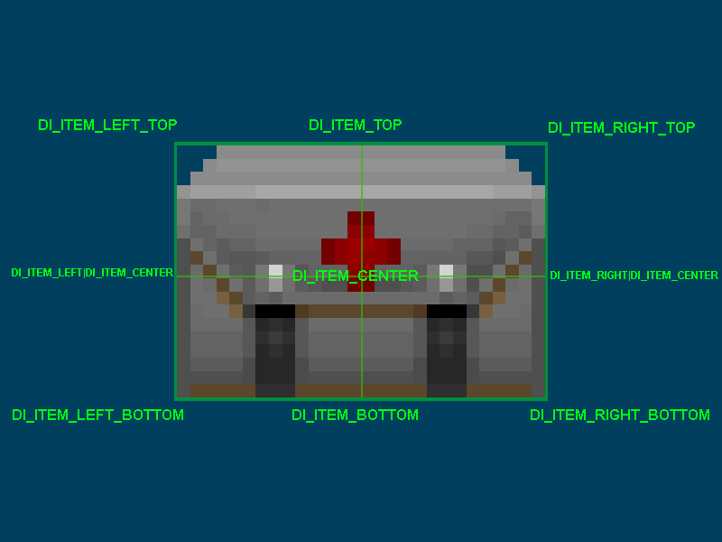

🟢 [<<< BACK TO START](README.md)

🔵 [Constants](14_Constants.md)

------

*This chapter is a work-in-progress. To be revised/completed.*

# HUD and statusbar

- [HUD and statusbar](#hud-and-statusbar)
  * [Overview](#overview)
  * [Creating a HUD](#creating-a-hud)
    + [Add the HUD in MAPINFO](#add-the-hud-in-mapinfo)
    + [Initialization](#initialization)
    + [Structuring Draw()](#structuring-draw--)
      - [1. Super.Draw()](#1-superdraw--)
      - [2. Check HUD state](#2-check-hud-state)
      - [3. Begin the HUD](#3-begin-the-hud)
      - [4. Start drawing](#4-start-drawing)
  * [Drawing in the HUD](#drawing-in-the-hud)
    + [HUD element offsets](#hud-element-offsets)
      - [Statusbar offsets](#statusbar-offsets)
      - [Fullscreen offsets](#fullscreen-offsets)
        * [Text offsets](#text-offsets)
      - [HUD scaling](#hud-scaling)
      - [HUD aspect ratio](#hud-aspect-ratio)
    + [Drawing in the HUD](#drawing-in-the-hud-1)
      - [Setting up a font](#setting-up-a-font)
      - [DrawImage()](#drawimage--)
      - [DrawTexture()](#drawtexture--)
      - [DrawInventoryIcon()](#drawinventoryicon--)
      - [Information functions](#information-functions)
      - [Force 1:1 aspect ratio without disabling UI scaling](#force-1-1-aspect-ratio-without-disabling-ui-scaling)

## Overview

A HUD (heads-up display) is various information displayed on the player's screen, such as health, armor and ammo reserves. The aiming reticle and the pop-up messages are also a part of the HUD.

HUDs exist in the [UI context](https://zdoom.org/wiki/Object_scopes_and_versions#Scoping_system), just like menus, which means they can read play-scope data but not modify it.

GZDoom supports 3 types of HUDs that can coexist and replaced: 

* Statusbar: usually the smallest HUD. GZDoom comes with a statusbar styled after the original Doom HUD that consists of a single graphic and some numbers drawn on top.

* Fullscreen: the typical fullscreen HUD. GZDoom's native fullscreen HUD doesn't have any sort of background, providing better visibility, and spread things on the screen (such as displaying keys in the top right corner).

* Alternative HUD: a special fullscreen HUD that is designed to override mod-specific HUDs. Uses custom scaling, so its size can't be used-controlled. A custom alt HUD *can* be defined in ZScript, however.

Note that statusbar and fullscreen HUDs are actually one HUD, just switching between different modes. If you create your own HUD, you're free to provide only one version of the HUD instead of two.

The alternative HUD, however, is a separate class that is drawn *on top* of the normal HUD. Properly defined regular and alt HUDs are designed in such a way that one of them simply stops displaying anything while the other is active, but they still exist at the same time.

## Creating a HUD

All HUDs have to be based on the [`BaseStatusBar`](https://zdoom.org/wiki/Classes:BaseStatusBar) class (you can find its source [on GZDoom's Github](https://github.com/coelckers/gzdoom/blob/517e803b3e43dd88b54a66f26f3cce5b6137ca19/wadsrc/static/zscript/ui/statusbar/statusbar.zs#L105)). Despite the name, it's *not* just for statusbars; this class is a base for all HUDs, including the alternative one.

If you only want to add minor changes to an existing HUD, you can inherit from one of the vanilla HUDs ([see GZDoom Github](https://github.com/coelckers/gzdoom/tree/master/wadsrc/static/zscript/ui/statusbar)), such as `DoomStatusBar`.

A HUD is a regular ZScript class, so there's nothing particularly special about its structure. Note that a HUD is *not* an actor, so it doesn't have properties or the Default block like actors do. What you need to do is override various virtual functions to add your own behavior to your HUD. The basic structure of a HUD looks like this:

```csharp
class MyCustomHUD : BaseStatusBar
{
    // As with all ZScript classes, here you can
    // declare class fields, constants and such.

    override void Init()
    {
        // This function is called once, when the
        // HUD is first created. Here you can
        // define various default values.
        // For example, HUD fonts are commonly
        // created here.
    }

    override void Draw(int state, double ticFrac)
    {
        // This is where you draw the things you can
        // see in the HUD. This function is called
        // every frame, so the frequency of its calls
        // depends on the player's framerate.
    }

    override void Tick()
    {
        // Similarly to actors, HUDs have this function,
        // and it's called every tic, i.e. 35 times per
        // second, regardless of framerate.
        // You can't draw anything here, but it's good
        // for things that need to happen on a fixed
        // timed basis.
    }
}
```

`Init()`, `Draw()` and `Tick()` are, of course, not all `BaseStatusBar`'s functions—you can find the full list and descriptions of the functions [on ZDoom wiki](https://zdoom.org/wiki/ZScript_virtual_functions#BaseStatusBar). Most important things will happen in `Draw()`, however.

### Add the HUD in MAPINFO

Technically, this should be done at the end of the whole thing, but I'll mention it right here just so it doesn't slip your attention: **HUDs need to be added via MAPINFO**. If you don't do that, you won't see your HUD.

There are 2 HUDs in the game that exist at the same time: the regular HUD and the alternative HUD. The latter gets drawn if the player enables the "Alternative HUD" option in GZDoom options menu. It's possible to replace only one of those or both, although arguably it's more common to only replace the base one and let the player use the classic alternative HUD if they desire.

In either case, you'll need to use [MAPINFO's Gameinfo block](https://zdoom.org/wiki/MAPINFO/GameInfo_definition) to add those HUDs as follows:

```csharp
Gameinfo
{
    StatusBarClass = "MyBaseHUD"
    AltHUDClass = "MyAltHUD"
}
```

...where "MyBaseHUD" and "MyAltHUD" are the actual class names of your HUD classes.

Note that GZDoom's alternative HUD can be enforced by the player if they set the `hud_althud_forceinternal` CVAR to `true`. 

Alternative HUD is a regular HUD, also based on the `BaseStatusBar` class; [GZDoom's alternative HUD](https://github.com/coelckers/gzdoom/blob/master/wadsrc/static/zscript/ui/statusbar/alt_hud.zs) is simply designed differently from the classic HUD: it uses different scale and a bunch of custom functions for drawing.

### Initialization

The first virtual you need to deal with is `Init()`. It's called once, when the HUD is created (which is whenever the game is loaded) and is normally used to define various default values. 

### Structuring Draw()

There are several steps you need to take in order to properly draw things in your HUD.

#### 1. Super.Draw()

First, you *must* call `Super.Draw(state, ticFrac)` before doing anything anything custom. If you don't do that, the HUD will technically work, but a lot of things will be broken: messages won't display/disappear propertly, the crosshair's size won't increase when picking up items, and so on.

#### 2. Check HUD state

The second thing you need to do is check the value of `state`—it's the first argument of `Draw()`. `State` (not related to actor states) has the following values: `HUD_None`, `Hud_StatusBar`, `Hud_FullScreen` and `HUD_AltHud`.

Based on these values you'll need to decide what exactly to drawn since you can essentially have multiple variations of the same HUD. The basic idea is as follows:

* `HUD_None` — the HUD is disabled by the player (e.g. by pressing the + key on the keyboard twice). Normally with this state you don't want to draw anything, and you can simply call a `return` and stop everything there:

```csharp
override void Draw(int state, double TicFrac)
{
    super.Draw(state, TicFrac);
    if (state == HUD_None)
        return;

    // actual drawing stuff starts here
}
```

If you don't add this exception, the player won't be able to disable the HUD, it'll still be drawn even if they keep pressing +. There's no good reason to block this feature, so I don't recommend doing that.

* `HUD_StatusBar` — the player is using the minimal version of the HUD, aka the statusbar. In classic Doom this was the only existing HUD. In GZDoom statusbar is explicitly defined to only occupy the bottom part of the screen, 32 pixels tall (so, it's 200x32 by default). However, this state doesn't enforce any limitations by itself; it's up to you to decide what to do with it. You can draw a proper, classic-style statusbar, separate from the fullscreen HUD. You can also draw the same things for fullscreen and statusbar states, essentially merging them into one HUD. You can also just make two separate HUDs, or make them similar but make the "statusbar" one into a minimal version. 

* `HUD_FullScreen` — the player is using the fullscreen version of the HUD. This is arguably the most commonly used HUD nowadays and this is where you'll likely focus most of your efforts. 

* `HUD_AltHud` — the "Alternative HUD" option is enabled: the alternative HUD is being drawn. As mentioned earlier, the alternative HUD itself is a whole separate HUD class. What's important is that GZDoom doesn't switch between them; instead, when `state == HUD_AltHud`, the alternative HUD gets drawn *on top* of the base HUD, while the base HUD remains active. In other words, if you don't want the HUDs to overlap, you need to make sure that in this state your base HUD is not drawing anything (or only draws some specific elements that don't overlap the alternative HUD elements).

#### 3. Begin the HUD

After getting the `state` (or maybe even before it) you'll need to actually start the drawing process. Doing that requires calling one of the Begin* functions: `BeginHUD()` or `BeginStatusBar()`. These functions must be called before any of the actual drawing functions, such as `DrawImage()`. Let's take a look at them.

```csharp
void BeginStatusBar(bool forceScaled = false, int resW = -1, int resH = -1, int rel = -1)
```

`BeginStatusBar()` is used by the vanilla statusbar. This function defines a box area of specific size and places that box at the bottom center of the screen. The size of the box will adjust to screen size by default but it won't change its aspect ratio (e.g. a 320x200 box will always be 4:3, so with a wider screen you'll see a textured border at the sides).

What's also important is that `BeginStatusBar()` will move up the viewport: meaning, the whole image of what you can see in the game will be moved up to make space for the statusbar.

The arguments work as follows:

* `bool forceScaled` — if you pass `true`, the HUD will always be drawn at the same size, ignoring all scaling options (meaning, the player won't be able to scale the HUD using the "User interface scale" menu option). False by default.

* `int resW` — the width of the statusbar HUD box. The default value is `-1` which is interpreted as 320.

* `int resH` —the height of the statusbar HUD box. The default value is `-1` which is interpreted as 200.

* `int rel` — currently unused and shouldn't be modified (defaults to `-1`).

```csharp
void BeginHUD(double Alpha = 1., bool forcescaled = false, int resW = -1, int resH = -1)
```

`BeginHUD()` is normally used by the fullscreen HUD. In contrast to `BeginStatusBar()` it draws relative to screen corners (or center points of screen edges, if you prefer). This will give various drawing functions access to special flags that define relative positioning, which will guarantee your HUD will work in different aspect ratios (e.g. if you draw something in the bottom left corner, it'll be there both on 4:3 and all the way up to 21:9). This function also doesn't move the viewport.

The arguments are:

* `double Alpha` — the alpha of the HUD, lets you make it translucent. `1.0` by default (fully opaque).

* `bool forcescaled` — works the same way as with `BeginStatusBar()`: draws the HUD at a fixed resolution and disablesthe ability to scale it.

* `int resW` — the virtual width of the fullscreen HUD. The default value is `-1` which is interpreted as 320. Note, the HUD will still scale to match screen resolution and aspect ratio.

* `int resH` — the virtual height of the fullscreen HUD. The default value is `-1` which is interpreted as 200. Note, the HUD will still scale to match screen resolution and aspect ratio.

Which one you need is a matter of design. The vanilla Doom HUD uses both, calling `BeginStatusBar()` if the state is `HUD_StatusBar`, and `BeginHUD()` for `HUD_Fullscreen`:

```csharp
    override void Draw (int state, double TicFrac)
    {
        Super.Draw (state, TicFrac);

        if (state == HUD_StatusBar)
        {
            BeginStatusBar();
            DrawMainBar (TicFrac);
        }
        else if (state == HUD_Fullscreen)
        {
            BeginHUD();
            DrawFullScreenStuff ();
        }
    }
```

(See the full code on [GZDoom repository](https://github.com/coelckers/gzdoom/blob/master/wadsrc/static/zscript/ui/statusbar/doom_sbar.zs))

However, it's perfectly possible to only use `BeginHUD()` and then just manually decide what to draw based on the `state`. As mentioned in the previous point, your "statusbar" doesn't have to be a literal statusbar, it can be just some sort of a minimal HUD but drawn using the same methods as the fullscreen one.

#### 4. Start drawing

`BaseStatusBar` comes with [many functions](https://zdoom.org/wiki/Classes:BaseStatusBar#Non-static), but the ones you'll be using most of all are, arguably, `DrawString()`, `DrawImage()` and `DrawInventoryIcon()`. 

Note that often those functions are packed into other functions just for the sake of convenience. For example, if we look again at the `Draw()` call from DoomStatusBar:

```csharp
    override void Draw (int state, double TicFrac)
    {
        Super.Draw (state, TicFrac);

        if (state == HUD_StatusBar)
        {
            BeginStatusBar();
            DrawMainBar (TicFrac);
        }
        else if (state == HUD_Fullscreen)
        {
            BeginHUD();
            DrawFullScreenStuff ();
        }
    }

    void DrawMainbar(TicFrac)
    {
        [...]
    }

    void DrawFullScreenStuff ()
    {
        [...]
    }
```

The `DrawMainBar()` and `DrawFullScreenStuff()` functions are not drawing functions like `DrawImage()`; instead they're simple void functions added to better structure the drawing. You don't *have* to do it — there's nothing stopping you from shoving everything inside different code blocks in `Draw()` — but it's recommended to do something similar just to keep things more sensible. Of course, it's up to you how to structure and name those functions.

The actual drawing is covered in more detail in the next subchapter.

## Drawing in the HUD

Once your HUD class and `Draw()` are set up correctly, you can actually start drawing things, such as images, numbers, icons, bars, etc.

### HUD element offsets

First, let's talk about how elements (such as images, strings, etc.) are placed on the HUD. Note, for the examples we'll be using `DrawImage()`, which is the simplest `BaseStatusBar` function that is designed to draw images.

**All drawing functions have offsets that define where the element will be drawn.** For example, `DrawImage()`'s second argument is the offsets (as a `vector2` value):

```csharp
DrawImage("MEDIA0", (0, 0));
```

This will draw a medikit sprite at the top left corner of the HUD area. The starting point of the offsets aka `(0, 0)`, is by default the top left corner. Positive X values will shift the point to the right, positive Y values shift it downwards — this is always true, regardless of the type of HUD and the use of offset-related flags.

As noted before, statusbar and fullscreen HUDs treat offsets differently. 

#### Statusbar offsets

Statusbar-type HUDs (prefaced with `BeginStatusBar()`) draw stuff in a box of specific size. Usually the elements are drawn with explicit offsets from the top left corner. For example, the Doom statusbar is drawn within a 320x200 box, and the bar graphic is drawn at `(0, 168)` since the bar is exactly 32 pixels tall, so it covers the 32 bottom pixels of the box (the graphic itself is drawn starting from its top-left corner).

When the user changes their HUD size using "User interface scale" GZDoom option, statusbars don't change their aspect ratio. For example, if you define a 320x200 statusbar but play on a 16:9 screen, you'll see empty space on the sides.

#### Fullscreen offsets

In contrast, fullscreen HUDs (prefaced with `BeginHUD()`) are drawn along the whole screen, so `(0, 0)` points to the top left corner of the *screen* (by default), not a specific area. The size of the fullscreen HUD specified through `BeginHUD()` only defines the virtual canvas initially allocated for the HUD elements but does *not* actually correspond to screen resolution or aspect ratio. For example, if you define a 320x200 fullscreen HUD, the 320x200 area should be basically treated as a guide to how much space you have for your elements, which means the graphic elements should be initially designed with a 320x200 canvas in mind; however, it does *not* correspond to how much space you will actually have available: even when it's scaled up to the screen size, the width will likely be above 320 and the height will be above 200 due to aspect ratio and screen size.

As such, explicit offsets like `(0, 168)`, **should never be used with fullscreen HUDs**. Instead, elements should be aligned against specific anchor points, such as screen corners and edges. This can be achieved with the use of the various DI_SCREEN* and DI_ITEM* flags. All of these flags can be seen can be found [in GZDoom GitHub repository](https://github.com/coelckers/gzdoom/blob/eb56eb380e5b35c9e1d4ba5323a4ec6a1dc0ae8c/wadsrc/static/zscript/engine/ui/statusbar/statusbarcore.zs#L27).

DI_SCREEN* flags define the starting point for the position coordinates. For example, `DI_SCREEN_LEFT_TOP` will define the left top corner as `(0, 0)`, while `DI_SCREEN_RIGHT_BOTTOM` will define right bottom as such. Note, it doesn't change the *direction* of the offsets: positive X is still down and positive Y is still right; it only changes the position of the starting point. This means that, if you use `DI_SCREEN_RIGHT_BOTTOM`, you basically have to use `(0, 0)` or negative values to go upward and leftward, since positive values will shift the element beyond the screen edges.

The flags can be combined using `|` to define both corner and edge offsets, e.g. `DI_SCREEN_LEFT|DI_SCREEN_TOP`. However, there are also pre-combined flags available, which are more commonly used; here's how they're positioned on the screen:


DI_ITEM* flags define where the HUD graphic itself will be placed relative to the specified coordinates. For example, with `DI_ITEM_LEFT_TOP` the anchor point will be placed at the top left corner of the image. Note, that **the graphic's own offsets are ignored when drawn on the HUD**, instead the DI_ITEM* flags define its relative position. This allows you to draw graphics on the screen, such as sprites, without worrying about their initial offsets.

Similarly to DI_SCREEN* flags, DI_ITEM* flags can be combined, but there are also some combinatory flags already available. Here's how they define anchor points of an element:



Combining DI_SCREEN* and DI_ITEM* flags, you can position graphics relative to screen corners, edges or center without worrying about the size of the image, or the screen. For example, let's say we want to draw a medikit sprite **at the center of the screen**:

```csharp
DrawImage("MEDIA0", (0,0), DI_SCREEN_CENTER);
```

Simply use `|` to append one of the DI_ITEM* flags, e.g.:

```csharp
DrawImage("MEDIA0", (0,0), DI_SCREEN_CENTER|DI_ITEM_LEFT_TOP);
```

The GIF below demonstrates how the different DI_ITEM* flags will move the image relative to its origin point (the origin is marked with a red circle):


To reiterate:

* The offsets (`(0, 0)` in this example) and the DI_SCREEN* flags define the *position of the origin point*.

* The DI_ITEM* flags define the *position of the image relative to the specified origin point*.

Using this knowledge, you can draw an image **at the top left corne**r:

```csharp
DrawImage("MEDIA0", (0,0), DI_SCREEN_LEFT_TOP|DI_ITEM_LEFT_TOP);
```


Conversely, if you need to place an element exactly **at the left *bottom* corner** and you don't want to worry about the size of the image or screen resolution, use this:

```csharp
DrawImage("MEDIA", (0,0), DI_SCREEN_LEFT_BOTTOM|DI_ITEM_LEFT_BOTTOM);
```


Note that in both cases we're using `(0, 0)` as offsets, meaning the image is drawn directly adjacent to the screen edges/corners. You can use offsets to adjust its relative position. For example, this will draw the Medikit sprite **at the bottom right corner, but 2 pixels away** from the bottom and the right edges:

```csharp
DrawImage("MEDIA", (-2,-2), DI_SCREEN_RIGHT_BOTTOM|DI_ITEM_RIGHT_BOTTOM);
```


Note that `DrawImage()` and most of the other drawing functions support their own scaling, sepate from the HUD size. For example, you can have a 320x200 HUD but draw the Medikit twice as large:

```csharp
DrawImage("MEDIA", (-2,-2), DI_SCREEN_RIGHT_BOTTOM|DI_ITEM_RIGHT_BOTTOM, scale: (2, 2));
```


As long as the flags are set up correctly, the image will remain at the same place but will change its size.

Note, scaling of a specific HUD element is unrelated to the HUD's own scale, which can be controlled by the user (explained below).

##### Text offsets

If you're drawing text or numbers, e.g. with `DrawString()`, DI_ITEM* flags are not applicable. Instead you'll need [DI_TEXT* flags](https://github.com/coelckers/gzdoom/blob/14fc2a011ed77cffc68f8599285e5228e03d9f01/wadsrc/static/zscript/engine/ui/statusbar/statusbarcore.zs#L75).

The principle is the same, except the only flags are `DI_TEXT_ALIGN_LEFT`, `DI_TEXT_ALIGN_RIGHT` and `DI_TEXT_ALIGN_CENTER`. By using them you'll define where the text is placed on the screen. For example:

```csharp
DrawString(mIndexFont, CPlayer.health, (0, 64), DI_SCREEN_CENTER|DI_TEXT_ALIGN_CENTER);
```

This will draw the player's current health 64 units under the center of the screen, with the text aligned to the center.

#### HUD scaling

By default the player can control the scale of their hud by using the -/= keyboard keys or the "User interface scale" menu option (found under *Options > HUD Options > Scaling Options*). 

For **statusbar HUDs**, the whole HUD area will be changed in size, and the elements in it will change their size with it.


> Left: x1UI scale. Right: x4 UI scale.

Since normally statusbars only include a single bar graphic at the bottom, it may seem like only that graphic changes. But in fact, the whole previously allocated area changes (relative to the bottom center of the screen), so if you put anything above the statusbar, it'll be moved as well.

For fullscreen HUDs, however, things are different. The area of a fullscreen HUD is always the whole screen and that fact doesnt change with the scaling. Instead, the visual size *and* position of every element is changed:


> Left: x1UI scale. Right: x4 UI scale. Note how the health and ammo indicators remain in the corners regardless of scale settings. Changing the resolution to a different aspect ratio will also not affect their placement.

As such, if you want to incorporate scaling properly, you once again must use the DI_SCREEN and DI_ITEM flags mentioned earlier, so that the elements of your HUD remain in the same relative places despite changing their size. As shown earlier, if you want to draw a Medikit sprite at the bottom left corner, use this:

```csharp
DrawImage("MEDIA", (0,0), DI_SCREEN_LEFT_BOTTOM|DI_ITEM_LEFT_BOTTOM);
```

With this the graphic will remain at the bottom left corner, regardless of UI scale.

However, if you define a 320x200 HUD and then try to achieve the same with explicit offsets like this:

```csharp
DrawImage("MEDIA", (0,292));
```

...this will break immediately when the player decides to use non-default UI scale, since the 292 position will be moved around relative to the scaling options. That's why using DI_SCREEN* and DI_ITEM* flags, as described in the previous section, is so important.

It is also possible to disable the option to scale the HUD completely by setting the `forceScaled` argument of the `BeginHUD()` and/or `BeginStatusBar()` to `true`, however, this basically robs the user of a feature they may find useful without a good reason, so I do not recommend doing that.

#### HUD aspect ratio

As you probably know, [all of Doom graphics is vertically stretched by the factor of 1.2](https://zdoom.org/wiki/Aspect_ratio_correction). HUDs are not an exception: HUD graphics are also vertically stretched by default. At the moment of writing this, the only way to disable that behavior for HUDs is to set the `forceScaled` argument of the `BeginHUD()` and/or `BeginStatusBar()` to `true`, however that also disables the ability for the user to change the size of the HUD, which is usually undesirable.

HUD aspect ratio is controlled by the `hud_aspectscale` console command: when set to true (default), the HUD graphics will be stretched.

Most of the time you don't need to worry about, unles your HUD features circular elements, because those will be stretched or squished when the user switched to the other aspect ratio than the one the images were authored for.

### Drawing in the HUD

Finally, let's talk about how to draw things!

#### Setting up a font

If you're planning to draw text or numbers anywhere in the HUD, you'll first need to set up a HUD font. Fonts used by the HUD have to be cached to a field of the `HUDFont` type and created with the `HUDFont.Create()` function. But before that they also need to be obtained and cast to a `Font`-type variable.

This is normally done only once, in `Init()`:

```csharp
class MyHUD : BaseStatusBar
{
    // This will contain a reference to the font:
    HUDFont mIndexFont;

    override void Init()
    {
        super.Init();
        Font fnt = "MYHUDFNT"; //obtain the font named "MYHUDFNT"
        mIndexFont = HUDFont.Create(fnt); //cache the font
    }
}    
```

After this point you'll be able to use `mIndexFont` in functions like `DrawString()`. Note, the variable name, as usual, can be anything; I'm using `mIndexFont` as an example, since this is what is used in `DoomStatusBar`.

I should note that `HUDFont` is a whole separate class, whose purpose is to handle HUD fonts, and `Create()` is its only method. Among other things, `Create()` allows specifying monospaced fonts or defining custom spacing. You can find the documentation for this class [on ZDoom Wiki](https://zdoom.org/wiki/Classes:HUDFont).

#### DrawImage()

```csharp
native void DrawImage(String texture, Vector2 pos, int flags = 0, double Alpha = 1., Vector2 box = (-1, -1), Vector2 scale = (1, 1));
```

As you can see by the `native` keyword, this function is defined in C++. The arguments work as follows:

* `string texture` — the name of the texture. Despite being defined as a `string`, all graphic names are case-insensitive. Although the word "texture" is used, you can actually use any image here: textures, flats, graphics or sprites.

* `vector2 pos` — the position where the element will be drawn. See notes on the offsets above to learn how the position works with various offsets. Note that the graphic's offsets set via SLADE are ignored and do not affect its placement.

* `int flags` — a bit field for flags, such as DI_SCREEN* and DI_ITEM* flags.

* `double alpha` — the translucency of the element, from 0.0 to 1.0.

* `vector2 box` — allows defining a fixed area within which the element is drawn. This can be used to crop images, for example: e.g. if you use a 48x32 image but define the box argument as `(12, 12)`, the image will be cropped to a 12x12 square. The default value is `(-1, -1)`, which means the box's size will be equal to the size of the element.

* `vector2 scale` — the individual scale of the element (independent from the general HUD scale); works pretty much like, for example, actor scale. Note, this is relative scale, e.g. at `(2, 2)` the element will appear x2 larger than it normally would.

#### DrawTexture()

```csharp
void DrawTexture(TextureID texture, Vector2 pos, int flags = 0, double Alpha = 1., Vector2 box = (-1, -1), Vector2 scale = (1, 1))
```

This function is largely identical to `DrawImage()`, with the exception of the first argument: instead of taking the name of a graphic as a `string`, it takes a `TextureID`-type argument. `TextureID` is a special [data type](07_Variables_and_data_types.md) that contains a reference to a texture, but not the actual texture name.

You likely won't need this texture often.

```csharp
void DrawString(HUDFont font, String string, Vector2 pos, int flags = 0, int translation = Font.CR_UNTRANSLATED, double Alpha = 1., int wrapwidth = -1, int linespacing = 4, Vector2 scale = (1, 1))
```

This function draws a string of text. Note, it needs a HUDFont font to be set up before it can be used. The argumenst are:

* `HUDFont font` — the name of the field that contains the font.

* `String string` — the actual text to be displayed. Instead of writing the text literally, if you're using the [LANGUAGE lump](https://zdoom.org/wiki/LANGUAGE), you can pass `StringTable.Localize("$LANGUAGECODE")` to display the correct string as defined in LANGUAGE.

* `Vector2 pos` — the position of the text element, just like in `DrawImage()`.

* `int flags` — a bit field for flags, such as `DI_TEXT_ALIGN_LEFT`, `DI_TEXT_ALIGN_RIGHT` and `DI_TEXT_ALIGN_CENTER` (determine how the text will be aligned relative to the specified position), as well as the DI_SCREEN* flags mentioned earlier.

* `int translation` — the color translation applied to the font. Note, fonts are always translated via IDs that can be found [on GZDoom GitHub](https://github.com/ZDoom/gzdoom/blob/6489f5ebf0a1d05355eebc8718c5adf0709790c3/src/common/fonts/v_font.h#L47), for example `Font.CR_Red`, `Font.CR_White`, etc. The default value, `Font.CR_UNTRANSLATED`, means the color of the font graphics will be used as is.

* `double alpha` — the translucency of the element, from 0.0 to 1.0.

* `int wrapwidth` — defines the length of the string in pixels at which it should wrap and start a new line ***(further testing needed)***. The default value is `-1` whip disables wrapping.

* `int linespacing` — defines the spacing between lines if the text is wrapped.

* `vector2 scale` — the individual scale of the element (independent from the general HUD scale). Can be used to make the text appear larger or smaller relative to the size of its glyphs.

#### DrawInventoryIcon()

```csharp
void DrawInventoryIcon(Inventory item, Vector2 pos, int flags = 0, double alpha = 1.0, Vector2 boxsize = (-1, -1), Vector2 scale = (1.,1.))
```

This function is largely similar to `DrawImage()` but instead it draws the inventory icon defined in a specific `Inventory` class (retrieving it from the item's `Inventory.Icon` property). You need to pass a pointer to an inventory item to make it work, e.g.:

```csharp
let armor = CPlayer.mo.FindInventory("BasicArmor"); //a pointer to the class that handles armor
if (it)
    DrawInventoryIcon(it, (0, 0), DI_SCREEN_RIGHT_BOTTOM|DI_ITEM_RIGHT_BOTTOM);
```

#### Information functions

`BaseStatusBar` defines many functions that can be used to retrieve various information. Some of them are:

* `int GetArmorAmount()` — returns the current amount of armor the player has.

* `int GetArmorSavePercent()` — returns the armor's `savepercent` value (damage absorption).

* `String GetWeaponTag()` — returns the select weapon's `Tag` property as a string (usually contains the weapon's name).

* `bool isInvulnerable()` — returns `true` if the player is currently invulnerable due to power-ups or other effects.

These are just some of the examples, but many more can be found on [ZDoom Wiki](https://zdoom.org/wiki/Classes:BaseStatusBar).

#### Force 1:1 aspect ratio without disabling UI scaling

If you're determined to create a HUD that supports UI scaling, yet looks identical regardless of aspect ratio, it's actually possible. You will have to check the valuie of the `hud_aspectscale` CCMD and then multiply Y position and size of all elements by 0.8333... in order to counter aspect ratio changes. This can be achieved with a wrapper function. For example, for `DrawImage()` it'd look like this:

```csharp
// As with all constants, this constant can be 
// defined anywhere. We're using this value becase
// we want to counter the x1.2 stretch, and
// 1.2 multiplied by this is roughtly equal to 1:
const ASPECTBLOCK = 0.833333333;

// This is used to cache the console variable, since
// calling GetCVar is actually an expensive operation,
// and you definitely don't want to do that every frame.
// This must be defined in your HUD class:
transient CVar aspectScale;

// This wrapper function works just like DrawImage,
// except images drawn with it will always look as if
// 1:1 aspect ratio is used. It uses exactly the same
// arguments as the regular DrawImage():
void NoAspectDrawImage(String texture, Vector2 pos, int flags = 0, double Alpha = 1., Vector2 box = (-1, -1), Vector2 scale = (1, 1)) 
{
    // Cache the CVar the first time this is called:
    if (!aspectScale)
    {
        aspectScale = CVar.GetCvar('hud_aspectscale',CPlayer);
    }

    // Now check the value of the CVar:
    if (aspectScale.GetBool() == true) 
    {
        // If it's true, multiply Y scale and position
        // by 0.83... so that it remains virtually the same:
        scale.y *= ASPECTBLOCK;
        pos.y *= ASPECTBLOCK;
    }
    // Use the final values to draw the actual image:
    DrawImage(texture, pos, flags, Alpha, box, scale);
}
```

------

🟢 [<<< BACK TO START](README.md)

🔵 [Constants](14_Constants.md)
